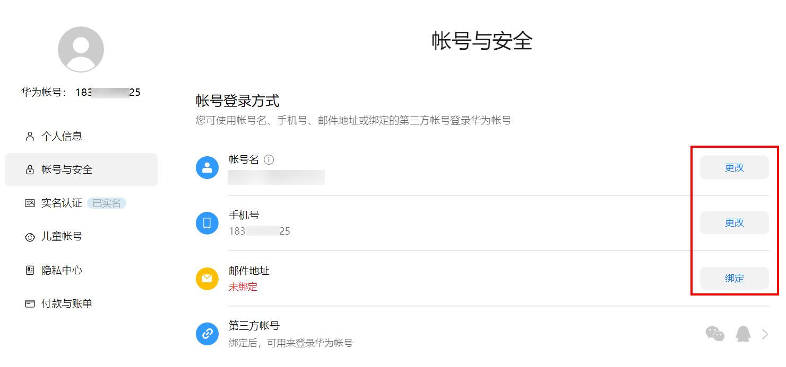
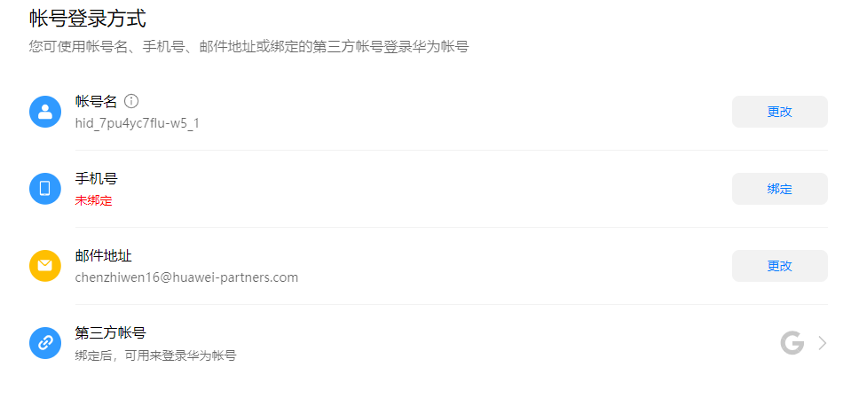
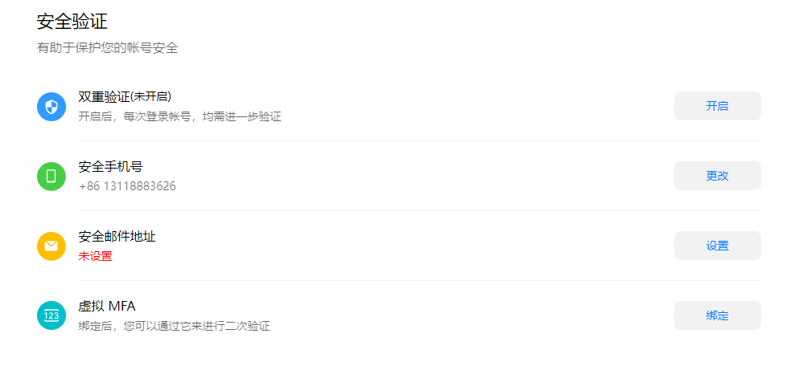
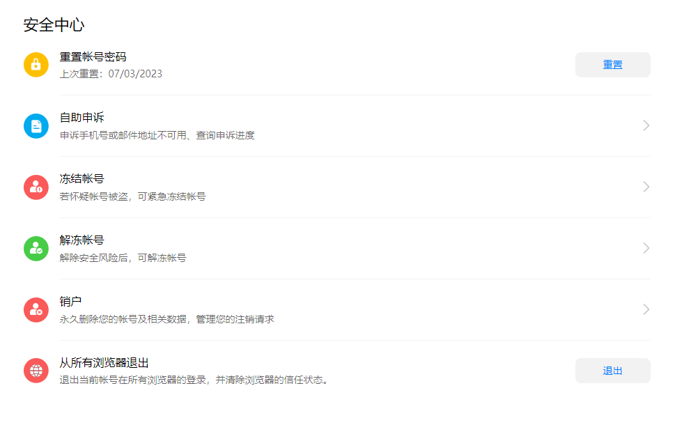
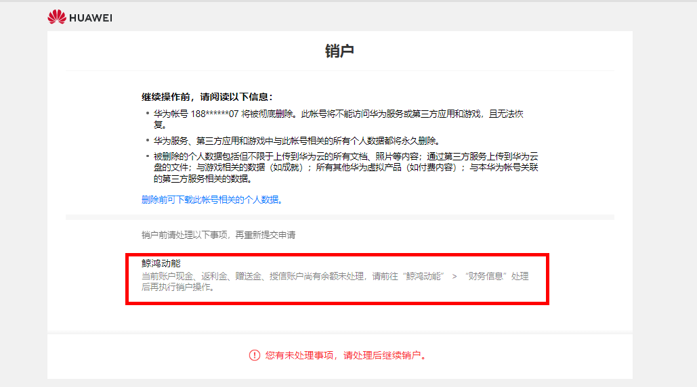
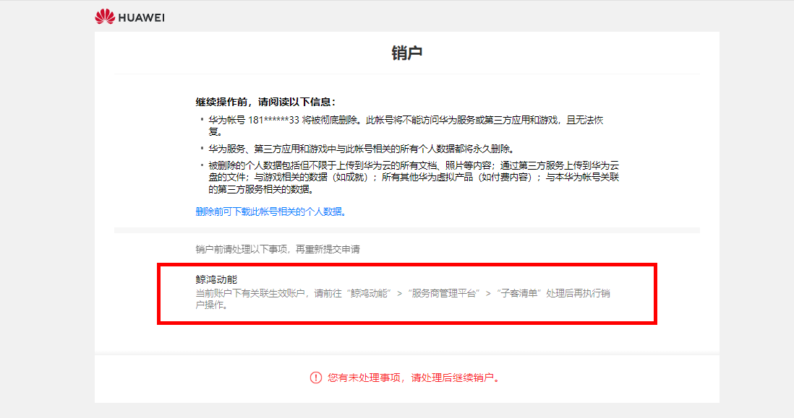
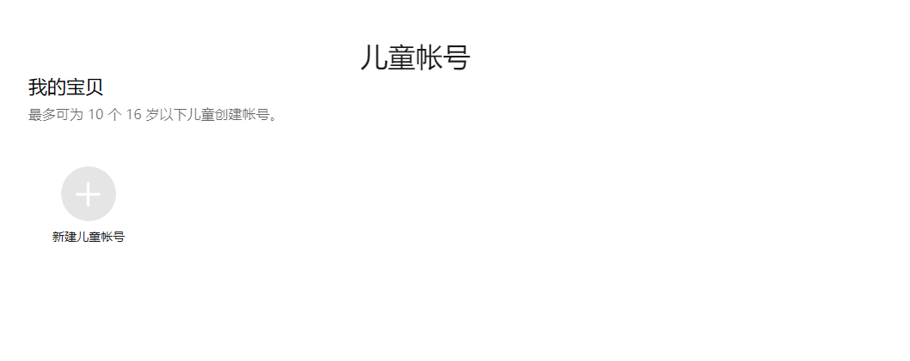

# 华为账号中心

## 功能简介

华为账号中心为广告主提供账号管理功能，支持查看、修改华为账号信息，如账号名、手机号、邮箱地址等。

### 个人信息

您可修改头像、昵称、账号名、性别、生日信息。

### 账号与安全

您可设置和修改账号登录方式、安全验证、安全中心等信息。

<strong>账号登录方式：您可修改账号、手机号、邮件地址、第三方账号。</strong>

<strong>安全验证：您可开启双重验证、更改手机号、设置邮件地址和绑定虚拟MFA功能</strong>。

<strong>安全中心：</strong>您可重置账号密码、自助申诉、冻结和解冻账号、销户以及从所有浏览器退出等功能。

华为账号销户场景：

1. 如您的华为账号已注册鲸鸿动能直客账户或服务商账户，当您进行华为账号销户操作时，如果该直客账户或服务商账户里的现金、返利金、赠送金尚有余额未处理，请前往“鲸鸿动能” -&gt; “财务信息”处理后再执行销户操作。
2. 如您的华为账号已注册鲸鸿动能子客账户，当您进行华为账号销户操作时，该子客账户里的现金、返利金、赠送金尚有余额未处理，请联系您的上级服务商前往“鲸鸿动能” -&gt; “服务商管理平台” -&gt; “转账”处理后再执行销户操作。

   
3. 如您的华为账号已注册鲸鸿动能服务商账户或经理账户，当您进行华为账号销户操作时，该服务商账户或经理账户下如有关联生效账户（非停用/未完成注册状态的账户），请前往“鲸鸿动能”-&gt;“服务商管理平台”-&gt;“子客清单”处理后再执行销户操作。

   
4. 如您的华为账号不涉及上述三种场景，但依然未能成功销户，请前往“鲸鸿动能” -&gt; “在线客服”咨询处理方案后再执行销户操作。

### 儿童账号

最多可为10个16岁以下儿童创建账号。

### 隐私中心

可以管理您的隐私，详情可访问[隐私网站](https://legal.cloud.huawei.asia/website/privacy/index.htm?language=zh-cn&code=SG)查看所有功能

### 付款与账单

支持设置付款方式、自动付费和账单管理等功能。

## 相关链接

[华为账号信息设置](https://developer.huawei.com/consumer/cn/doc/start/account-management-0000001052865467)

[华为账号常见问题](https://id1.cloud.huawei.com/AMW/portal/faq/zh-cn_faq.html?version=china&regionCode=cn&lang=zh-cn&reqClientType=90&loginChannel=90000300&clientID=101476933)
