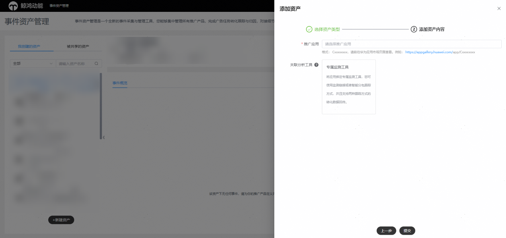
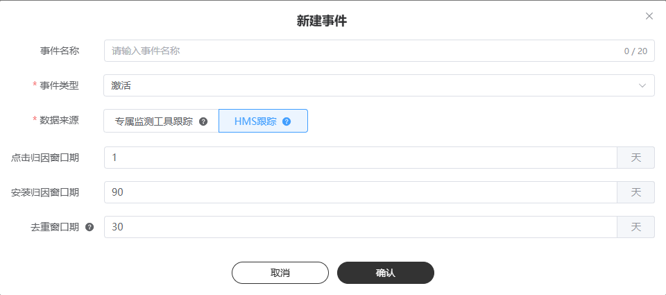
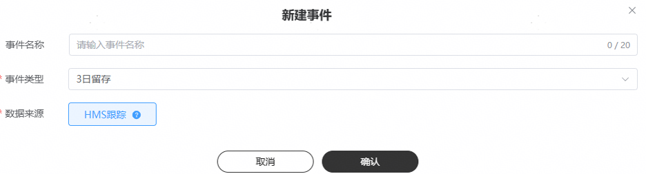
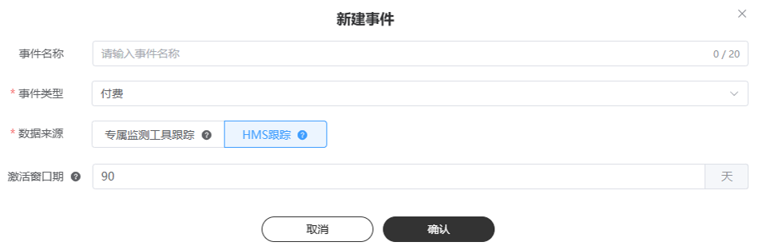

# HMS跟踪

## 基本原理

HMS跟踪借助于HMS Core的能力，能够在不借助任何其他跟踪平台、不集成任何SDK、免开发免埋码的情况下跟踪应用的激活、次留和付费，后期将开放更多事件类型。

激活（HMS）：指用户通过您的广告安装了您的应用后第一次打开该应用。

次留（HMS）：指激活用户在次日又打开了此应用。

付费（HMS）：指通过广告带来的新增用户在您的应用完成应用内付费的数据，该指标跟踪依赖您的App集成Huawei Pay功能。

 

激活（HMS）、次留（HMS）、付费（HMS）仅支持oCPC单出价，不支持oCPC双出价。

## 操作步骤

1. <strong>新建资产</strong>

   操作入口：“工具”-&gt;“事件资产管理”-&gt;“新建资产”

   - 推广应用：选择您需要创建的应用，同时支持手动输入应用ID或包名

     应用ID格式：Cxxxxxxxx，请前往华为应用市场页面查看。例如：应用地址为 https://appgallery.huawei.com/ app/C12345678，则其ID为“C12345678”。应用包名例如：com.huawei.xxxxx。
   - 关联分析工具：将推广的应用关联到具体的分析工具，此处选择专属监测工具、Huawei Analytics。
   - 智能跟踪：

     当不关联任何分析工具的情况，不会存在智能跟踪开关，也不需要配置。
   - 监测链接：

     当不关联任何分析工具情况下，不会存在监测链接填写框，也不需要填写。
   - 可选字段：

     当不关联任何分析工具情况下，不会存在可选字段配置栏，也不需要配置。

   
2. <strong>新建事件</strong>

   操作入口："选择资产"-&gt;"新建事件"

   - 事件名称：选填，转化名称长度应在20字符内，只能包含中英文、数字、下划线和空格。如果不填事件名称默认为事件类型。
   - 事件类型：事件类型，广告主可以多选。
   - 数据来源：选择HMS跟踪。
   - 窗口期配置：点击归因窗口期默认30天，安装归因窗口期默认90天。支持tracking portal 广告主可配置。按照App维度缓存窗口期，广告主下次配置作为默认填充项。
   - 当您创建事件类型为“激活”的事件时，支持配置去重窗口期。

   

   - 当您创建事件类型为“留存”的事件时，则不需要选择窗口期。

   

   - 当您创建事件类型为“付费”的事件时，支持配置激活窗口期。

   
3. <strong>联调</strong>

   数据来源为HMS的事件类型不需要手动联调，指标将默认已启用，只需要完成事件创建即可。

## 数据回传

数据来源为HMS的事件类型不需要广告主回传任何数据，只需要完成事件创建即可。

## 统计场景

事件资产管理概览页支持查看有效转化事件量； 投放端DSP portal所有报表，不再额外提供HMS指标数据，进行指标归一化处理，例如：创建数据来源为HMS的激活指标后，广告主可以在报表的激活指标查看转化数据。
