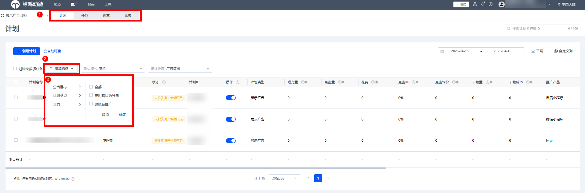
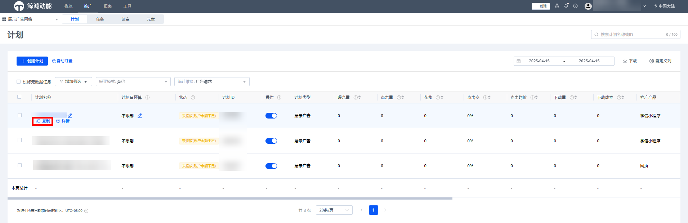
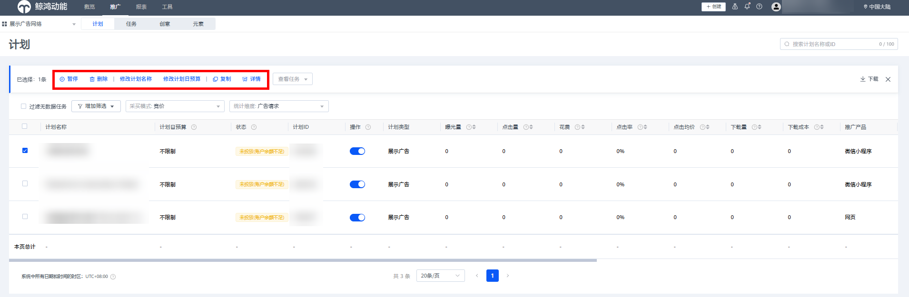

# 管理广告

## 功能简介

当一个账户存在多个广告计划/任务/创意时，广告主需要查看不同广告的投放效果，或对部分广告进行批量操作，可在鲸鸿动能投放平台的“推广”界面中进行。

## 操作步骤

在“推广”界面，广告主可通过“筛选”、“复制”、“暂停/删除/修改”等功能对广告进行管理。

### 筛选

1. 在“推广”界面，选择需要筛选的广告层级（计划/任务/创意/元素）。
2. 单击“增加筛选”并选择筛选方式。

   

### 复制

1. 选择需要复制的计划，单击“复制”

   
2. 复制广告计划后，则生成一条与原计划结构及设置相同的广告计划，复制成功后新计划默认开启，如果您不希望立即开启，复制时可勾选“复制后暂停新的副本广告计划”。

### 暂停/删除/修改

- 勾选需要修改的计划/任务/创意/元素，可进行暂停、开启、删除和修改等操作。
- 修改计划预算支持当日生效和次日生效，每条计划日预算每天可修改20次。
- 广告主既可以对单个目标进行修改，也可以多选计划/任务/创意等进行批量修改。

  

   

  批量修改操作限制如下：
  - 计划、任务删除后不可恢复，请谨慎操作。
  - 单个计划下最多可复制50条任务。
