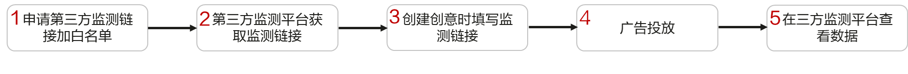
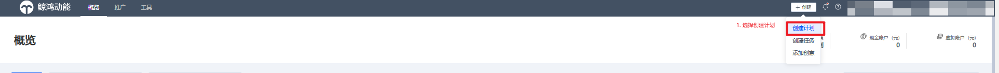
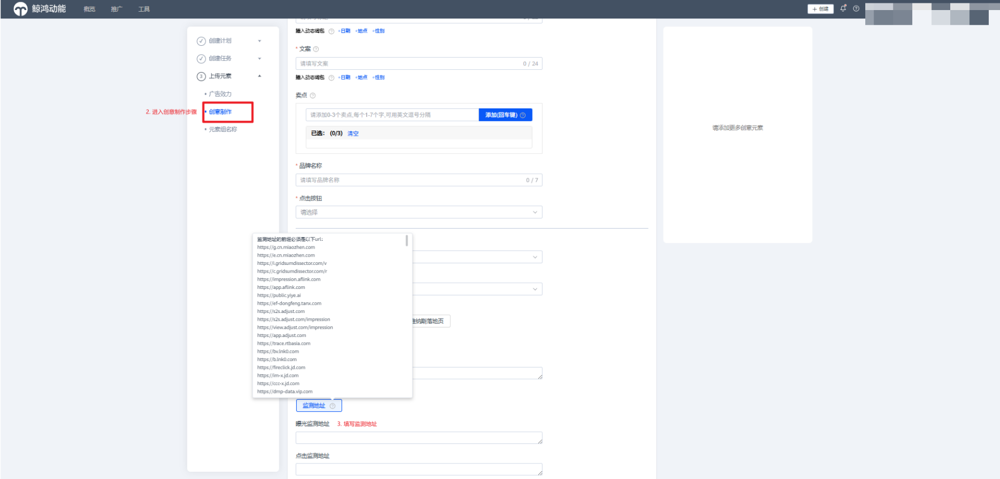

# 使用指南

1. 您向鲸鸿动能运营申请第三方监测链接白名单。

    

   第三方监测服务器域名信息应在白名单内。

   第三方监测平台监测地址需要符合鲸鸿动能平台要求。
2. 您在第三方监测平台获取监测链接。监测链接支持字段与格式请参考[第三方监测实现方式](https://developer.huawei.com/consumer/cn/doc/promotion/ads_jiance01-0000001057721993)。
3. 新建广告任务，上传广告创意时填写监测地址。

   
4. 投放广告。
5. 广告投放后您可在三方监测平台查看数据。

<strong>三方域名加白名单详情：[三方域名加白名单](https://developer.huawei.com/consumer/cn/doc/promotion/ads-sfjbmd-0000002541143520)</strong>

## 相关链接

[创建推广创意](https://developer.huawei.com/consumer/cn/doc/promotion/ads_spxsg-0000001058448635)
