# 平台介绍

 

本文档仅针对中国大陆区域，如需查看非中国大陆区域投放指导，请参考文档：[《非中国大陆区域投放指导》](/docs/monetize/promotion/adsrizhi-0000001143181107)

## 简介

鲸鸿动能是基于鸿蒙生态的全场景智慧营销平台。 依托华为1+8+N全场景硬件、媒体及内容生态，鲸鸿动能立足营销方法论，以AI能力构筑创新基座，用全面、快捷、精准的数据科学平台构筑场景化解决方案，助力品牌方实现商业增长的同时，高效提升品牌力价值。截至2025年9月30日，全球超8.5万个应用集成Ads Kit。

鲸鸿动能广告平台（[https://ads.huawei.com](https://ads.huawei.com/)）目前已接入华为视频、阅读、音乐、浏览器、钱包、主题等多种自有媒体，以及第三方媒体应用，涵盖开屏广告、锁屏广告、横幅广告、信息流广告、激励视频、视频贴片等主流展示位类型，可触达超过5.8亿高品质用户人群，帮助广告主高效达成营销目标。

 

1. 鲸鸿动能广告支持竞价广告和合约广告两种类型：
   - <strong>竞价广告</strong>：由广告主或服务商在鲸鸿动能投放平台自主操作（本文档内容仅针对竞价广告投放方式）。
   - <strong>合约广告</strong>：由华为媒介代为操作，如需咨询或投放合约广告，请与您的服务商联系或咨询鲸鸿动能BD/运营。
2. 鲸鸿动能广告支持展示广告网络和应用市场应用推广两种投放网络类型：
   - <strong>展示广告网络</strong>：投放非应用市场的广告类型，各大APP在各个位置上的广告。
   - <strong>应用市场应用推广</strong>：投放在应用市场上的应用广告。

## 名词解释

合约广告：即GD广告( Guaranteed Delivery ) ，指媒体和广告主约定在某时段、某广告位上保量投送该广告主的广告，计费方式为CPT、CPM。

竞价广告：即用户自主投放，通过调整价格进行排名，按广告效果付费的广告形式，在信息流中以不固定位置出现，提供多维度定向、多种优化工具以及多样的展示形式，满足广告主的个性化投放需求，计费方式为CPC、 CPM、CPD、oCPC、CPA。

## 平台能力

鲸鸿动能广告为广告主提供一站式服务，包括：便捷的开户流程、多样的产品推广能力、灵活的计费方式、精准的人群定向、丰富的优化手段等多种能力以及7\*24小时客户服务，助力广告主高效投放。

目前鲸鸿动能投放平台支持展示广告网络和应用市场应用推广两种投放网络类型的投放，您可以根据需要开通不同网络类型的广告账户，其中更多关于应用市场应用推广广告账户内容详情可参考：[业务介绍](/docs/monetize/promotion/bp-introduction-0000001309070266)

- <strong>便捷的开户流程</strong>

  鲸鸿动能广告平台开户由经验丰富的服务商协助完成，助您快速开启投放。
- <strong>多样的产品推广能力</strong>

  鲸鸿动能广告平台支持的推广产品：网页、Android应用、快应用/快游戏、促销活动、微信小程序、鸿蒙应用和元服务。

  | 推广产品类型 | 介绍 |
  | --- | --- |
  | 网页 | 支持使用[维纳斯落地页](/docs/monetize/promotion/ads_gongju14_1-0000001477131173)或自定义落地页。 |
  | Android应用 | HarmonyOS NEXT版本之前的设备可支持Android应用推广。  - 应用下载：可以指定某应用，通过投放H5落地页链接，将客户引导至应用下载页面。 - 应用促活：可以投放某应用的直达链接，若用户已安装该应用，可跳转至应用内指定页面。 |
  | 快应用/快游戏 | 用户点击广告时，可直接跳转至快应用内的详情页，默认开放给已安装快应用中心的用户。  HarmonyOS NEXT版本之前的设备支持“快应用”，HarmonyOS NEXT之前及之后的设备均支持“快游戏”。 |
  | 促销活动 | 适用于电商应用推广促销活动，需同时填写Deeplink和H5落地页链接。当用户点击广告时，若已安装该应用，则拉起应用；若未安装该应用，则跳转H5落地页链接。  （备注：暂时仅支持在HarmonyOS NEXT版本之前的设备推广） |
  | 微信小程序 | 基于微信平台的新应用生态，用户单击后即可跳转微信小程序。 |
  | 鸿蒙应用 | HarmonyOS NEXT版本及之后的设备可支持鸿蒙应用推广。（支持投放应用下载与促活广告） |
  | 元服务 | HarmonyOS NEXT版本及之后的设备可支持元服务推广。（可投放促活广告） |
  | 通投Android&鸿蒙应用 | 同一广告计划内可创建 Android 应用、鸿蒙应用两种推广产品类型的任务，同时创建的任务都默认共享相同的定向设置、投放时间与出价策略。 |
- <strong>灵活的计费方式</strong>

  鲸鸿动能广告平台支持CPM、CPC、CPD、oCPC、CPA等多种计费方式，广告主可根据业务需要，灵活选择计费方式。

  - <strong>CPM（Cost Per Mille）</strong>，按每千次曝光付费。
  - <strong>CPC（Cost Per Click）</strong>，按每次点击付费。
  - <strong>CPD( Cost Per Download)</strong>，按每次下载付费。
  - <strong>oCPC（Optimized Cost Per Click）</strong>，按点击付费的智能出价方式，广告主提供期望转化成本，系统以目标转化成本为优化目的自动出价，按照点击扣费。
  - <strong>CPA（Cost Per Action）</strong>，按广告行为付费。

- <strong>精准的人群定向</strong>

  基于7.3亿+华为优质用户基础，鲸鸿动能广告平台具有丰富的用户画像标签，确保广告投放更精准，具体定向能力如下：

  | 定向分类 | 定向维度 |
  | --- | --- |
  | 地域 | 不限、中国大陆、自定义地理位置 |
  | 性别 | 不限、男、女 |
  | 年龄 | 不限、18~23岁、24~34岁、35~44岁、45~54岁、55岁及以上 |
  | App安装定向 | App已安装、未安装 |
  | 细分受众 | 细分受众定向可以选择“不限”或者“自定义”，“自定义”细分定向可选以下维度： - 用户属性：根据用户的基础信息圈选人群。 - 用户行为：用户的APP行为（一个月内活跃APP类型、未安装APP类型、已安装APP类型）。 - 行业兴趣：根据用户对某些行业、商品的兴趣进行定向。 - 购买意向：近期可能有购买商品、服务的人群。 |
  | 设备 | 不限、按品牌划分、按价格划分 |
  | 联网方式 | 不限、WIFI、2G、3G、4G、5G |
  | 自定义人群 | 不限、自定义（高消费、潜在购房购车、语言教育、少儿教育、 明星粉丝、游戏付费等） |
  | 媒体类型 | 不限、包含（游戏、应用） |
  | 智能扩量 | 智能扩量可在计划达到一定转化后放开你选定的定向条件，自动扩展人群，提升跑量。  功能支持在 CPD,CPT,oCPC,CPA,oCPA,TROAS,CPCV,CPS,CPC 场景下使用。 |
- <strong>高效的优化手段</strong>
  - 维纳斯建站工具：提供丰富的模板和多功能的营销组件，帮助广告主高效搭建落地页。
  - 转化跟踪接口：将广告主侧的转化数据收集并与广告平台侧的投放数据进行关联，提升广告投放效果分析能力并为oCPC提供数据支撑。
  - oCPC：按点击付费的智能出价方式，广告主提供期望转化成本，系统以目标转化成本为优化目的自动出价，按照点击扣费。
  - 第三方监测：平台支持接入第三方监测，广告主可以获得由第三方监测公司提供认证的广告数据，监测广告曝光、点击等关键指标。
  - Marketing API：让外部客户在本地也能远程使用鲸鸿动能广告平台，完成广告投放、报表分析、创意制作等功能，提升营销效率。

- <strong>专业的客户服务</strong>

  平台提供7\*24小时客户服务，提供专业的售前和售后咨询，全面协助广告主进行广告投放。

## 查看投放端界面

<strong>1. 登录鲸鸿动能投放平台</strong>

登录鲸鸿动能投放平台（[https://ads.huawei.com](https://ads.huawei.com/)），建议您使用Chrome浏览器或FireFox浏览器进行登录。

 

鲸鸿动能网页适配主流手机机型自带浏览器、夸克浏览器、QQ浏览器等，其他浏览器暂不承诺支持。

<strong>2. 了解投放平台整体界面</strong>

 

以下展示内容为推广范围同时开通了<strong>展示广告网络</strong>和<strong>应用市场应用推广</strong>双权限的广告账户，不同推广范围权限的账户在功能和界面会有所不同，更多账户详情可参考：[概述](/docs/monetize/promotion/ads_kaihu01-0000001185834834)。

<strong>概览</strong>

- 概览界面如下图示：

  

  ①②处支持创建广告计划/任务/创意。

  ③表示“账户“，支持查看财务信息，包含今日支出、账户余额、账户日预算等；表示“站内信“，用于查看系统发送的通知，包含系统消息、审核消息、账户消息和财务消息；为在线客服、文档中心、意见反馈入口。

  ④查看账户预算与余额。

  ⑤查看账户效果总览。

  ⑥查看账户下任务审核情况。

  ⑦查看最近创建的计划和详细数据。

<strong>推广</strong> <strong>界面</strong>

- 推广界面支持创建和管理广告，您可以单击左上角红框处切换进入不同推广范围的推广页面，，详情参见“[管理广告](/docs/monetize/promotion/ads_guanli-0000001483955025)”。

  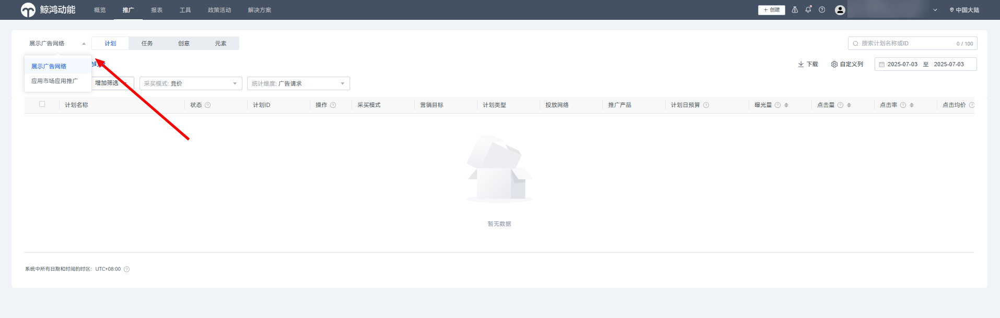

  展示广告网络推广界面：

  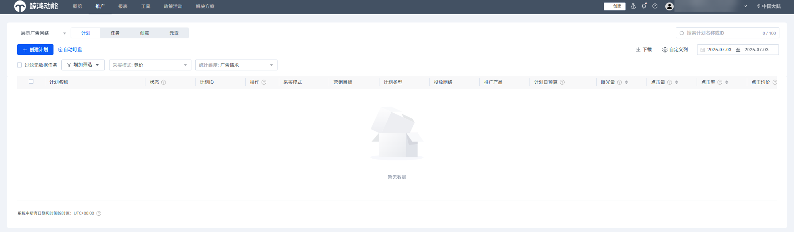

  应用市场应用推广界面：

  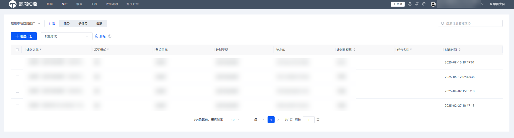

<strong>报表界面</strong>

- 同时开通了展示广告网络和应用市场应用推广权限的账户可以通过左上角红框处单击切换到不同推广范围的报表界面。

  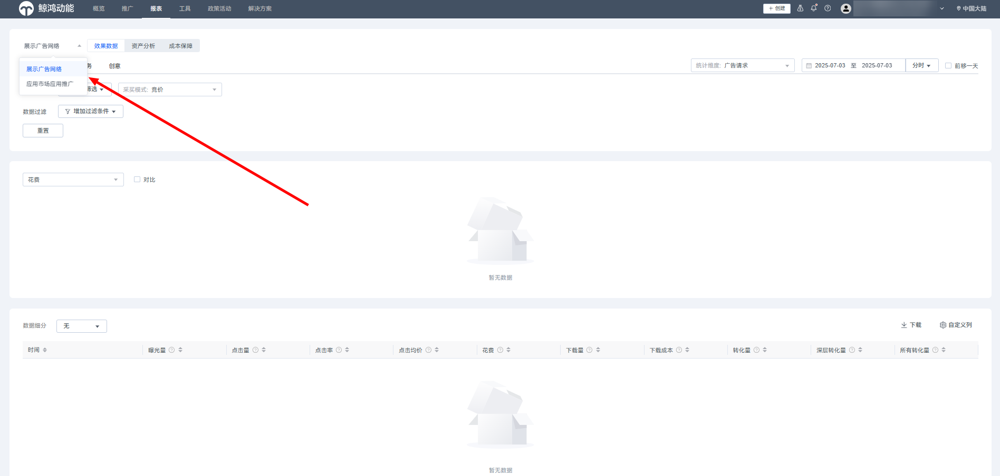

  展示广告网络报表:

  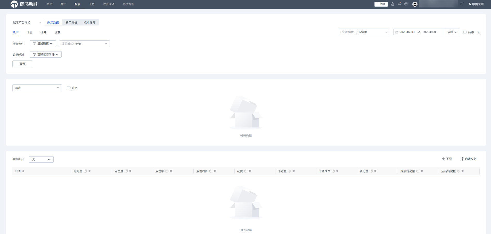

  分为效果数据、资产分析和成本保障三个部分：

  效果数据支持按照账户、计划、任务和创意等维度查看投放数据，详情参见“[查看广告效果](/docs/monetize/promotion/ads_chakan-0000001054974499)”。

  资产分析支持按照商品投放和创意模板两个维度查看数据，该功能为白名单开放，详情参见“[动态商品广告](https://developer.huawei.com/consumer/cn/doc/promotion/ads_youhua_dpa01-0000001932970577)”。

  成本保障支持投放oCPC任务的激励数据查询。

   

  对于报表中的<strong>“</strong>指标口径<strong>”</strong>说明：

  广告请求指所有指标都按照该次广告请求发生的时间统计。

  转化回传指转化跟踪的指标（激活、表单提交）按照实际回传转化的时间进行统计，非转化跟踪指标（曝光、点击、下载）仍按照请求发生的时间统计。

  示例：

  | 时间 | 12月1日23：55 | 12月1日23：59 | 12月2日00：01 | 12月2日00：10 | 12月3日08：00 | 12月4日08：00 | 12月4日08：10 |
  | --- | --- | --- | --- | --- | --- | --- | --- |
  | 用户行为 | 用户在华为视频请求广告 | 用户产生了曝光 | 用户产生了点击 | 用户下载完成 | 用户完成了激活 | 用户完成了次日留存 | 用户完成了付费 |
  | 广告请求口径 | / | 所有数据记录在2020/12/1 | | | | | |
  | 转化回传口径 | / | 曝光：12月1日 | 点击：12月1日 | 下载：12月1日 | 激活：12月3日 | 次留：12月4日 | 付费：12月4日 |

  应用市场应用推广报表：

  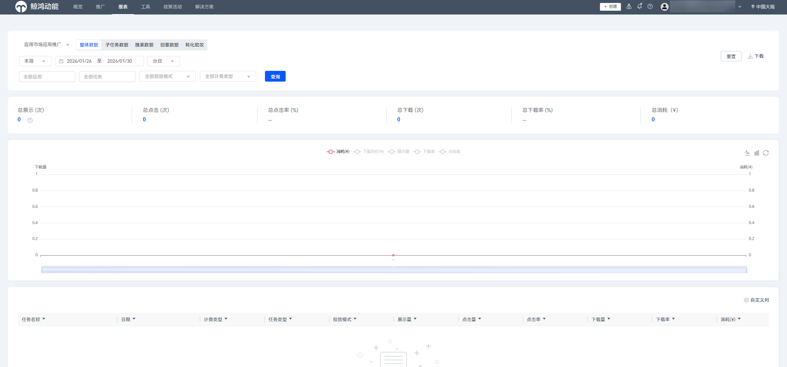

  应用市场应用推广报表支持整体数据、子任务数据、搜索数据和创意数据四个维度查看数据，同时您也可以通过应用、任务、投放模式和计费类型筛选查询数据。详情请参考：[查询整体数据报表](/docs/monetize/promotion/bp-delivery-task-management-overall-data-0000001294054000)

<strong>工具</strong>

- 您可以通过移动鼠标到图中红框序号1或2处，进行不同推广范围权限（展示广告网络或应用市场应用推广）的工具页面的切换。

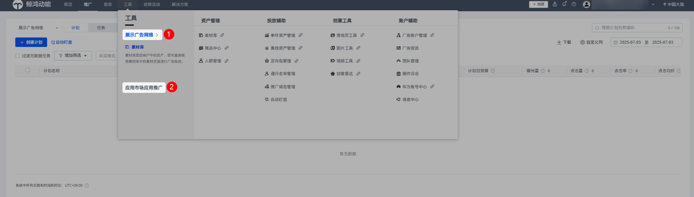

工具-展示广告网络：为了帮助广告主更好地管理和优化广告账户，针对展示广告网络推广，平台提供了一系列广告投放工具，包含资产管理、投放辅助、创意工具和账户辅助等功能，更多详情请参考[工具](https://developer.huawei.com/consumer/cn/doc/promotion/ads_gongju01-0000001458876609)。

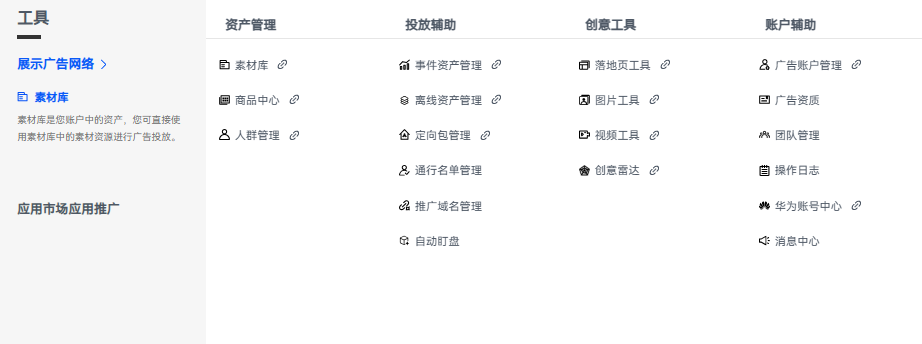

工具-应用市场应用推广：为了帮助广告主更好地管理和优化广告账户，针对应用市场应用推广，平台同样提供了一系列广告投放工具，包含资产管理、投放辅助、创意工具和账户辅助等功能，更多详情请参考：[功能操作指南](https://developer.huawei.com/consumer/cn/doc/promotion/bp-functions-0000001337372921)

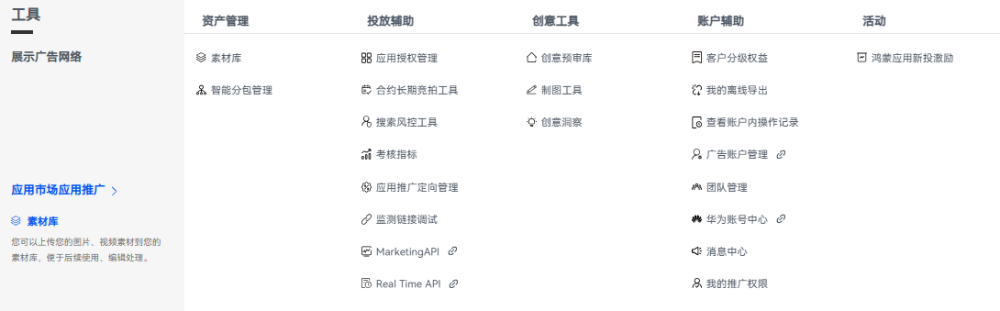

<strong>解决方案</strong>

仅开通应用市场应用推广的广告账户权限才会展示，解决方案提供卸载召回和贷款行业解决方案的功能。

- 卸载召唤：在应用市场内，通过召回创意，召回活动等形式在巨大流量中定位卸载用户，进行高效召回。
- 贷款行业解决方案：通过定制化的贷款行业特有功能和专属流量场景，一站式助力突破营销困境，在应用市场中高效获客。

更多详情请参考：[卸载召唤](https://developer.huawei.com/consumer/cn/doc/promotion/bp-functions-load-recall-0000001417593661)、[贷款行业解决方案](https://developer.huawei.com/consumer/cn/doc/promotion/bp-functions-lending-industry-solutions-0000001965441244)。

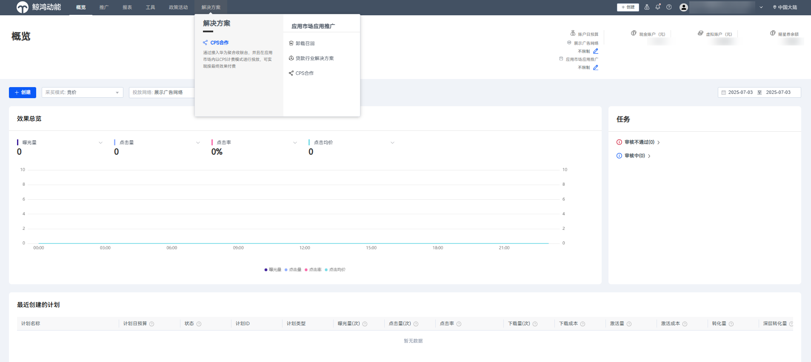

<strong>政策活动</strong>

符合条件的账户可以通过政策活动模块查看相关的激励计划，单击“报名申请”申请报名。

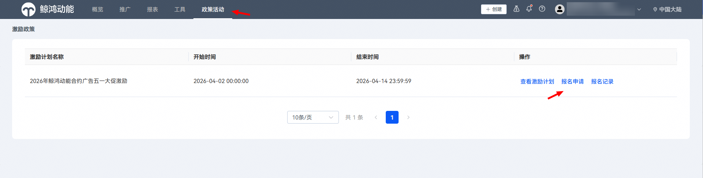

## 相关链接

[人群管理](https://developer.huawei.com/consumer/cn/doc/promotion/ads_gongju04-0000001458996605)

[事件资产管理](/docs/monetize/promotion/ads_gongju08-0000001469108293)

[创意中心](/docs/monetize/promotion/ads_gongju27_cygj-0000001428820894)

[团队管理](/docs/monetize/promotion/ads_gongju22-0000001459036953)

## 相关链接

[开户流程](/docs/monetize/promotion/ads_kaihu01-0000001185834834)

[联系我们](/docs/monetize/promotion/ads_lxwm01-0000001192387242)
