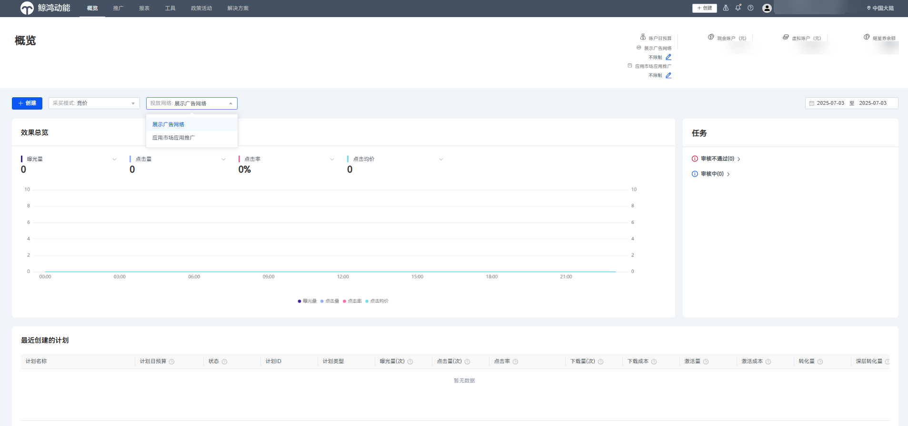
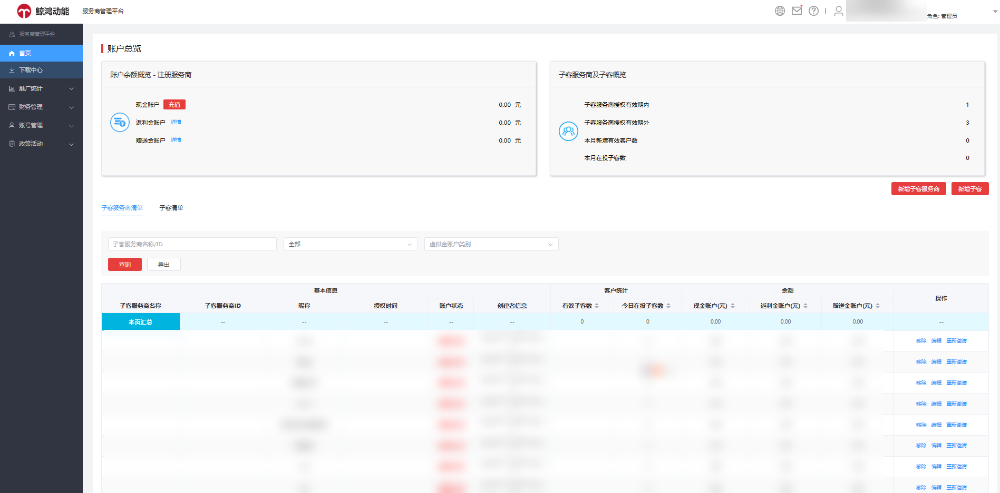
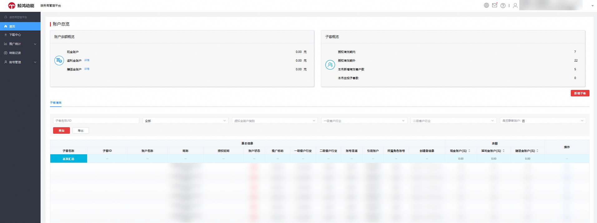
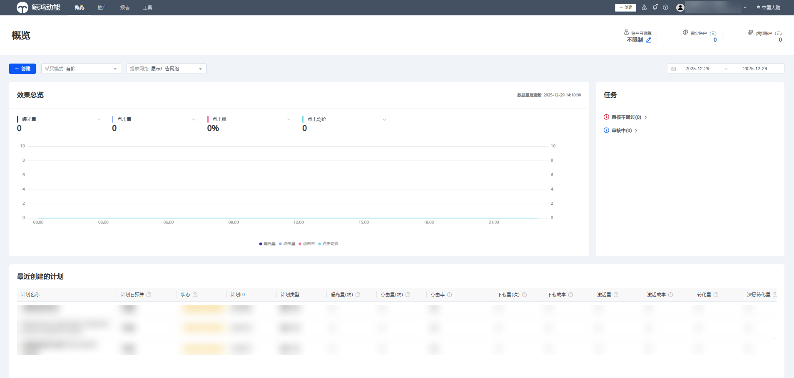

# 概述

## 概述

## 名词解释

账号：用于登录、交易或查询的场景，标识一个人或者组织登录访问系统。

账户：广告主在平台开通的一个户头，用于承载资金和投放等一系列行为。

## 华为账号与管理式华为账号

鲸鸿动能华为账号分为普通华为账号和管理式华为账号：

- <strong>华为账号</strong>：是访问所有华为服务的唯一用户账号，用以帮助您更好地使用华为应用、服务、网站或其他非华为服务，在登录的不同设备上享受统一快捷的账号服务体验，广告主注册华为账号后才能在鲸鸿动能投放平台进行一系列操作和服务，更多详情请参考[华为账号](/docs/monetize/promotion/ads-hwzh-0000002188054913)。

- <strong>管理式华为账号：</strong>管理式华为账号是面向合作伙伴提供的账号生命周期管理服务，组织管理员可以创建多个成员账号，对成员账号进行管理、冻结等操作。成员账号可用于注册鲸鸿动能广告账户，以此突破1个安全手机号只能绑定5个华为账号的限制，更多详情可参考[管理式华为账号](/docs/monetize/promotion/ads_glszh01-0000001321238810)。

 

每个华为账号必须绑定安全手机号，一个手机号最多只能绑定5个华为账号；通过管理式华为账号平台，广告主1个手机号可以创建多个华为账号，无安全手机号绑定个数限制。

## 鲸鸿动能广告账户

鲸鸿动能广告账户分为直客账户、服务商账户、子客服务商账户、子客账户、经理账户五种类型。

- <strong>直客账户：</strong>如果您只推广自己企业的产品和服务，请选择直客类型，支持投放广告、充值账户，直客账户属于单独的账户，与其他账户类型无关联。

   

  在注册直客账户的过程中，会有不同的推广范围权限供您选择，您可以根据实际情况和需求，选择“展示广告网络”和“应用市场应用推广”中的一种或者两种权限同时开通，不同推广范围权限的直客账户在功能和界面上会有所不同，更多详情请参考：[直客账户注册（展示广告网络）](/docs/monetize/promotion/ads-zkzhzcyygg-0000002507044685)、[直客指南（应用市场应用推广）](https://developer.huawei.com/consumer/cn/doc/promotion/bp-start-guest-0000001273458482)。

  如下图为同时开通两种推广范围权限的直客账户界面。

  

- <strong>服务商：</strong>如果您是广告代理商，代理其他企业投放广告，请注册成服务商账户；

   

  在注册服务商账户的过程中，您可以根据实际情况和需求，选择推广范围权限为“展示广告网络”或“应用市场应用推广”中的一种进行注册，其在功能和界面上会有所不同。<strong>应用市场应用推广服务商账户内容详情请参考：[客户投放伙伴指南](https://developer.huawei.com/consumer/cn/doc/promotion/bp-start-customer-partner-0000001323978477)</strong>

  <strong>以下均为开通展示广告网络权限的服务商账户内容。</strong>

  <strong>展示广告网络权限</strong> <strong>服务商账户分为三个层级：</strong> <strong>服务商、子客服务商、子客</strong> <strong>，如下图：</strong>

  

  - 每个服务商可以新增多个子客服务商和子客，子客服务商可以新增多个子客。
  - 服务商和子客服务商账户只用于管理，不能创建投放任务，只有子客账户可以创建投放任务。
  - 只有服务商账户可以进行充值，子客服务商、子客均不可进行充值，子客服务商、子客需要由他的上一级进行转账。
  - 服务商账户如图所示：

    

    更多详情请参考[服务商账户](/docs/monetize/promotion/ads-fuwushangzhanghaozhuce-0000001861670469)。
  - 子客服务商账户如图所示：

    

    更多详情请参考[子客服务商账户](/docs/monetize/promotion/ads-zikefuwushangzhuce-0000001861750633)。
  - 子客账户如图所示：

    

    更多详情请参考[子客账户](/docs/monetize/promotion/ads-zikezhuce-0000001814790812)。

    <strong>鲸鸿动能广告服务商管理平台</strong>：是鲸鸿动能广告为服务商提供的用于管理子客服务商及子客的系统，您可以登录不同类型的服务商账户进行管理，不同推广范围权限的服务商账户其在功能和界面会有所不同，详情可参考[：服务商账户管理（展示广告网络）](https://developer.huawei.com/consumer/cn/doc/promotion/ads-fwsglpt-0000001900947765)、[客户投放伙伴主账户（应用市场应用推广一级服务商）](https://developer.huawei.com/consumer/cn/doc/promotion/fusion-level1-partner-0000002466178454)、[客户投放伙伴子账户（应用市场应用推广子客服务商）](https://developer.huawei.com/consumer/cn/doc/promotion/fusion-level2-partner-0000002499177789)。

- <strong>经理账户</strong>：同一公司使用多个账户进行广告投放时，希望能够对多个账户统一管理。通过给广告账户绑定经理账户，您可以在登录经理账户后方便的在各个广告账户之间切换登录并进行数据查看等操作，同时可通过经理账户实现跨账户共享广告资产。

更多详情请参考[经理账户](/docs/monetize/promotion/ads-jinlizhanghu-0000001878420417)。
