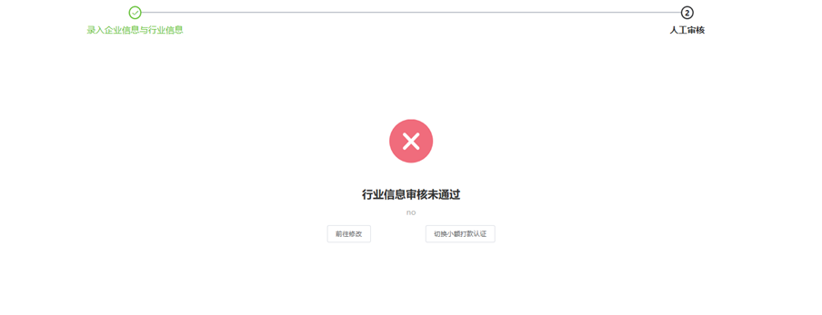
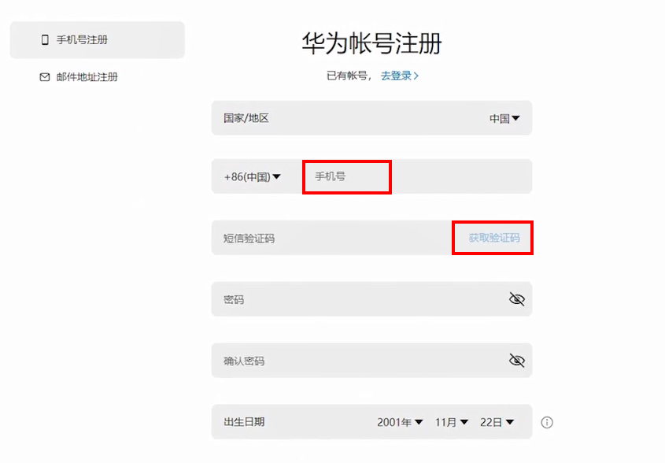
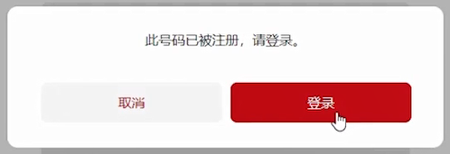

# FAQ

## 开户注册

<strong>Q1：</strong> <strong>广告主开户需要多长时间？</strong>

<strong>A：</strong>广告主开户审核时长为1-3个工作日内。

爆量异常的SLA会延迟1-3个工作日不等，建议使用极速开户。

<strong>Q2：</strong> <strong>开户审核被拒了怎么办？</strong>

<strong>A：</strong>审核被拒后，再次登录将显示审核未通过的原因，此时可以根据页面提示进行操作，您可以选择修改资料，也可以选择切换认证方式。

<strong>Q3</strong> <strong>：</strong> <strong>服务商为广告主开户的流程是什么？</strong>

<strong>A</strong>：开户流程如下：

服务商：从服务商后台向广告主的邮箱发送开户邀请

广告主：1. 注册华为账号 2. 进行企业信息认证

<strong>Q4</strong> <strong>：</strong> <strong>已经注册过华为账号的手机号/邮箱号如何开户？</strong>

<strong>A</strong>：以下两种场景，需要按照已有华为账号开户流程完成开户：

场景一：广告主在开户前已经注册了华为账号。

场景二：服务商为广告主开户时，已经在注册页面输入了手机号/邮箱号，完成了注册环节，在企业信息认证页面超时登出或页面关闭。此时系统已经生成了华为账号，请服务商按照已有华为账号开户流程完成开户。

<strong>已有华为账号开户流程如下</strong>：

（1）服务商重新向广告主邮箱发送开户邀请；

（2）广告主单击邮箱中的注册链接，跳转到华为账号注册界面，选择手机/邮箱注册；

（3）输入已生成的华为账号（已完成注册的手机号或者邮箱号），单击发送验证码；

（4）输入验证码后，跳出弹框提示“此号码已被注册，请登录”；

（5）单击此弹框中的“登录”，将跳转华为账号登录界面，登录已有华为账号，将直接进入企业信息认证环节。

<strong>Q5：</strong> <strong>开通鲸鸿动能广告账户时，允许A企业使用自己的营业执照代理第三方B企业开户么？</strong>

<strong>A：</strong>不允许，鲸鸿动能广告账户仅接受推广主体用自己的营业执照开户。

<strong>Q6：注册华为账号并完成开户怎么修改</strong> <strong>绑定的手机号？</strong>

<strong>A：</strong>登录广告平台，单击“工具”-“华为账号中心”，即可在页面中修改绑定手机号；若您登录遇到问题，请单击以下对应链接查看具体解决方法：

- [忘记账号/密码如何找回？](https://developer.huawei.com/consumer/cn/doc/start/account-management-0000001052865467#section9937111542518)
- [如何登录华为账号？](https://developer.huawei.com/consumer/cn/doc/start/registration-and-verification-0000001053628148)
- [如何申请停用账号？](https://developer.huawei.com/consumer/cn/doc/start/account-management-0000001052865467#section096391211287)

<strong>Q7：同一公司主体是否支持开设多个广告账户？</strong>

<strong>A：</strong>支持。

<strong>Q8：客户行业和审核行业有什么区别？</strong>

<strong>A：</strong>审核行业：依据国家法律法规要求，推广开户主体经营范围内的行业及所需提交的行业资质。

客户行业：当前账户所推广的产品、推广标的所属行业分类。
