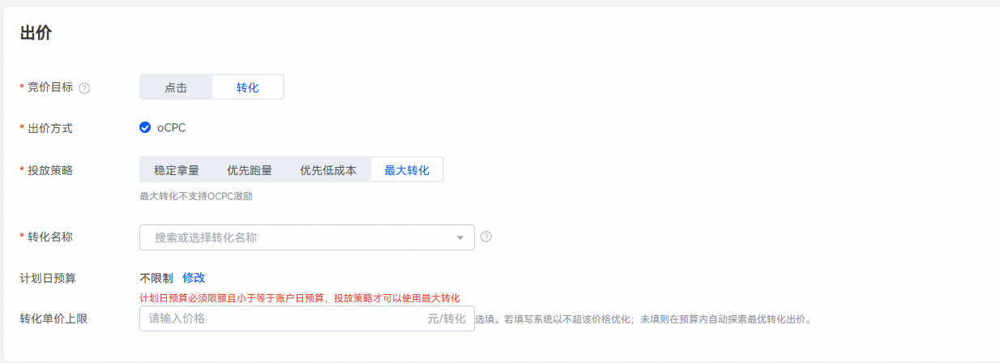

# oCPC使用指引

1. <strong>开通oCPC权限：</strong>广告主向运营申请开通对应转化目标的oCPC权限。
2. <strong>新建转化跟踪指标并选择跟踪方式：</strong>详情参见[转化跟踪接口](/docs/monetize/promotion/ads_gongju08-0000001469108293)，若您选择的跟踪方式为API接入，需要完成联调并确保转化回传数据正常。
3. <strong>创建oCPC任务：</strong>权限开通后，登录投放平台即可创建oCPC任务。

   如下图所示，在创建任务阶段，根据实际需求设置该oCPC任务的“转化目标”、[“投放策略”](/docs/monetize/promotion/ads_ocpc10-0000001473118477)、“期望转化成本”等参数。

   
4. <strong>判断oCPC任务是否度过学习期：</strong>任务回传转化数量满足下表要求：

   | 转化目标 | 当前学习期转化数量要求 | 学习期时间期限 |
   | --- | --- | --- |
   | 激活 | 5 | 7天 |
   | 注册 | 5 | 7天 |
   | 次留 | 5 | 7天 |
   | 付费 | 5 | 7天 |
   | 表单提交 | 1 | 5天 |
   | Venus表单提交 | 1 | 5天 |
   | 用户唤醒 | 5 | 7天 |
   | 有效线索 | 1 | 5天 |
   | 授信 | 1 | 5天 |
   | 关键行为 | 10 | 7天 |
   | 自定义网页 | 15 | 7天 |

    

   注：针对创建任务创意中选择的部分行业是免学习期的。

## oCPC出价产品

## 单目标产品

单出价产品以目标成本转化率作为广告的优化目标，系统根据您设置的目标转化出价，实时预估每次展示的转化概率并智能调控出价，为广告主获取更多优质流量、提升转化效率。

当前oCPC单目标产品支持的转化目标和对应学习期任务回传转化数量要求：

| 转化目标 | 学习期转化数量要求 |
| --- | --- |
| 激活 | 7天5个激活 |
| 注册 | 7天5个注册 |
| 次留 | 7天5个次留 |
| 付费 | 7天5个付费 |
| 表单提交 | 5天1个表单提交 |
| Venus表单提交 | 5天1个Venus表单提交 |
| 唤醒 | 7天5个唤醒 |
| 有效线索 | 5天1个有效线索 |
| 授信 | 5天1个授信 |
| 关键行为 | 7天10个关键行为 |
| 自定义网页 | 7天15个加桌 |

## 双目标产品

### 双出价

投放双出价需同时设置两个出价，即浅层出价和深层出价。保率双出价产品以目标率（目标率=浅层出价/深层出价）为优化目标；非保率双出价产品以成本（包括浅层和深层）为优化目标，不保目标率。系统将按照广告主设置的浅层、深层出价或目标率进行优化和调节，最终保证目标的达成

当前oCPC双出价产品支持的转化目标和对应学习期任务回传转化数量要求如下：

| 转化目标 | 一阶段（学习期） | 二阶段 | 三阶段 |
| --- | --- | --- | --- |
| 激活次留保率双出价 | 7天5个激活 | 7天8个次留 | / |
| 唤醒次留保率双出价 | 7天5个唤醒 | 7天8个次留 | / |
| 激活付费非保率双出价 | 7天5个激活 | 7天5个付费 | / |
| 唤醒付费非保率双出价 | 7天5个唤醒 | 7天5个付费 | / |
| 表单提交/表单提交（Venus）-有效线索非保率双出价 | 5天1个表单提交 | 5天1个有效线索 | / |
| 注册/表单提交-授信非保率双出价 | 7天5个注册 | 5天1个授信 | / |
