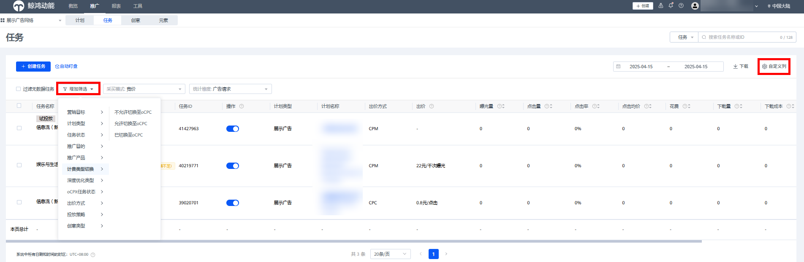

# 一键切换

## 功能简介

为降低oCPC新任务学习成本，扩大账户已有优质转化特征的优势，提升学习期通过率，鲸鸿动能广告平台支持CPX任务一键切换成oCPC任务。

一键切换功能使用前提：

1. 该账户已开通oCPC权限，完成转化跟踪联调；
2. 该CPX任务投放的版位支持oCPC出价方式；
3. 满足学习期任务回传转化数量要求：

   | 转化目标 | 当前学习期转化数量要求 | 学习期时间期限 |
   | --- | --- | --- |
   | 激活 | 5 | 7天 |
   | 注册 | 5 | 7天 |
   | 次留 | 5 | 7天 |
   | 付费 | 5 | 7天 |
   | 表单提交 | 1 | 5天 |
   | venus表单提交 | 1 | 5天 |
   | 用户唤醒 | 5 | 7天 |
   | 有效线索 | 1 | 5天 |
   | 授信 | 1 | 5天 |
   | 关键行为 | 10 | 7天 |
   | 自定义网页 | 15 | 7天 |

## 操作步骤

1. <strong>任务筛选</strong>，筛选出允许切换至oCPC的任务。

   方法1：在推广界面选择“任务”-“增加筛选”-“计费类型切换”

   方法2：在自定义列中找到“属性指标”-“计费类型切换”

   

    

   换成功或不支持切换的任务显示“—”。
2. <strong>编辑任务</strong>，选中可切换至oCPC的任务，单击“编辑”。
   1. 设置竞价目标为“转化”；
   2. 选择投放策略；
   3. 设置转化名称和期望转化成本；
   4. 单击提交，完成一键切换。

   

    

   完成一键切换后，默认任务状态为“投放中”，且该任务进入oCPC稳定期。
