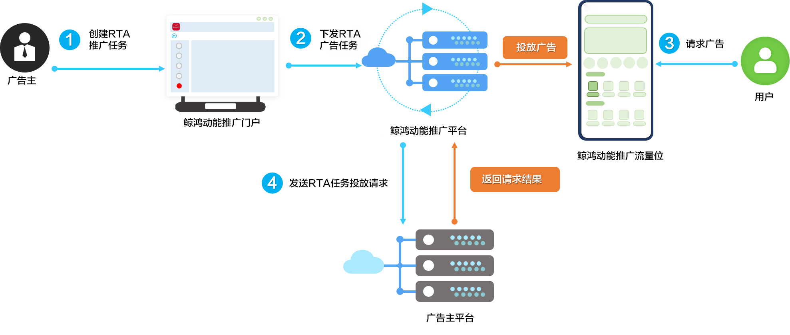

# 简介

## 功能简介

<strong>RTA</strong>（Real Time API）广告形式，是指广告平台收到媒体请求后，除了引擎本身的各项过滤和排序逻辑，还会实时的请求、接收广告主对“是否为目标用户”的反馈结果。如是广告主的目标用户，则继续走排序、竞价流程；如不是广告主的目标用户，则从广告队列内删除。

广告主投放过程中，希望利用自有的一方数据来判断是否目标用户，可使用RTA功能进行判断。

## 优势

<strong>实时响应</strong>

1. 广告主可以实时更新自己的目标人群，无需打包上传。
2. 系统实时响应广告主的变更。

<strong>数据安全</strong>

1. 广告平台未暴露自身用户画像、特征、行为。
2. 广告主未暴露自身深度转化行为。

<strong>灵活决策</strong>

1. 广告主通过回传出价/出价比例介入竞价策略，灵活决策不同质量用户的价值。
2. 广告主自主决策“是否为目标用户”，“是否参与竞价”。

## 权限开通

如您需使用RTA功能，请联系运营或服务商开通权限。

## 相关链接

[《鲸鸿动能RTA接口说明》](https://alliance-communityfile-drcn.dbankcdn.com/FileServer/getFile/cmtyPub/011/111/111/0000000000011111111.20260529160107.02112316066656133981813788529923:20260531101325:2800:53D5CF9219FB8F28F979844085D7CD83BE52508A55031F5073E632F664E410E2.pdf?needInitFileName=true)
