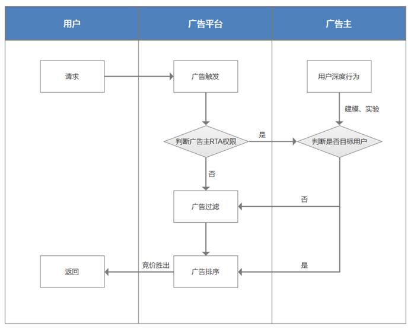
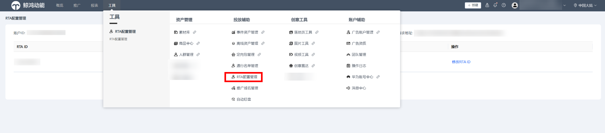
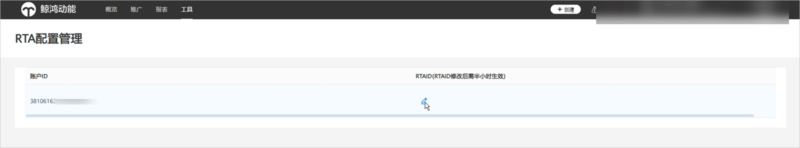

# 流程说明

## RTA流程

## RTA对接流程

1. <strong>权限申请</strong>：请联系运营或服务商申请开通RTA权限。
2. <strong>对接测试</strong>：鲸鸿动能生成密钥明文后将会通过邮件告知您。并根据调研表信息，构造请求对接测试，详见[接口说明](https://developer.huawei.com/consumer/cn/doc/promotion/ads_rta04-0000001474730924)。
3. <strong>上线使用：</strong>联调通过后由鲸鸿动能进行上线配置，配置完成即可上线使用。

## RTA自助配置

您可通过Marketing API接口自助查询和修改RTA策略，具体接口信息请参考[RTA策略管理](https://developer.huawei.com/consumer/cn/doc/promotion/ads_rtacelue-0000001139919431)。

 

<strong>新建RTA账户/原有账户开通RTA权限/已开通RTA权限账户关闭权限</strong>等操作仍需联系运营或服务商处理。

<strong>查询</strong>

频率控制 每个账户&lt;=100次/min

①请求消息

- 账户ID

②返回消息携带信息

- 企业名称
- 账户ID
- 处理方式（默认播放、默认过滤）
- 缓存时间窗（1h、1d、不缓存、10-1440min自定义）
- RTA ID

<strong>修改</strong>

频率控制 每个账户&lt;=20次/天

① 请求消息携带信息（不可通过接口修改RTA接口地址和企业名称，返回的配置将覆盖原配置）

- 账户ID（必填）
- 处理方式（默认播放、默认过滤）
- 缓存时间窗（1h、1d、不缓存、10-1440min自定义）
- RTA ID

②返回消息携带信息

- 接口错误码：成功、失败、错误码

## 广告主自行配置RTA ID

## 操作步骤

1. 您可通过投放端 “工具 ”-&gt;“投放辅助”-&gt;“RTA配置管理”进入RTA配置管理页面。

    

   广告账户开启RTA权限时，工具栏内才有“RTA配置管理”选项。

   
2. 您可以配置/编辑RTA ID。

   
3. 编辑完成后，请单击“确定”，RTA ID修改后需半小时生效。如您后续还需修改，单击编辑再次修改即可。
