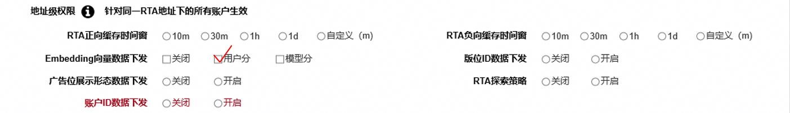
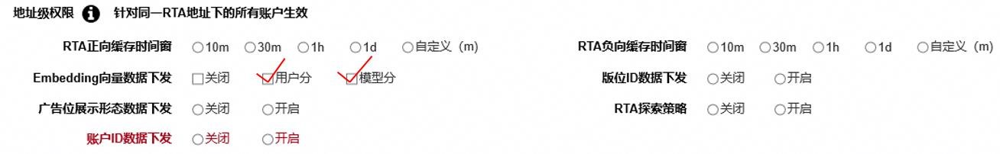

# FAQ

<strong>Q1：签名密钥如何生成</strong> <strong>？</strong>

签名密钥由鲸鸿动能生成明文。

<strong>Q2：缓存模式的缓存说明</strong>：

1. 缓存模式的缓存时长支持 1h、1天（24h）、自定义（10-1440min）、不缓存。
2. 每一次请求都按照以下这个逻辑：优先使用缓存策略，没有缓存策略用广告主实时返回的策略（等45ms），45ms内没有返回结果的使用默认策略。
3. 广告主返回结果，若45ms内返回则实时生效；45ms-300ms的返回结果在用户第二次请求时生效（即作为第二次请求的缓存策略）；超过300ms的结果不记录。

<strong>Q3：RTA</strong> <strong>接口设备标识</strong> <strong>有哪些？</strong>

RTA接口设备标识有oaid和ifa。在广告资源来自于非华为设备时（即跨端场景），可能由于非华为设备系统版本低等原因导致无法采集OAID，故需要新增ifa设备标识。RTA接口设备标识如下表所示：

| 场景 | 设备系统 | 设备标识 | RTA接口设备标识 |
| --- | --- | --- | --- |
| 华为设备 | HarmonyOS | OAID | oaid |
| 国内跨端场景 | 安卓系统 | 能采集OAID则采集OAID | oaid |
| 国内跨端场景 | ios系统 | IDFA | ifa |
| 海外跨端场景 | ios系统 | IDFA | ifa |
| 海外跨端场景 | 安卓系统 | GAID | ifa |

<strong>Q4：响应接口出价比例（priceweight）说明</strong>

- 出价比例（priceweight）取值范围（0,50.00]，支持15-16位有效数字的小数。
- 出价比例（priceweight）作用于出价：若返回出价比例（priceweight）大于等于50则按50倍修改出价，返回在0~50（不能等于0）之间则将原任务出价\*出价比例作为新出价。
- oCPC出价列表（ocpcPriceInfoList）中出价比例（priceweight）对oCPC任务生效，需要联系运营单独为账户开通RTA-oCPC出价权限。

<strong>Q5：响应接口出价（price）说明</strong>

- 出价（price）作用于出价，RTA返回的出价可代替原投放端出价参与竞价；同时返回出价（price）和出价系数（priceweight）时，出价（price）生效，出价比例（priceweight）不生效。
- oCPC出价列表（ocpcPriceInfoList）中出价（price）对oCPC任务生效，需要联系运营单独为账户开通RTA-oCPC出价权限。
- 出价（price）值若小于投放端任务要求最低出价（即版位底价），则RTA返回结果无效，该任务将被过滤，不会参与最终竞价排序；若出价（price）值大于投放端任务要求最低出价，则以RTA返回出价为准，使用RTA返回出价参与最终竞价排序。

- 出价（price）支持15-16位有效数字的小数，取值范围与投放端取值范围一致。

  |  | 国内 | 海外 |
  | --- | --- | --- |
  | 最高出价 | 参照计划日限额配置，无日限额则默认取999999999 | 参照计划日限额配置，无日限额则默认取999999999 |
  | 最低出价 | 参照版位底价 | 参照版位底价和国家底价 |
- 出价（price）按计费方式返回出价，可以只返回某一种或某几种计费方式的出价，如只返回\\{ "cpm":10\\}，则只对CPM计费任务生效，其他类型任务维持原价。
- "currency":"CNY"币种为海外投放预留字段，国内不用传，币种只支持CNY、USD、EUR、GBP、JPY、HKD这6种，默认是CNY。

<strong>Q6：</strong> <strong>RTA-oCPC出价相关说明</strong>

- 如需对oCPC任务进行调价，需使用oCPC出价列表（ocpcPriceInfoList）中出价（price）或出价比例（priceWeight），不能直接填在UserInfo的出价（price）或出价比例（priceWeight）中；oCPC出价列表（ocpcPriceInfoList）需要联系运营单独为账户开通RTA-oCPC出价权限并进行联调。
- 当前RTA已支持oCPC单出价和双出价场景。
- RTA-oCPC出价不保成本，也不享受赔付政策。

<strong>Q7：</strong> <strong>RTA-oCPC双出价相关说明</strong>

- 在RTA的RtaResponse的User的OcpcPriceInfo中新增deepConvType，表示双出价的深层目标转化类型。只有双出价时才生效。双出价的范围目前有：激活注册、激活次留、激活付费、唤醒次留、唤醒付费；

- 双出价只支持用出价比例priceWeight；
- 以广告主对激活单出价、激活次留和激活付费双出价举例：

a）激活单出价

convType = 激活

deepConvType = 不配置

b）激活次留双出价

convType = 激活

deepConvType = 次留

c）激活付费双出价

convType = 激活

deepConvType = 付费

d）单出价的通配

convType = 10000

deepConvType = 不配置

e）双出价的通配

convType = 10000

deepConvType = 10000

<strong>Q8.关于 74.110 版本（2025-12-03）上线的能力 Embedding 向量数据下发支持用户分和模型分多选的说明</strong>

如果是单选用户向量分，则协议中 embv 字段填写的是用户向量分的内容（即一个普通字符串）。如果是单选模型向量分，则协议中 embv 字段填写的是模型向量分的内容（即一个普通字符串）。

如果是多选了用户向量分和模型向量分，则协议中的 embv 字段填写的是一个 JSON 内容字符串。

（即："\\{\"user\_score\_embv\":\"用户向量分内容\",\"model\_score\_embv\":\"模型向量分内容\"\\}"）

举例：

<strong>在 WO 界面 Embedding 向量数据下发 选项中，单选用户分或者模型分：</strong>

请求体：

\\{

… … // 其他字段省略

“embv”: “用户向量分内容/模型向量分内容” // 普通字符串

第34页，共35页

\\}

<strong>在 WO 界面 Embedding 向量数据下发 选项中，多选用户分和者模型分：</strong>

请求体有如下可能：

\\{

… … // 其他字段省略

“embv”: "\\{\"user\_score\_embv\":\"用户向量分内容\",\"model\_score\_embv\":\"模型向量分内容

\"\\}"

\\}

\\{

… … // 其他字段省略

“embv”: "\\{\"user\_score\_embv\":\"用户向量分内容\"\\}" // 模型向量分内容为 null

\\}

\\{

… … // 其他字段省略

“embv”: "\\{ \"model\_score\_embv\":\"模型向量分内容\"\\}" // 用户向量分内容为 null

\\}
