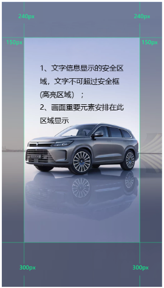
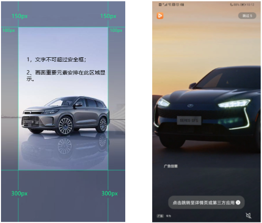
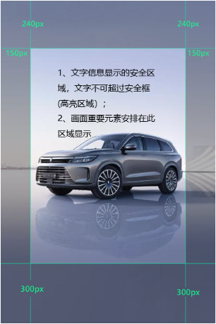
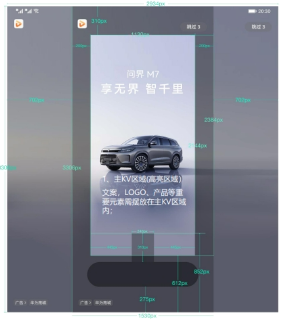
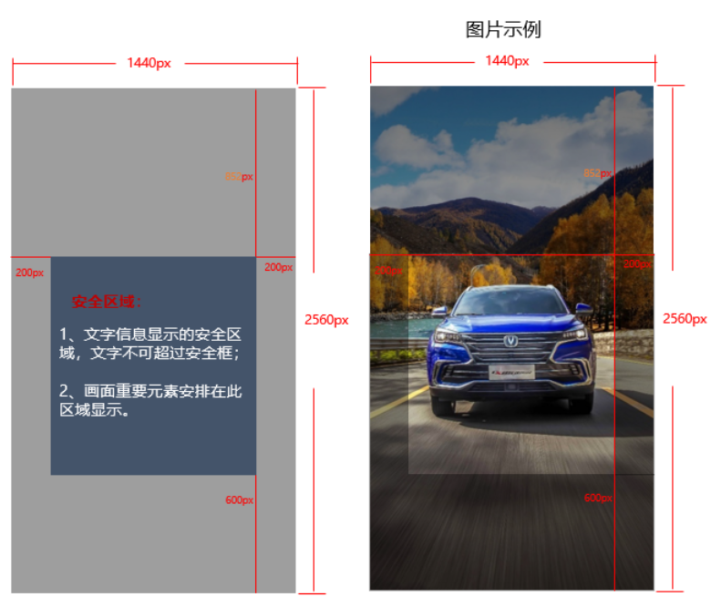
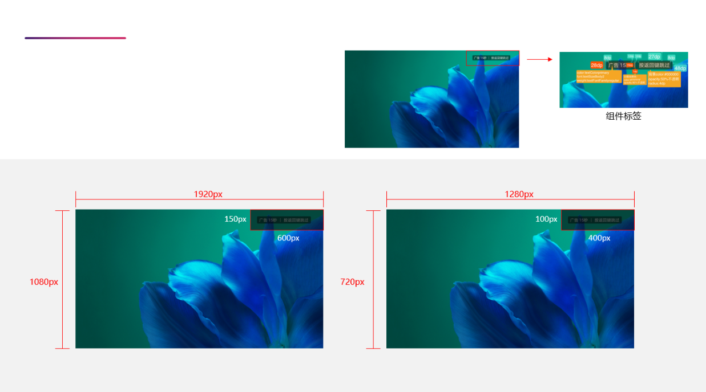
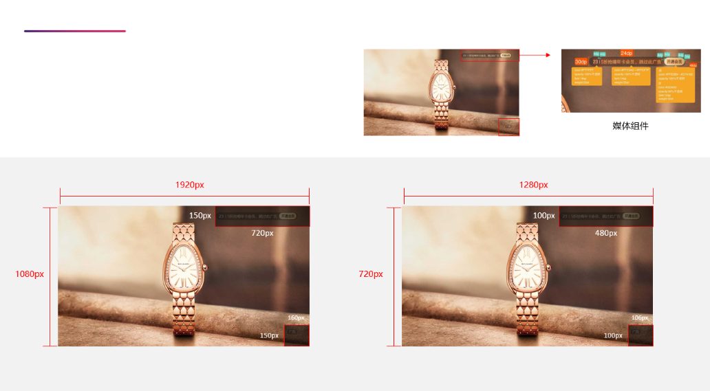

# 安全区要求

## 开屏广告安全区域设置参考

 

如果您投放<strong>开屏版位</strong>的应用促活广告，应用促活的链接必须具备一键返回的能力，一键返回是指当用户看到广告并点击进入页面后，在界面上可以返回应用的一种能力，更多配置及样式请参考：[鲸鸿动能一键返回对接说明](https://alliance-communityfile-drcn.dbankcdn.com/FileServer/getFile/cmtyPub/011/111/111/0000000000011111111.20260529160102.63622989461622075576442309376485:20260531100740:2800:2A8D6162D3484C0A66F6BF043DD86DEFF7B367A2C29E53FCEF7ADB016C300C89.pdf?needInitFileName=true)。

<strong>统一开屏9:16竖版大图开屏安全区域（1080\*1920）</strong>

尺寸：1080\*1920px

格式：jpg/png/gif

大小：大小不超过150KB

深色阴影区域为非安全。文案、主体等需要避开所有阴影位置摆放。

<strong>统一开屏9:16竖版视频开屏安全区域（720\*1280）</strong>

尺寸：720\*1280px

格式：MP4

大小：大小不超过1024KB

时长：5s

扫描方式：逐步扫描

视频编码H264，音频编码AAC；帧率&gt;=23fps

深色阴影区域为非安全。文案、主体等需要避开所有阴影位置摆放。

<strong>统一开屏2:3竖版大图开屏安全区域（1080\*1620）</strong>

尺寸：1080\*1620px

格式：jpg/png/gif

大小：大小不超过150KB

深色阴影区域为非安全。文案、主体等需要避开所有阴影位置摆放。

<strong>统一开屏折叠屏开屏（ 2934\*3306）</strong>

尺寸：2934\*3306px

格式：jpg/png

深色阴影区域为非安全。文案、主体等需要避开所有阴影位置摆放。

## 杂志锁屏图片安全区域（1440\*2560）

尺寸：1440\*2560px

格式：JPG/JPEG

大小：不超过500KB

注意事项：安全框（白区范围），关键信息不得超过安全框。

## 智慧屏-大屏开机安全区域（1920\*1080/1280\*720）

<strong>主内容安全区</strong>

标识占位：右上；

1920\*1080尺寸阴影区域面积：600\*150px;

1280\*720尺寸阴影区域面积：600\*150px;

关键信息（logo/文字信息）不得位于阴影区域。

## 智慧屏-视频贴片安全区域 (1920\*1080/1280\*720)

<strong>主内容安全区</strong>

标识占位：右上；

1920\*1080尺寸阴影区域面积：720\*150px,右下：160px\*150px

1280\*720尺寸阴影区域面积：480\*100px,右下：106px\*100px

关键信息（logo/文字信息）不得位于阴影区域。

