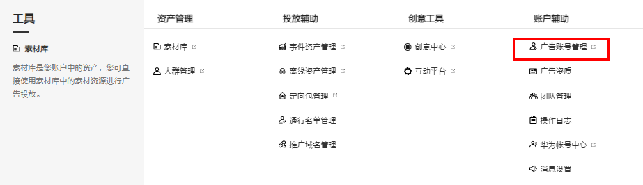
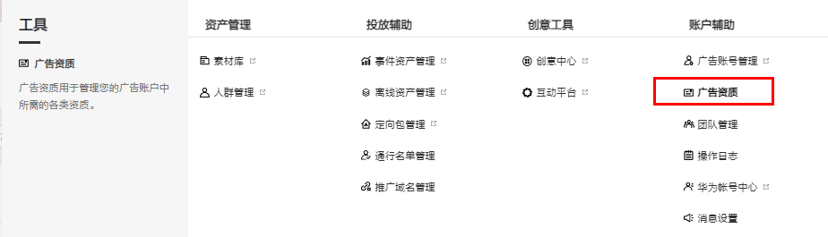
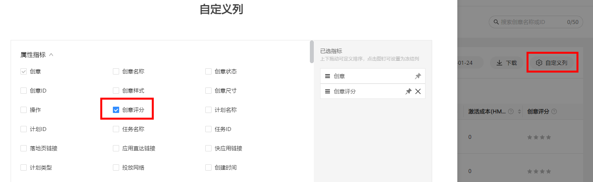

# FAQ

## 资质审核

<strong>Q1：投放账户中的广告资质审核需要多久？</strong>

<strong>A：</strong>广告资质提交后，工作日 24 小时内完成审核；周末 / 节假日提交的资质，将在第一个工作日起 48 小时内按顺序处理。

审核时效内不支持催审，请耐心等待审核结果。如确实有紧急投放需求，请联系您的代理商/渠道经理沟通反馈。

<strong>Q2：资质变更了应该如何修改？</strong>

<strong>A：</strong>（1）如主体资质、行业资质有变更，应在后台上传变更后的资质，上传成功后将触发审核。

入口：“平台首页”-&gt;“工具箱”-&gt;“广告账号管理”。

（2）如广告主需要补充或变更授权证明资质时，需在广告平台补充对应授权及证明资质。

入口：“平台首页”-&gt;“工具箱”-&gt;“广告资质”。

<strong>Q3：企业主体可以变更吗？</strong>

<strong>A：</strong>目前暂不支持公司主体直接变更。

## 素材审核

<strong>Q1：广告审核周期一般是多久？</strong>

<strong>A：</strong>合约展示的审核周期为3个工作日，建议尽早提交素材进行视觉预审，竞价广告工作日当天23：00前提交，会当天审核完毕，晚于23：00提交的任务将于第二天完成审核。

## 广告规范

<strong>Q1：素材为什么会上传失败？</strong>

<strong>A：</strong>请检查素材是否符合对应版位的尺寸要求。

<strong>Q2：网页推广任务输入URL提示不合法？</strong>

<strong>A：</strong>可能是以下三种情况：

① 链接中带“|”是不合法的，要转换成：%7C

例如：

转换前：https://m2.ikea.cn/cn/zh/?cid=ps|cn|fy18\_huawei\_kaiping|201804040925250417\_1

转换后：https://m2.ikea.cn/cn/zh/?cid=ps%7Ccn%7Cfy18\_huawei\_kaiping%7C201804040925250417\_1

② 链接不规范，没有正确使用“/”等连接符

例如：

转换前：https://www.meituan.com?utm\_source=hwkph5

转换后：https://www.meituan.com/?utm\_source=hwkph5

③ 链接中存在空格

<strong>Q3：为什么链接不能以http开头，要用https?</strong>

<strong>A：</strong>以http开头，有可能导致被其他广告主篡改抢量。

<strong>Q4：</strong> <strong>URL技术审核规则是？</strong>

<strong>A：</strong>不允许出现无效链接、加载速度要快、不允许App自动直接下载、不允许自动弹窗、不允许非功能浮层出现在非底部、首跳页面都不允许设置访问权限等。目标url须可以正常访问，不得存在病毒及恶意代码等。

<strong>Q5：素材尺寸是否会影响广告展现的先后？</strong>

<strong>A：</strong>不会。

<strong>Q6：第三方落地页有什么尺寸要求吗？</strong>

<strong>A：</strong>由于不同手机尺寸有差异，因此需要落地页具备自适应能力。

<strong>Q7：如何查看创意的质量评分？</strong>

<strong>A：</strong>登录广告平台，进入“推广”-“创意”，在“自定义列”勾选创意评分即可查看，具体创意评分标准可看以下附件。如果目前创意中查看不了创意评分，可以点击对应创意名称查看对应元素评分。

