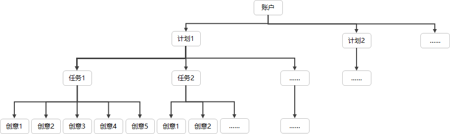
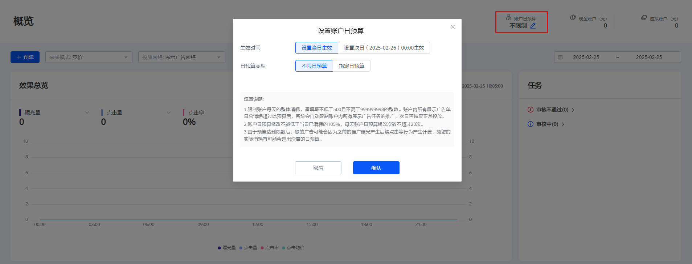
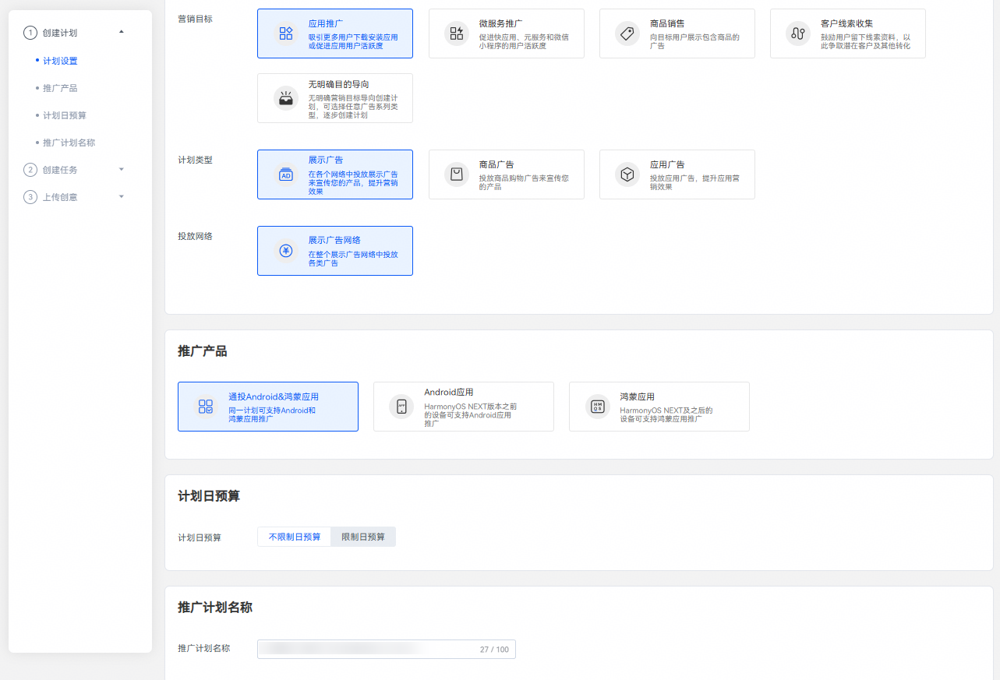
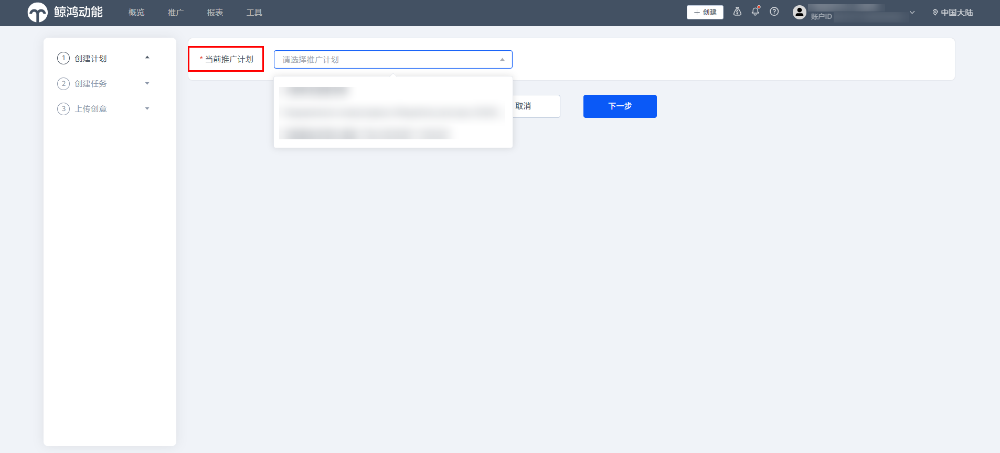
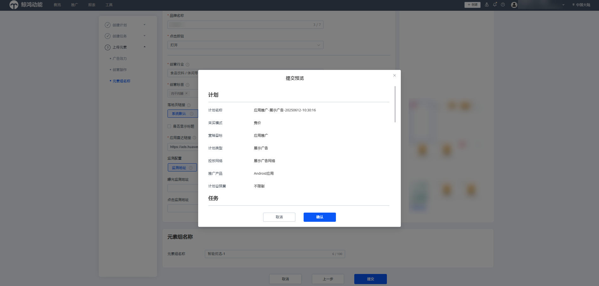

# 简介

## 名词解释

<strong>竞价广告：</strong>即用户自主投放，通过调整价格进行排名，按广告效果付费的广告形式，在信息流中以不固定位置出现，提供多维度定向、多种优化工具以及多样的展示形式，满足广告主的个性化投放需求，计费方式为CPC、 CPM、CPD、CPA、oCPC。

以下内容仅介绍鲸鸿动能平台的广告创建，应用市场应用推广相关的广告创建步骤请参考：[投放与任务管理](https://developer.huawei.com/consumer/cn/doc/promotion/bp-delivery-task-0000001284751146)

## 账户结构

鲸鸿动能广告平台通过计划、任务和创意3个层级对您的广告进行管理。每个账户下可以创建多个计划，每个计划下可以创建一个或多个任务，每个任务下可以上传一个或多个创意。

 

1、单个计划下可创建的任务数为无限制。

2、单个任务下最多创建十个创意。

3、一个账户下，计划、任务和创意每月的创建上限为50000、50000和250000；一个账户下总的未删除的计划、任务和创意数量上限分别为100000、100000和250000。

- <strong>计划</strong>：在推广计划级别，您可以根据营销目标设置将您的哪类产品以何种广告形式投放到哪个广告网络，并为您的计划设置日预算。计划创建完成后，除计划名称和计划日预算外，其他设置不支持修改。
- <strong>任务</strong>：在任务级别，您可以设置待推广的产品详情、投放类型、投放版位、投放时间、出价等，还可以设置地域、性别、年龄、设备、人群受众等定向条件。
- <strong>创意</strong>：创意是广告主展现给用户的推广内容，包括文字标题、图片或者视频素材等内容。创意决定了是否能吸引潜在受众，从而采取行动促成转化。

## 账户日预算

您可以通过投放端首页进行广告账户日预算设置，用于控制广告账户的每日消耗。账户日预算生效时间可以选择当日生效和次日生效，日预算类型可以选择不限日预算和限定日预算。

<strong>账户日预算填写说明：</strong>

1.限制账户每天的整体消耗，请填写不低于500且不高于999999998的整数。

2.账户日预算修改不能低于当日已消耗的105%，每天账户日预算修改次数不超过20次。

3.由于预算达到限额后，您的广告可能会因为之前的推广曝光产生后续点击等行为产生计费，故您的实际消耗有可能会超出设置的日预算。

## 广告创建流程

以下通过一个简单的广告创建流程介绍您需要设置哪些信息，并对营销目标、计划类型、投放网络、定向条件等概念做简要的解释。

1. 创建广告计划。

   登录[鲸鸿动能广告平台](https://ads.huawei.com/usermgtportal/home/index.html#/)后，在首页单击，选择“创建计划”，进行新计划创建。创建计划时，您可以设置采买模式、营销目标、计划类型、投放网络、推广产品、日预算及推广计划名称等信息。

   

   - <strong>采买模式</strong>：默认选择竞价模式，在终端用户每次发起广告请求时，您的广告需要和其它广告主的广告进行竞价，鲸鸿动能广告会按照竞价eCPM进行排序，eCPM高的任务会获得本次展示机会。其中合约广告需联系鲸鸿动能平台进行创建，详情请参考[简介](https://developer.huawei.com/consumer/cn/doc/promotion/ads-heyuejianjie-0000001789911665)。
   - <strong>营销目标</strong>：您通过此广告希望达成的推广目的，选定营销目标后，系统会只展示支持此营销目标的计划类型和投放网络，并在投放过程中根据您的营销目标进行投放优化。
     - <strong>应用推广</strong>：吸引更多用户下载安装应用或促进应用用户活跃度。
     - <strong>微服务推广</strong>：促进快应用、元服务和微信小程序的用户活跃度。
     - <strong>商品销售：</strong>向目标用户展示包含商品的广告。
     - <strong>客户线索收集：</strong>鼓励用户留下线索资料，以此争取潜在客户及其他转化。
     - <strong>直播推广：</strong>向目标用户展示直播类的广告。

        

       直播推广为白名单功能，如您需推广此类产品请联系运营申请权限。
     - <strong>无明确目的导向</strong>：无明确营销目标导向创建计划，可选择任意广告系列类型，逐步创建计划，如果在创建广告过程中您希望完全控制推广的各项设置，可以选择此选项。
   - <strong>计划类型</strong>：是指您希望投放的广告在哪种场景下被展示给用户，当前支持下述类型：
     - <strong>展示广告</strong>：在各个网络中投放展示广告来宣传您的产品，提升营销效果。
   - <strong>投放网络</strong>：是指您希望在哪个投放网络上推广您的广告。
     - <strong>展示广告网络：</strong>在整个展示广告网络中投放各类广告，广告展示在华为自有媒体、三方媒体。
   - <strong>推广产品：</strong>您可以在鲸鸿动能广告平台投放您的网页或Android应用等产品。
     - <strong>网页</strong>：您希望推广某个网页时请选择此选项。推广的网页可以是您提供服务的网站页面，可以是您品牌的介绍页面、商品在线订购页面，也可以是您应用的介绍和下载页面。
     - <strong>Android应用</strong>：如果您希望更多用户下载您的应用，或对已经下载应用的用户进行促活，推广产品请选择Android应用。（HarmonyOS NEXT版本之前的设备可支持Android应用推广）
     - <strong>鸿蒙应用：</strong>HarmonyOS NEXT之后的设备可支持鸿蒙应用推广（支持投放应用下载与促活广告）。
     - <strong>通投Android&鸿蒙应用：</strong>同一广告计划内可创建 Android 应用、鸿蒙应用两种推广产品类型的任务，同时创建的任务都默认共享相同的定向设置、投放时间与出价策略。
     - <strong>元服务：</strong>HarmonyOS NEXT版本及之后的设备可支持元服务推广（可投放促活广告）。
     - <strong>快应用/快游戏：</strong>如果您希望推广您的快应用/快游戏请选择此选项，快应用/快游戏是一种新型免安装应用，用户无需安装应用，点击广告即可使用您的应用，占用存储极少。（HarmonyOS NEXT版本之前的设备支持"快应用"，HarmonyOS NEXT之前及之后的设备均支持"快游戏"）
     - <strong>促销活动：</strong>适用于电商应用推广促销活动，需同时填写Deeplink和H5落地页链接。当用户点击广告时，若已安装该应用，则拉起应用；若未安装该应用，则跳转H5落地页链接。（HarmonyOS NEXT版本之前的设备可支持促销活动）
     - <strong>微信小程序：</strong>基于微信平台的新应用生态，用户点击后即可跳转微信小程序。
   - <strong>计划日预算：</strong>如果您希望控制计划下所有任务的每日消耗金额，可以为计划指定日预算金额。超过限额时系统将自动暂停此计划的投放并在次日恢复限额和投放。日预算支持修改，修改后您可以选择立即生效或者次日生效，每天可以修改10次。
   - <strong>推广计划名称：</strong>设置一个清晰易懂的计划名称，方便您在广告账户中轻松找到这个计划，例如：推广产品 + 营销目标 + 投放网络 + 目标人群。
2. 创建广告任务。
   - 计划创建完成后，单击“下一步”即进入创建推广任务阶段。
     - <strong>广告投放类型</strong>：包含正式投放及[试投放](https://developer.huawei.com/consumer/cn/doc/promotion/afs-stfgg-0000002347483153)。
       - 正式投放：您的广告将正式投放给用户，此时您的广告会产生花费、展示、点击等数据。
       - 试投放：您的广告会投放到您指定的设备上，在正式投放广告前使用，便于您在手机上查看广告样式。
     - <strong>推广产品详情</strong>：不同的推广产品，需要设置的参数有所不同。
     - <strong>推广目的：</strong>

       如您希望提升应用活跃用户数，请选择“应用促活”。选择“应用促活”，定向中的“APP安装”选项将被固定为“已安装”。

       如您希望提升应用的下载量，请选择“应用下载”。选择“应用下载”，定向中的“APP安装”选项将被固定为“未安装”。

       如您希望提升应用的预约下载量，请选择“预约下载”。选择“预约下载”，定向中的“APP安装”选项将被固定为“未安装”。需要注意的是，仅当您的应用在AppGallery处于“预约”状态时方可选择此推广目的。
     - <strong>定向</strong>：支持地域、性别、年龄、细分受众、自定义人群、设备等丰富的定向标签。同时支持您选择已有的定向包，详情可参考[定向](https://developer.huawei.com/consumer/cn/doc/promotion/ads_dingxiang-0000001532239189)。
     - <strong>版位</strong>：版位提供预览效果图，不同的版位出价底价不同。

       如果您投放的广告为展示应用广告、展示网页广告，鲸鸿动能广告将版位分成通用版位和自动版位；通过流量进行区分，鲸鸿动能广告将版位分成三类：
       - 通用版位：
         - 三方媒体资源：在接入鲸鸿动能广告变现服务的三方应用上展示您的应用广告。
         - 自有媒体资源：在华为自有的应用上展示您的应用广告，例如：华为视频、华为音乐等版位。
         - 其他首选资源：精心挑选资源进行打包，可能会包含三方媒体资源、自有媒体资源或者三方SSP等版位。
       - 自动版位：系统自动为您选择效果较好的位置进行展示广告，无需手动选择版位，只需上传相应图片、视频等元素。
     - <strong>投放日期</strong>：（系统中所有日期和时间的时区：UTC+08:00）
       - 不限制日期：如果您希望广告一直投放，您可以设置一个起始日期，起始日期默认是您创建广告的当天，您也可以指定未来的某一个日期进行投放。
       - 选择日期范围：如果您希望广告在某一段日期内投放，您可以为广告设置指定的日期。
     - <strong>投放时间：</strong>
       - 全天：如果您希望广告全天投放，选择后，广告将会24小时进行投放。
       - 特定时间段：如果您希望广告在一天的某个时间段开始投放，此时您需要在页面上选择相应时间开始时间点和结束时间点。
       - 多个时间段：如果您希望广告每天的投放时间都不同，以一周为维度，您可以在周一设置一段时间，周二设置一段时间，设置完成后，这一周将会以此时间段投放广告。
     - <strong>出价：</strong>按照竞价目标（曝光、点击、转化等），设置广告出价。
     - <strong>任务名称</strong>：设置一个清晰易懂的任务名称，方便您在广告账户中轻松找到这个任务，例如：任务类型+推广产品+推广国家+版位+出价方式。
   - 如果您希望在已有的计划下增加新的任务，可以在首页单击 “创建”-&gt;”创建任务”，在弹出窗口中选择已有计划。新创建的任务将被添加到您选择的计划下。

     
3. 添加广告创意。

   根据您计划类型、投放网络、版位的不同，需要上传对应的创意图片或视频，设置品牌名称和描述信息等。

   <strong>创意名称：</strong>设置一个清晰易懂的创意名称，方便您在广告账户中轻松找到这个创意，例如：版位-创意样式-尺寸-创意编号。
4. 单击提交，提交后会弹出预览您创建的创意信息，确认无误点击确认即可完成创意创建。

   
5. 提交创意审核，审核通过后，广告将会正常投放。
