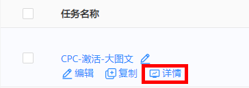
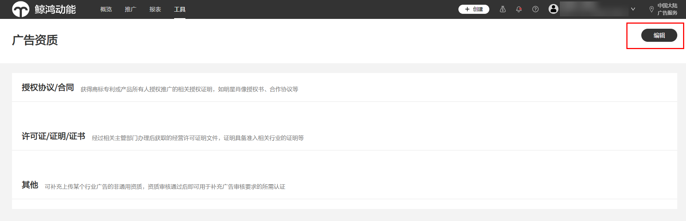

# FAQ

<strong>Q1: 合约广告和竞价广告的区别是什么？</strong>

<strong>A：</strong>竞价广告：竞价交易模式的本质是将量的约束从交易过程中去除，仅仅采用“价高者得”的简单决策方案来投放每一次广告。通过调整价格进行排名，按广告效果付费的广告形式，在信息流中以不固定位置出现，提供多维度定向、多种优化工具以及多样的展示形式，满足广告主的个性化投放需求。鲸鸿动能广告支持的竞价广告有展示广告和应用市场广告，计费方式为CPM、CPC、CPA、CPD、oCPC。

合约广告：指媒体和广告主通过预先签订合同约定广告位、时段、价格和展示量的广告交易模式，核心是 “保量+保价”，常用计费方式为CPT、CPM。

<strong>Q2：App更新对任务创建有什么影响？</strong>

<strong>A：</strong>App更新升级过程中会导致创建任务时无法输入App ID，需要等待App更新完成后，才可以创建以应用促活和应用下载为目的的任务。

<strong>Q3：已经在投CPD了，另外投放信息流CPC会冲突吗？</strong>

<strong>A：</strong>不冲突。

<strong>Q4：是否支持针对竞品的人群投放？</strong>

<strong>A：</strong>不支持针对特定竞品的已安装等人群投放，您可以制定人群需求（比如火车票人群），鲸鸿动能根据您的需求提供该类兴趣标签的人群包进行投放，详情请参见：[DMP](https://developer.huawei.com/consumer/cn/doc/promotion/ads_gongju04-0000001458996605)。

<strong>Q5：创建任务时，为什么搜索不到应有的人群包？</strong>

<strong>A：</strong>①人群包覆盖量小于5000无法搜到；②人群包类型不同，自定义定向和细分受众定向中都有可能，可分别搜索查看；③人群包未被使用导致被系统清理，具体情况可提供人群包ID联系运营排查。

<strong>Q6：如何查看广告的操作记录？</strong>

<strong>A：</strong>鼠标悬停在计划/任务/创意名称上，单击“详情”-“操作记录”，即可查看；您也可以在“工具”-“账户辅助”-“操作日志”中查看账户层级的操作记录。

<strong>Q7：如何查看广告资质的审核状态？</strong>

<strong>A：</strong>单击“工具”-&gt;广告资质，进入界面，将显示广告资质的审核状态与不通过的原因，广告主根据提示进行修改后，单击右上角“提交”，进入资质审核流程。

- 当页面中存在“审核不通过”资质时，该页面无法提交<strong>。</strong>
- 若页面中存在审核中的资质，则广告资质无法被编辑，需要等待审核员审核完毕后才可进行编辑。
- 广告资质审核不通过会用站内信提醒广告主。广告主可在“工具-&gt;消息设置”中选择消息通知渠道。

<strong>Q8：投放报表的数据是实时的吗？</strong>

<strong>A：</strong>不是。

<strong>Q9：定向的人群是否会更新？</strong>

<strong>A：</strong>系统定向会自动更新，自定义上传的人群则不会自动更新。

<strong>Q10：为什么报表花费与财务支出数据不一致？</strong>

<strong>A：</strong>由于展点消报表和财务支出统计统一口径的差异，报表中的花费和财务支出的数据不一定完全一致。举例：某任务的投放时间是6月8日12:00-24:00，广告在6月8日23:59分曝光，并于6月9日0:01分被点击。该点击产生的金额将显示在6月8日的花费报表中——与广告推广时间一致，以及6月9日的财务支出中——与广告平台实际扣费时间一致。是正常现象。若您需要查看和分析推广效果数据，建议您使用平台“报表”；若您需要查看实际扣费情况或用作结算凭证，请以“财务信息”数据为准。

<strong>Q11：一般广告创建完成之后的审核时间是多少？</strong>

<strong>A:</strong>广告的审核大部分会在24个小时内完成，对于一些复杂的情况可能需要更长审核时间，一般会在1-2个工作日内完成审核；为了确保投放的及时性，不耽误您的投放计划，请提前搭建任务和提交审核。
