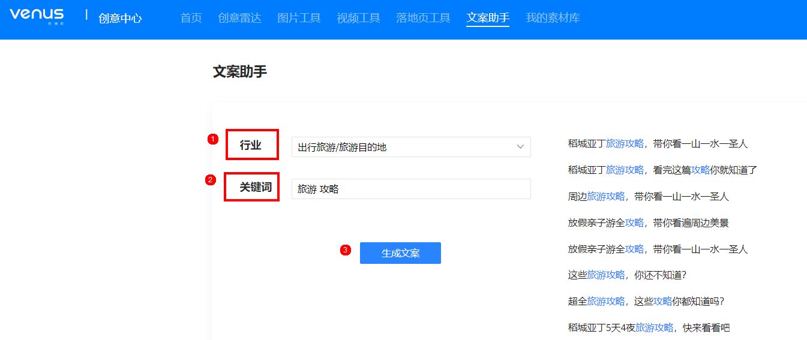

# 文案助手

## 功能简介

维纳斯文案助手工具是鲸鸿动能平台为广告主免费提供的文案创作工具，系统根据行业和关键词，通过智能算法自动生成优质文案，帮助广告主提高文案创作效率。

## 操作步骤

在投放端首页单击“工具”-&gt;“创意中心”进入维纳斯首页，选择“文案助手”。

1. 选择创意行业。
2. 输入关键词，最多支持4个关键词，多个关键词之间以空格分隔。
3. 单击生成文案，系统即智能推荐相关广告文案，可参考、复制，进行二次创作。

   
