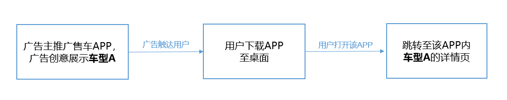

# 简介

## 概述

<strong>延迟Deeplink功能</strong>是鲸鸿动能平台提供给应用下载类广告主使用，依托于Deeplink功能（用户可通过广告链接直达指定App内的活动页），使用户通过鲸鸿动能推送的广告完成App下载安装后，在手机桌面打开该App时能跳转到与该广告相关的深度页面中，从而提升转化效果。

示例：

 

1. 延迟Deeplink功能只支持应用下载类广告。
2. 接入后，广告主按照正常投放流程创建应用下载广告任务，填入可用的deeplink链接即可。

相关链接：[《获取延迟Deeplink》](https://developer.huawei.com/consumer/cn/doc/HMSCore-Guides/deeplink-0000002031358796)
