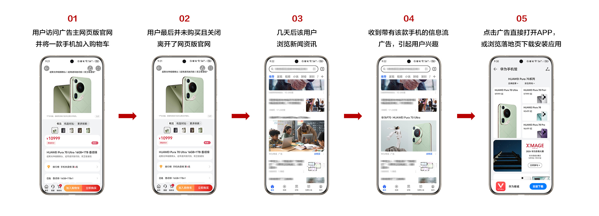
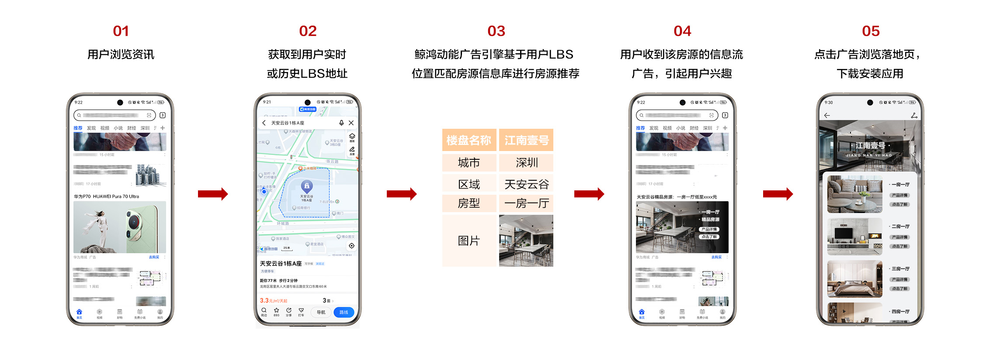

# 功能简介

## 概述

动态商品广告简称DPA(Dynamic Product Ads)，是满足海量商品投放需求，基于对用户和商品的理解，利用商品智能推荐模型，为用户寻找最适合的商品，通过动态创意和动态落地页来实现商品高效批量投放的一种广告投放方式。产品、视频、房产、新闻资讯、教育课程、酒店、景点等均可以视为“商品”。

DPA提供商品库对接功能，您可在鲸鸿动能平台导入海量商品数据，实现千人千面的创意效果，具体支持能力如下：

- 海量商品库对接，基于鲸鸿动能行业商品库字段及类目进行商品库对接。
- 商品库实时刷新，基于Marketing API接口对商品库中信息进行实时刷新。
- 动态创意与落地页，您可以选择对接RTA或使用系统推荐结果返回商品列表，实现实时商品推荐。

详情请查看[鲸鸿动能商品广告投放指南视频课程](https://ads.shixizhi.huawei.com/course/1502116313077112833/course-view?courseId=401108375989784576&activeIndex=-1&sxz-lang=zh_CN)。

## 营销场景

- <strong>老客唤起场景：</strong>基于用户在广告主的第一方数据，给用户推荐最感兴趣的商品。

- <strong>新客下载场景</strong>：由鲸鸿动能平台基于人群兴趣标签及商品库中商品数据，给用户推荐最感兴趣的商品；或基于用户实时或历史LBS地址，由鲸鸿动能平台匹配商品库推荐离用户距离近的商品资源，最大匹配范围为5KM。兴趣推荐适用于电商、影音娱乐、房地产等行业，LBS推荐适用于房地产行业。

  
