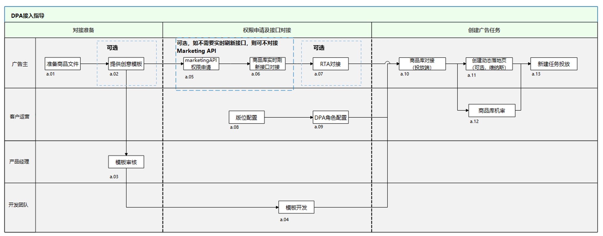

# 对接流程

## 流程图

DPA功能涉及商品库对接、Marketing API对接、创意模板开发等对接及开发，大致可分为对接准备、权限申请及接口对接、广告投放三个环节，具体流程如下所示：

## 流程说明

<strong>准备商品文件</strong>

根据鲸鸿动能DPA商品库字段接口及商品类目说明准备商品文件，详细行业字段介绍及商品类目说明前往[商品库接口说明](https://developer.huawei.com/consumer/cn/doc/promotion/ads_youhua_dpa13-0000001932970593)查看。

说明：商品库中内容需根据鲸鸿动能投放要求进行主动管理，包括但不限于商品类型、商品名称、商品图及视频等内容；如商品库中商品内容不符合要求，则会被禁止投放；此外商品文件中xml单个文件大小不可超过8G，xmlsitemap中xml子文件不超过2000个。

<strong>提供创意模板（可选）</strong>

平台提供通用无装饰性的模板。若您有定制要求，可根据投放的版位尺寸要求，提供PSD格式的创意模板，说明创意模板中需要动态替换的内容（定制模板需排期）；如使用直投模式无需提供创意模板。

<strong>接收广告主创意</strong>

接口人组织创意模板审核，确保创意模板符合投放要求，具体以评审结论为准。

<strong>模板开发</strong>

鲸鸿动能平台基于审核通过的创意模板进行开发，由鲸鸿动能平台安排模板上线时间。

<strong>MarketingAPI权限申请（可选）</strong>

Marketing API是鲸鸿动能对外开放技术能力的开放平台，其中包括DPA商品库的实时刷新字段，详细申请流程请前往[Marketing API对接流程](https://developer.huawei.com/consumer/cn/doc/promotion/ads_youhua_dpa15-0000001888130718)章节查看；如已对接Marketing API或不需要使用商品库实时刷新接口，可省略该步骤。

<strong>商品库实时刷新接口对接（可选）</strong>

根据Marketing API中商品库实时刷新接口对接流程对接，详细接口内容请查看[Marketing API对接流程](https://developer.huawei.com/consumer/cn/doc/promotion/ads_youhua_dpa15-0000001888130718)，如不需要对商品库数据进行实时刷新，可省略该步骤。

<strong>RTA接口对接</strong> <strong>（可选）</strong>

DPA支持通过RTA接口返回广告创意优选商品列表，投放前需完成RTA接口对接，详细RTA接口说明可查看[《鲸鸿动能RTA接口说明》](https://alliance-communityfile-drcn.dbankcdn.com/FileServer/getFile/cmtyPub/011/111/111/0000000000011111111.20260529160217.01010333981676511253187639211425:20260531101326:2800:BD307BB63E9CC0EC88A7E96C54F948AD9574034D1FCD67DB3E813BB75A5935C7.pdf?needInitFileName=true)。

<strong>版位配置</strong>

- 现网已配置信息流大图文动态商品广告、联盟信息流大图-动态商品广告等多个商品广告版位；如无广告主需投放的商品广告版位，可联系鲸鸿动能客户运营申请新增商品广告版位。
  - 任务类型：仅支持竞价
  - 创意样式：图片
  - 支持版位：1080\*607尺寸、720\*1280尺寸（仅直投模式）

<strong>DPA权限配置</strong>

可联系鲸鸿动能客户运营完成DPA权限配置，配置完成您即可在投放端看到商品库入口和商品广告计划类型。
