# 商品库对接

## 概述

广告主在鲸鸿动能投放端新建商品库，并完成商品库数据导入。因为不同账户可能配置不同的解析文件，如果新增投放账户对接商品库，需将新增的投放账户同步给鲸鸿动能客户运营，以配置对应账户的商品解析文件。

## 操作步骤

### 创建商品库

1. 登录鲸鸿动能平台，单击“工具”-&gt;“资产管理”-&gt;“商品中心”。

   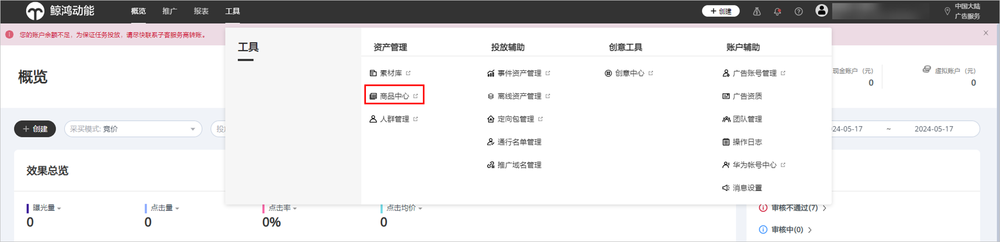
2. 进入商品中心后，在首页单击<strong>“新建商品库”</strong>。
   - 填写商品库名称（不可重复），并选择商品库类型，目前仅支持电商、短视频、房产、本地生活服务、汽车出行行业商品库，如需支持其他行业商品库类型，请联系客户运营申请。
   - 选择创意投放模式，包括“模板模式”和“直投模式”，可同时选择两种模式，与投放端创意模式关联同步。
     - “模板模式”即投放时使用创意模板投放。
     - “直投模式”即直接用商品库的图片作为创意直接投放，支持一个商品库中存在多个不同尺寸图片的商品，但需要确保商品库中单个商品的图片尺寸唯一，且尺寸与鲸鸿动能支持的创意尺寸一致。
   - 如您选择电商行业商品库，可选择性填写平台名称与平台logo。

   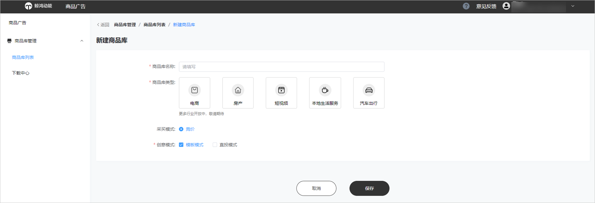
3. 在商品库详情页面，单击<strong>“录入商品”</strong>，进入录入商品页面。

   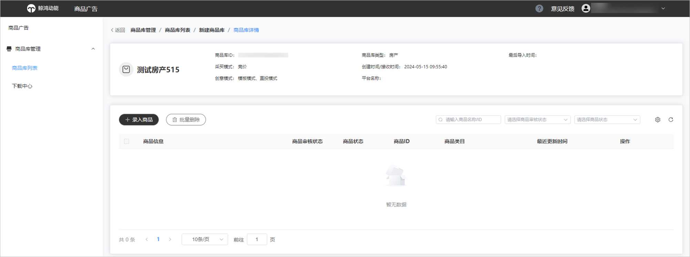

### 录入商品

<strong>选择商品导入方式</strong> <strong>：</strong>目前支持“定时拉取”和“手动上传”两种方式。“定时拉取”主要通过读取数据源地址信息，解析更新海量商品；适用于商品数量较多，并且商品信息会频繁更新的场景。“手动上传”即直接在平台内添加或通过模板上传商品信息；适用于商品数量较少，并且商品信息没有或者少有更新需求的场景。

### 手动上传商品

<strong>场景一：商品数量较少，且商品信息更新频率低</strong>

1. 导入方式选择手动上传，投放场景选择“一般商品库”。
2. 文件上传方式选择“标准字段上传”，支持上传格式为xml、xlsx的文件，大小为200M以内，严禁上传包含色情、暴力、反动等相关违法信息的文件。

   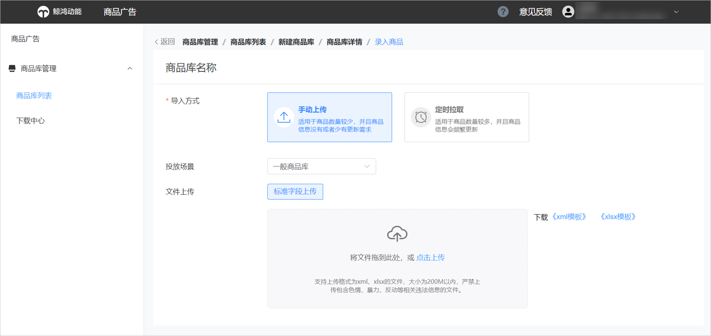

    

   该场景需要您按照鲸鸿动能标准模板[《xml模板》](https://alliance-communityfile-drcn.dbankcdn.com/FileServer/getFile/cmtyPub/011/111/111/0000000000011111111.20260529160223.58011929846220472002361846513579:20260531101326:2800:AF95985C8FB77191FBF00302BDBA201CE00B55212BA0F0A05FBC5D34F7E45127.zip?needInitFileName=true)或[《xlsx模板》](https://alliance-communityfile-drcn.dbankcdn.com/FileServer/getFile/cmtyPub/011/111/111/0000000000011111111.20260529160223.60312156641155016227679611360617:20260531101326:2800:1EA9F988F09498E975605757F7CBAD194D381B885191C43D1E76EC4CB5559DDE.xlsx?needInitFileName=true)填写商品信息，必填字段必填。
3. 文件上传成功会在上传框下方显示文件名称；若上传失败，请根据提示检查文件后修改重新上传。

   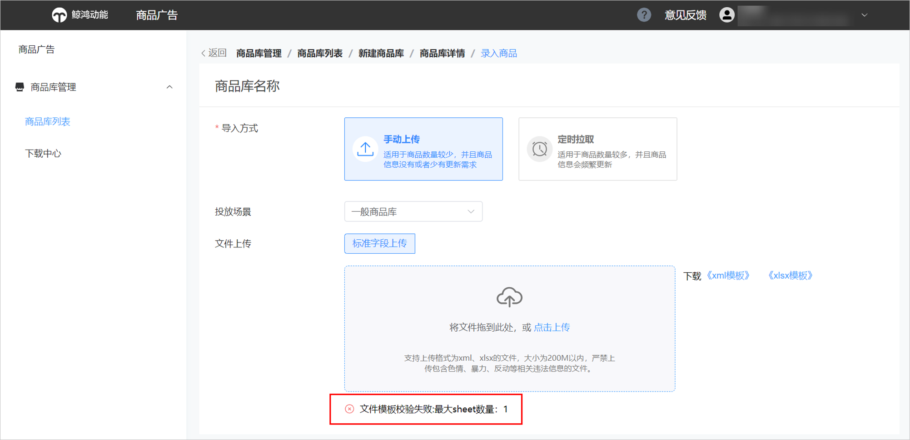
4. 单击“确认”商品库创建成功。

<strong>场景二：拥有大量商品，但商品信息更新频率低</strong>

1. 导入方式选择手动上传，投放场景选择“一般商品库”。
2. 文件上传方式选择“url上传”，支持上传格式为xlsx的文件，大小为200M以内，严禁上传包含色情、暴力、反动等相关违法信息的文件。

   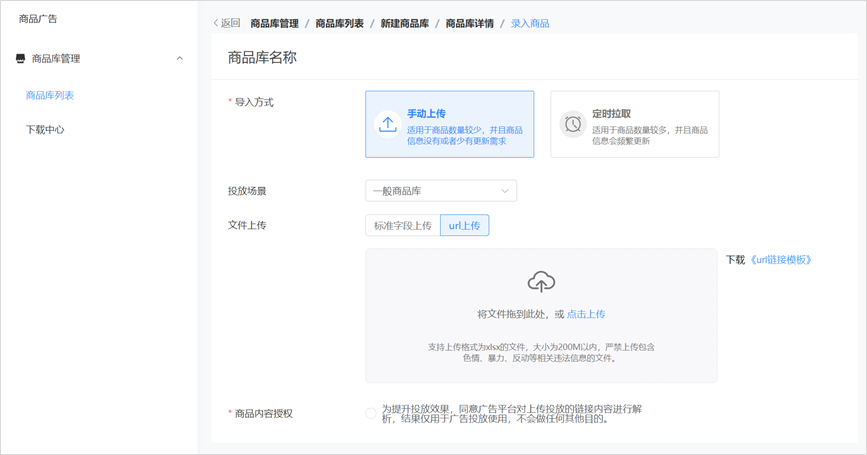

    

   该功能目前仅支持电商商品库使用，且您需按照鲸鸿动能[《url链接模板》.xlsx](https://alliance-communityfile-drcn.dbankcdn.com/FileServer/getFile/cmtyPub/011/111/111/0000000000011111111.20260529160223.14218785530678666506652513086299:20260531101326:2800:5F821B5FC9D6DB7B24FB70FE9B408C51A615514A0E9BFE3F6BC5ED0CFB1D2CDA.xlsx?needInitFileName=true)填写字段信息，由鲸鸿动能平台解析；您可在商品管理中心修改，解析会存在一定时延。
3. 文件上传成功单击“确认”即商品库创建成功；若上传失败，请根据提示检查文件后修改重新上传。

   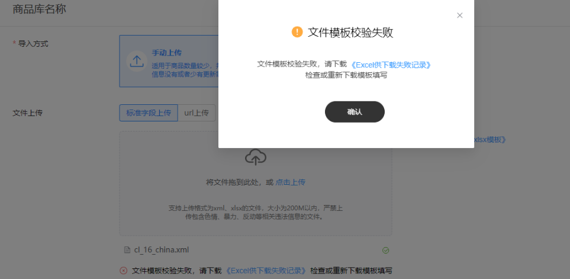

### 定时拉取

1. 导入方式选择“定时拉取”，定时拉取方式对接广告主商品库内容，通过读取数据源地址信息，解析更新海量商品信息。
2. 投放场景选择“一般商品库”。
3. 选择数据源，输入对应的数据源链接。数据源里的商品文件字段及商品类目需与鲸鸿动能接口要求保持一致，具体可参考[动态商品库接口V1.8](https://alliance-communityfile-drcn.dbankcdn.com/FileServer/getFile/cmtyPub/011/111/111/0000000000011111111.20260529160223.50219369209051475107580909202932:20260531101326:2800:69AFFEE2D72968EFC162C8304C5598467411ADB8C60D1CA82C892275A1017F07.zip?needInitFileName=true)和[《华为DPA行业商品类目V2.0》](https://alliance-communityfile-drcn.dbankcdn.com/FileServer/getFile/cmtyPub/011/111/111/0000000000011111111.20260529160223.99182579029245005147549009720824:20260531101326:2800:6E817C7786FCEAE9B4A508FA92F5532399338670DA323DB14AEA7CCD2B66914E.xlsx?needInitFileName=true)。
4. 填写用户名、密码（根据您数据源的设置情况决定是否需要填写），如果设置了用户名密码，则拉取XML文件时会在header中填入鉴权信息。
5. 填写完上述步骤后，单击“立即校验”数据源。

   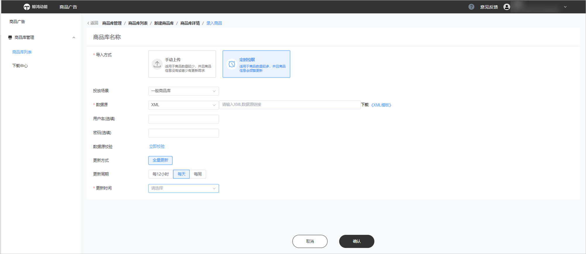
6. 校验成功后设置更新周期、更新时间。更新周期支持每12小时、每天更新和每周更新3种方式，更新时间支持0-23时整点更新。平台将根据您设置的更新周期和更新时间点对商品数据进行全量更新。
7. 单击“确认”商品库创建成功，商品库提交审核。

## 商品库管理

- 商品库创建完成后，您可在“商品库管理”-&gt;“商品库列表”页面查看管理您账户下的商品库。您可查看商品库名称、商品库ID、商品库类型、商品库来源、投放网络、商品库创建/接收时间、商品最后导入时间、商品数量（当前成功入库的商品总数）、创建账户等信息。
- 您可以根据商品库名称、商品库ID/商品库类型、商品库来源筛选查询商品库。
- 您可以编辑商品库名称，编辑、删除商品库，删除后不可恢复。

  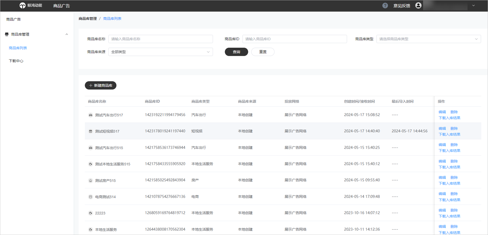

- 您可单击“编辑”进入商品库详情页面，在这您可查看到商品库基本信息。如您选择商品录入方式为本地上传还可查看到录入的商品信息，包括商品信息、商品审核状态、商品ID、商品类目、更新时间等信息。

  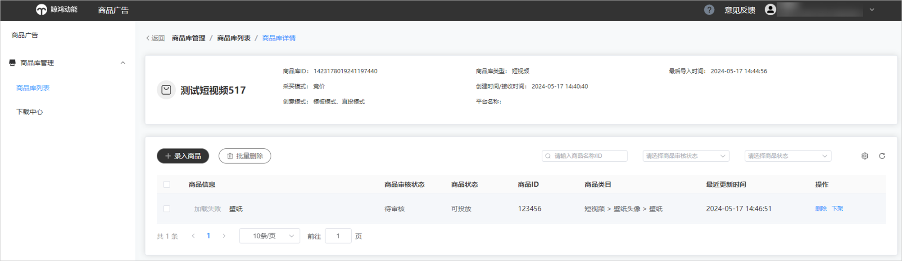
- 如您选择商品录入方式为本地上传，可再次录入商品；如您选择定时拉取，可编辑定时拉取设置。

  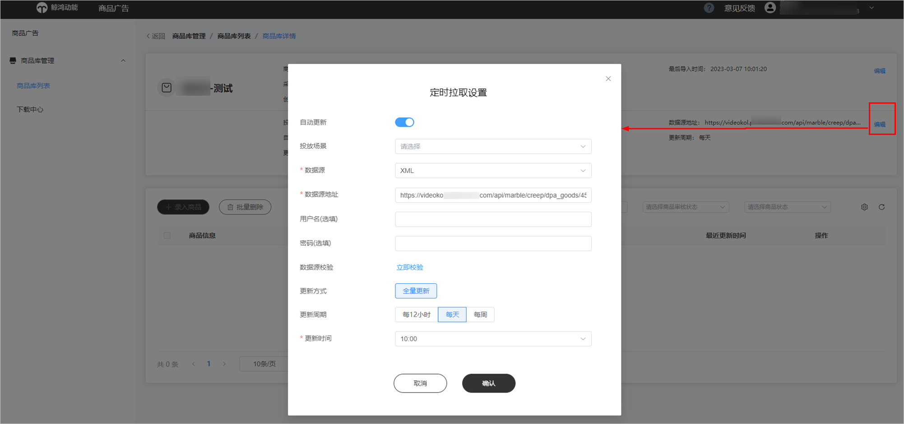
- 您可单击“下载入库结果”，查看商品库入库结果。您在下载中心可查看近7天内创建的入库结果导出任务，并支持根据文件名、导出状态、创建时间筛选任务；当某文件导出状态为导出完成时，单击下载即可以Excel格式下载入库结果详情、

  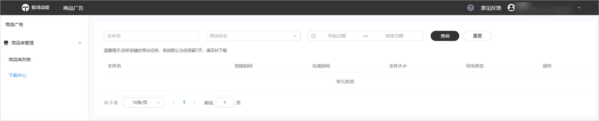

## 商品库审核

鲸鸿动能平台会对商品库内容进行审核，如存在相关禁投放商品将禁止投放，对接前请根据鲸鸿动能审核要求对商品库中商品质量进行主动管理，如商品属性是否可投放，商品图质量保障等。

商品库审核入库结果可在<strong>商品库管理页面</strong>查看，并支持以Excel格式下载入库失败商品详情；同时Marketing API支持回传商品的入库结果，以商品库为维度，针对入库失败的商品需要商品库ID-商品ID-入库失败的时间点-入库失败的原因一一对应。
