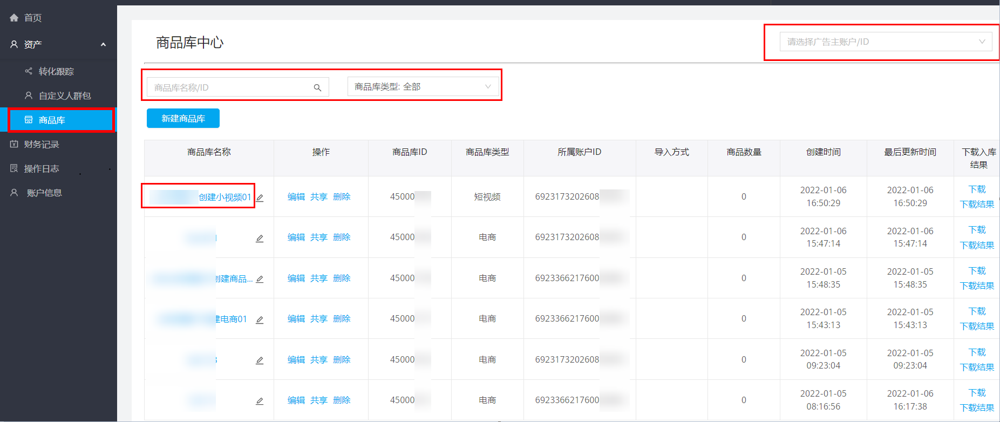
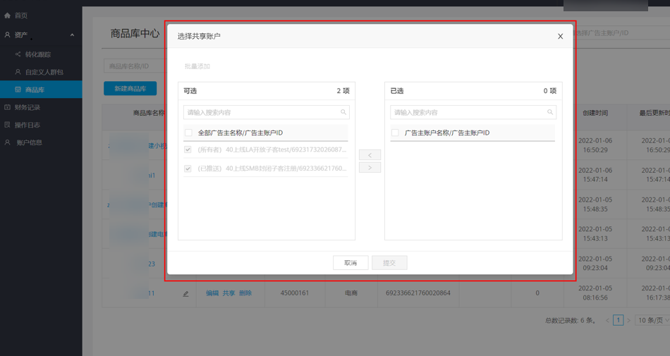
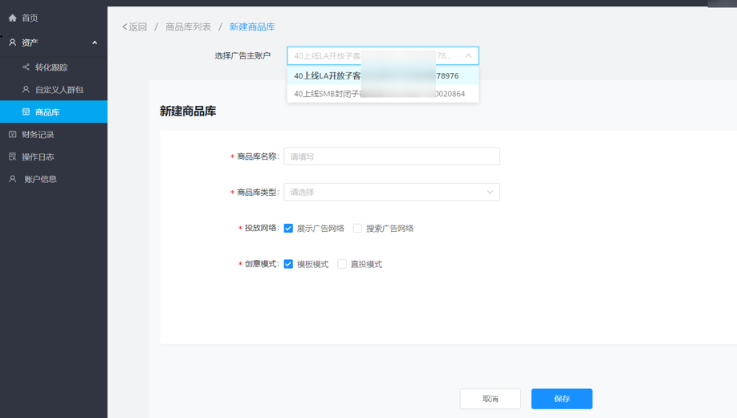

# 商品库共享

## 概述

经理账户如绑定有已开通DPA权限的账户，在菜单栏可见资产-商品库，经理账户【商品库资产】中拥有所属的广告账户下所有的商品库；可将名下商品库资产共享给其他广告账户（广告账户需拥有商品库权限）；同时可替名下某个广告账户创建商品库。

## 操作步骤

1. 登录经理账户，进入“资产” -&gt;<strong>“</strong>商品库<strong>”</strong>，列表展示该经理账户所关联广告账户下的商品库列表；单击商品库名称进入商品库信息页面，可查看商品库基本信息与和数据源配置信息。
   - 您可通过广告主账户ID搜索某一个账户下的商品库。
   - 您可输入商品库名称/ID搜索商品库，或通过商品库类型筛选商品库。

   
2. 单击“共享<strong>”</strong>，在左侧选择框内选择需要共享的账户，可把该商品库共享给该经理账户下其他已开通DPA权限的账户。

   
3. 您可通过经理账户新建商品库。单击“新建商品库”，选择新商品库要绑定的广告主账户，后续商品库新建流程与普通账户在投放端创建商品库的流程一致。新创建商品库在经理账户和所绑定账户的商品库列表页同步展示。

   
4. 新建完成后，您可在经理账户中对商品库进行管理。
   - 单击“编辑”，进入商品库编辑页面，可修改基本信息与数据源配置信息；修改后商品库owner账户、接收共享账户同步修改；经理账户与所属账户可编辑商品库，共享账户不支持修改。
   - 单击“删除”，即在经理账户中删除该商品库，同时会在共享账户的商品库列表中同步删除该商品库；当商品库有投放任务时，不支持删除。
   - 单击“下载入库结果”，您可以Excel格式下载该商品库的商品入库结果。
   - 在操作日志页面可查看商品库新建、共享等历史操作。
