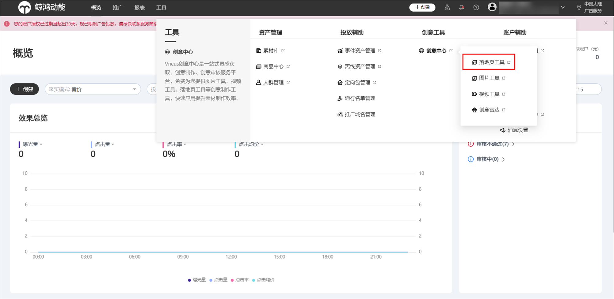
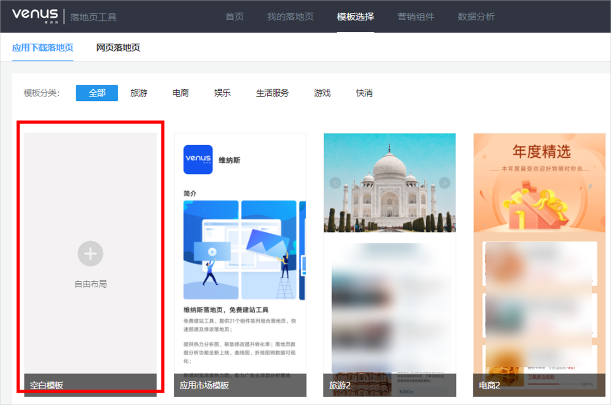
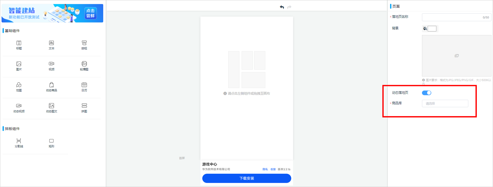
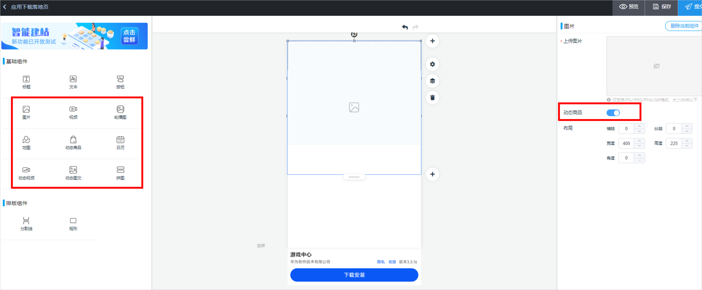

# 创建动态商品落地页（可选）

## 概述

动态商品广告落地页通过使用图片、轮播图、视频组件的动态商品功能，和使用动态商品、动态视频、动态图文组件实现。一个落地页仅支持关联一个商品库，支持同时使用多个动态组件。

落地页第一个动态商品与创意商品保持一致，剩余动态替换商品由RTA接口返回的其他商品按productList补充，或由华为商品推荐推荐的商品补充，展示的商品取决于最终的商品推荐模式。

## 操作步骤

1. 使用已开通动态商品广告权限的账户登录鲸鸿动能投放端，选择“工具”-&gt;“创意中心”-&gt;<strong>“</strong>落地页工具<strong>”。</strong>

   
2. 在“模板选择”页面，选择创建<strong>“应用下载落地页”</strong>。

   
3. 在落地页基础设置中开启<strong>“动态落地页”</strong>，并选择关联的“<strong>商品库</strong>”。

   
4. 选用图片、视频、商品等基础组件，设置素材展示形式。

   
   - 选择<strong>“图片”</strong>，上传图片后打开“动态商品”开关，实际投放时将动态展示商品主图，若在异常场景下获取不到商品库的商品主图，则展示编辑落地页时上传的图片。

   - 选择<strong>“视频”</strong>，打开“动态商品” 开关实现动态视频展示，如未上传视频封面，落地页将展示视频首帧画面。
   - 选择<strong>“轮播图”</strong>，上传图片后打开“动态商品”开关，实际投放时将动态展示商品主图，展示图片数量与上传图片数量一致；如需使用动态商品功能，建议上传的轮播图与商品库中的图片尺寸保持一致。轮播图支持单商品展示和多商品展示两种动态模式：

     单商品展示：从商品库获取同一个商品的图片进行轮播。

     多商品展示：从商品库获取不同商品的主图进行轮播，该模式下轮播图首个商品图与创意商品保持一致，其他商品图基于RTA反馈结果获取。
   - 选择<strong>“动态商品”</strong>，可设置动态商品样式（单列、双列、三列）和展示商品数量（4-20），实际投放时将动态展示商品信息；商品模板直接拉取商品库中的商品主图、描述、现价、原价、应用直达链接等商品信息；您还可以修改标签、按钮下载提示语。
   - 选择<strong>“动态视频”</strong>，默认为商品视频，关联调用Video字段，实际投放时将动态展示商品视频；可设置商品布局（单列、双列）和展示商品数量（4-20），可开启商品描述功能；商品描述可选商品名称、品牌名称和广告文案，您可自定义设置描述位置。
   - 选择<strong>“动态图文”</strong>，默认为商品主图，实际投放时将动态展示商品信息；可设置商品布局（单列、双列）和展示商品数量（4-20），可开启商品描述功能；商品描述可选商品名称、品牌名称和广告文案，您可自定义设置描述位置。
