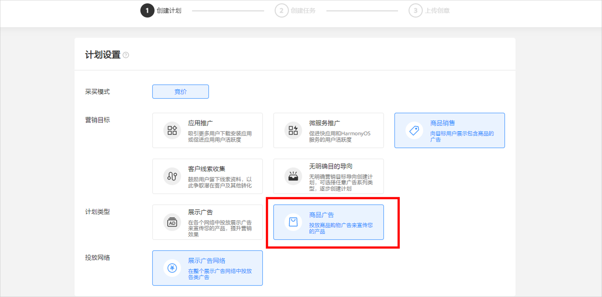
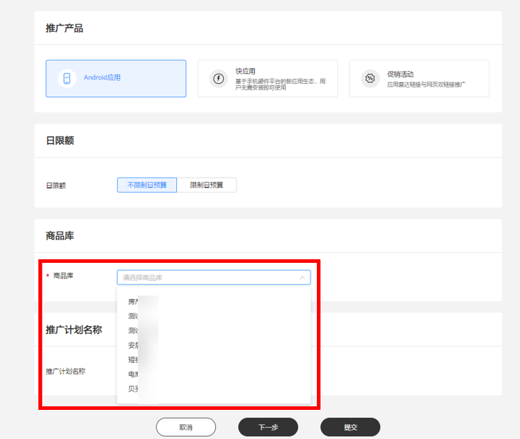
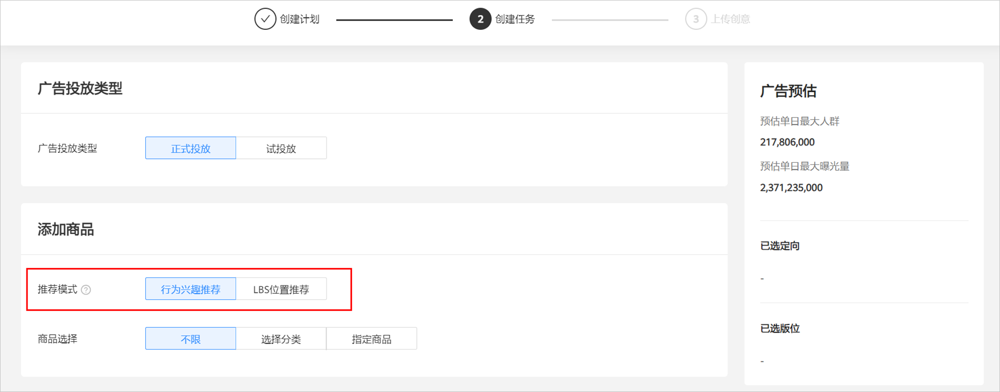
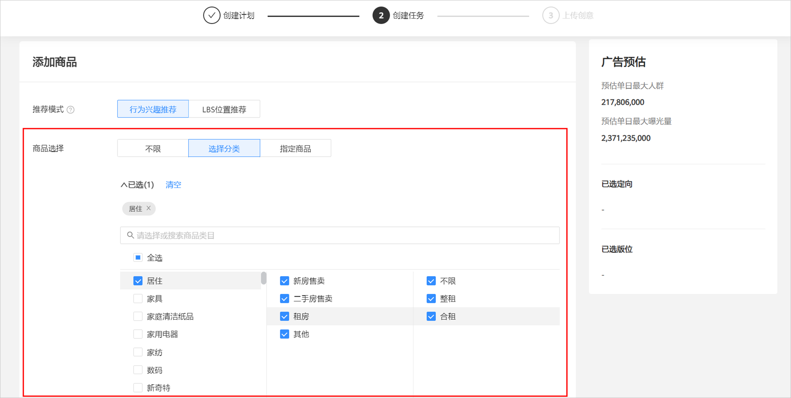
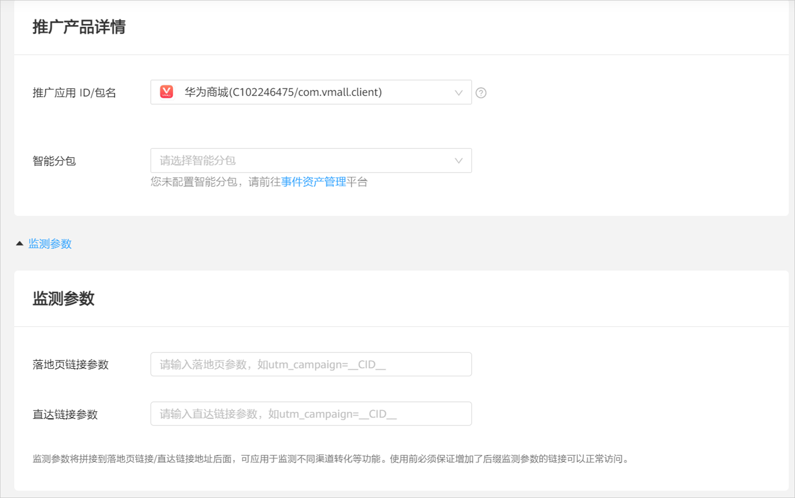
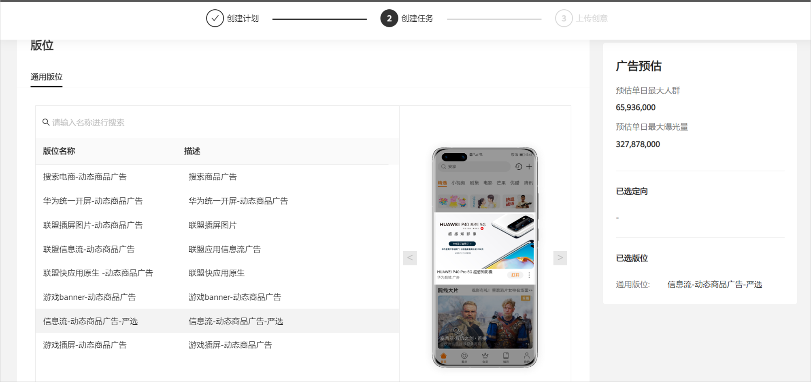
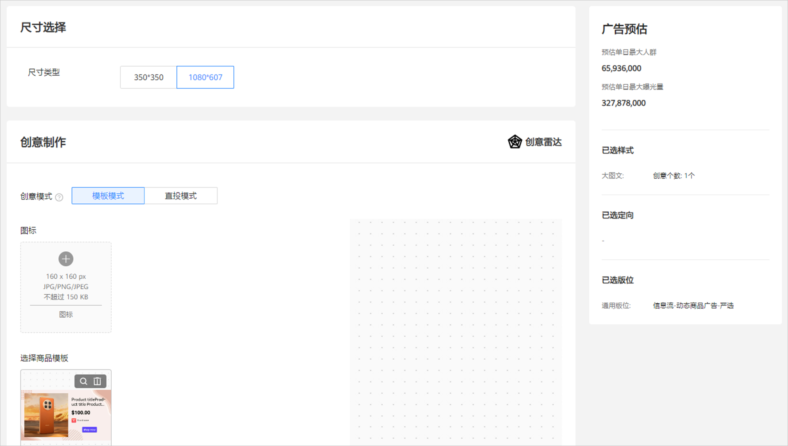
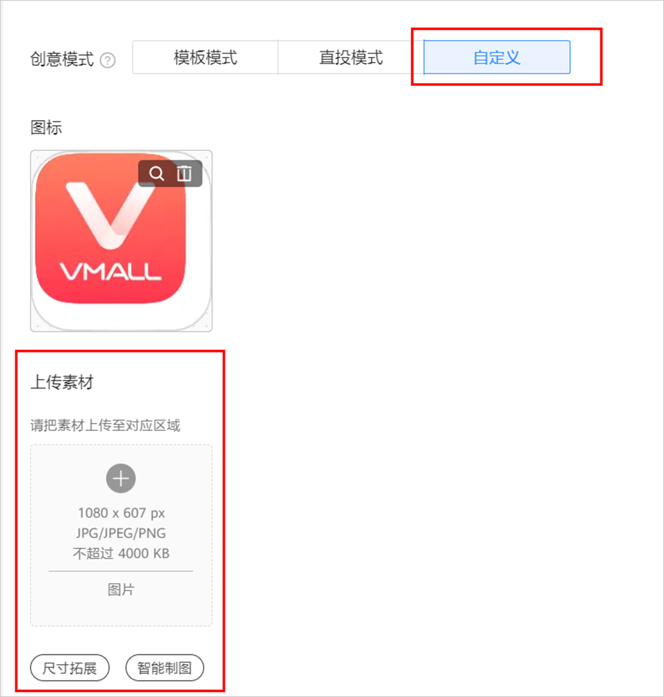

# 新建投放任务

## 操作步骤

1. 登录已开通动态商品广告权限的广告账户，创建广告计划。

   营销目标选择<strong>“商品销售”</strong>；计划类型选择<strong>“商品广告”</strong>。

   
2. 在计划设置中选择已接入成功的商品库。

   
3. 设置广告任务，DPA支持试投放，涉及RTA部分由华为商品推荐从对应商品库中随机挑选多个商品（具体数据依据创意及落地页中需要的商品数量确定）返回。
4. 选择推荐模式，如为电商、短视频、本地生活服务、汽车出行商品库，仅支持“行为兴趣推荐”场景；如为房产商品库，支持“行为兴趣推荐”和“LBS位置推荐”两种场景。

   行为兴趣推荐：基于广告主的第一方数据或平台内用户兴趣进行推荐，为不同人群推荐其最感兴趣的商品。优先采用广告主RTA返回的推荐结果，应用于广告创意展示，和动态落地页中的商品信息展示。如RTA接口返回参竞但未返回商品ID消息时，直接采用华为商品推荐方式。

   LBS位置推荐：基于用户LBS位置匹配商品位置进行推荐；由鲸鸿动能引擎匹配商品位置信息进行推荐，最大匹配范围为5KM，如在该范围内没有匹配的商品，则本次不做推荐。

   
5. 选择要投放的商品范围，您可选择“不限”，即整个商品库；您可选择部分商品分类，最多可细分至三级分类，当选择部分类目投放时，如RTA接口返回的优选商品列表中无该推广类目商品时，该任务则不参与竞价；您也可指定某一个商品推广，可输入商品ID或商品名称进行进行精准搜索。

   

    

   1、指定商品搜索功能为精确搜索，请您保证指定商品ID、商品名称的准确性。

   2、如您指定商品并确认后，请您把该商品ID或商品名称同步给客户运营，以用于配置确保广告正常投放。
6. 设置落地页和应用直达链接的监测配置，在此处填写的应用直达链接和落地页链接的监测参数，将拼接到H5链接/直达链接地址后面。示例：直达链接监测参数是&source=huawei，自定义直达链接或商品库中提取的某商品直达链接为：snssdk://huawei.com，真实投放时拼接的直达链接为：snssdk://huawei.com&source= huawei。

   
7. 选择投放版位，仅展示您可投放动态商品广告的版位，可提前联系对应客户运营配置版位。

   
8. 设置创意内容。
   - <strong>选择创意样式：</strong>您可选择多种创意样式，添加多个不同尺寸规格的创意进行投放，但您需确保商品库中的商品主图尺寸能满足您所设置的尺寸，否则将请求不到商品。
   - <strong>创意素材</strong>：选择创意样式、尺寸和创意模式，创意模式可选“模板模式”或“直投模式”；此处展示的创意模式与任务绑定的商品库创意模式相关联。如您指定商品投放还可选择“自定义”。

   “模板模式”可选择已预置的平台通用模板或定制模板，模板尺寸与版位尺寸一致，设置创意后支持创意预览效果。

   “直投模式”无需上传模板或素材，商品将直接根据RTA返回或由华为商品推荐返回的商品主图进行创意填充。

   

   “自定义”即您可以自定义上传创意素材，您自定义的商品素材，需审核通过后才可投放。

   

   - <strong>文案</strong>：可在文案输入框右下角选择“更多动态词包”，插入“ 商品字段“的动态词包进行动态内容替换，支持广告文案、商品描述、商品名称、商品原价、商品现价、商品折扣、商品类目、品牌名称等动态词包。
   - <strong>落地页</strong>：可使用自定义落地页或维纳斯落地页，维纳斯落地页可选普通维纳斯落地页和动态商品落地页。自定义落地页可选择通配符 “移动端H5商品落地页”和“移动端H5品牌落地页”，通过通配符关联商品库中的url字段链接；落地页以机审结论为通过依据，如选择使用通配符，落地页机器审核不通过时，则不会推荐该商品。
   - <strong>应</strong> <strong>用直达链接</strong>：若需使用商品库中的应用直达链接，可选择使用通配符“Android应用直达链接”，或者自定义填写应用直达链接 。
9. 提交审核，审核通过即可开始投放动态商品广告。
