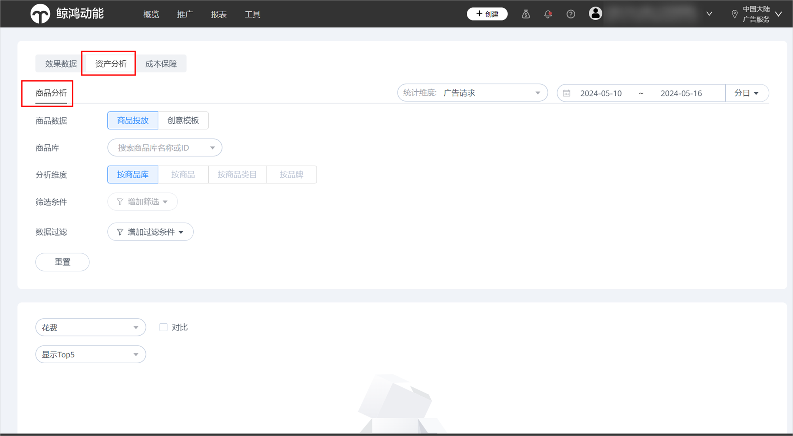

# 商品广告报表分析

鲸鸿动能平台提供商品分析报表功能，您可在“报表”-&gt;“资产分析”-&gt;“商品分析”查看动态商品广告投放数据。

商品数据支持按商品投放和创意模板查看。

商品数据选择商品投放，可下拉选择商品库查看对应商品库的投放数据。

- 分析维度：可按商品库、按商品、按商品类目、按品牌查看分析数据。
- 数据过滤：可按曝光量、点击量、下载量、花费、点击均价、点击率、触达用户数等指标过滤数据。
- 筛选条件：可按“统计维度”和“日期”筛选数据；如您选择“按商品”分析，可输入商品ID筛选数据；如您选择“按商品类目”分析，您可按一/二/三级类目筛选数据；如您选择“按品牌”分析，可选择商品品牌筛选数据。
- 完成条件设置后，您可在此页面按折线图查看数据趋势，数据维度与效果数据报表一致，同时支持2个数据对比分析。

- 您可在数据细分模块按所选分析维度查看细分数据，支持的指标和功能与效果数据报表一致。

商品数据选择创意模板，您可按照创意模板筛选数据，数据按创意模板维度统计呈现，其他指标功能与商品投放数据一致。
