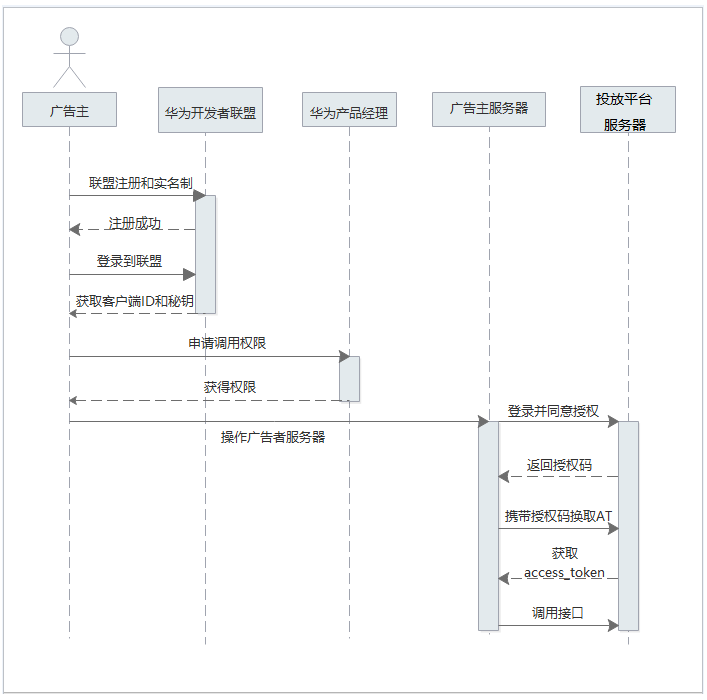

# Marketing API对接流程

Marketing API是鲸鸿动能广告对外开放技术能力的开放平台，为开发者提供统一的鉴权、开发、管理等服务，在功能、性能、安全、技术支持等多个方向提供良好的开发体验。通过底层的应用程序接口调用，实现数据与服务功能的传输，让您在本地也能远程使用鲸鸿动能平台系统，完成广告投放、报表分析、创意制作等功能，提升营销效率。。

## MAPI对接流程

1. 请您到[华为开发者联盟完成实名认证](https://developer.huawei.com/consumer/cn/doc/start/atpopb-0000001062836624)。
2. OAuth2.0认证：Marketing API 采用OAuth2.0授权码模式（authorization code）进行授权认证，所有接口均通过请求头中传递的access\_token（授权令牌）来进行身份认证和鉴权。
3. 申请应用权限：您获取到客户端ID和密钥后，需联系客户运营为客户端ID申请调用权限。
4. 您获得权限后，登录并同意授权，获取access\_token。
5. 调用业务接口。
6. 详细对接流程指导请参考[Marketing API接入流程](https://developer.huawei.com/consumer/cn/doc/promotion/ads_api05-0000001058436244)。

## Marketing API DPA商品库接口

您可通过Marketing API接口查询商品库、创建商品库、更新商品库、删除商品库、查询商品库筛选条件取值、查询符合条件的商品数量、查询商品库入库失败记录、更新商品价格、批量下架商品、查询商品库动态模板。接口详情可参考[Marketing API 使用指南&gt;DPA商品库](https://developer.huawei.com/consumer/cn/doc/promotion/ads_mapi_spk04-0000001195380810)。
