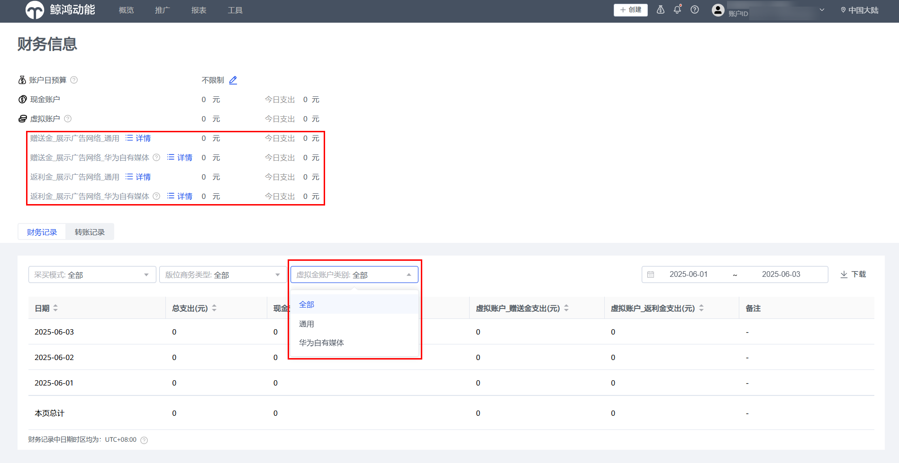
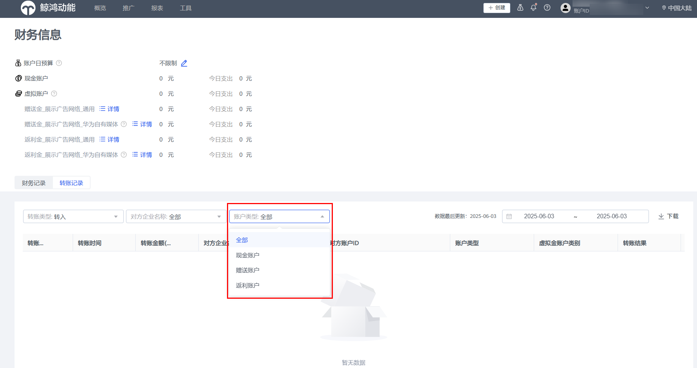
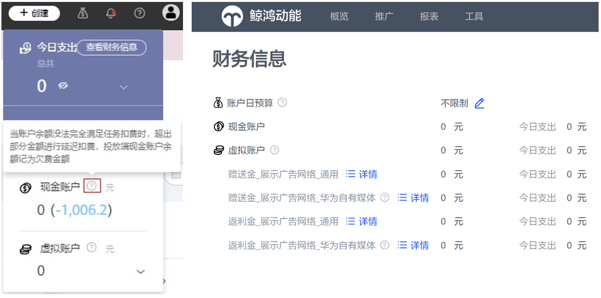
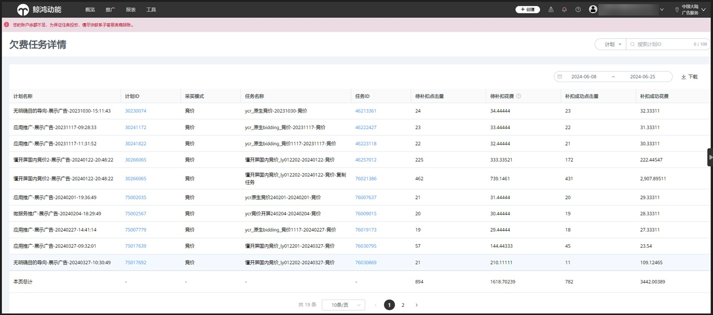

# 子客账户财务信息（展示广告网络）

## 概述

广告主在鲸鸿动能平台充值、投放广告后，可在投放端查看财务信息。

## 操作步骤

1. <strong>登录鲸鸿动能广告平台</strong> <strong>：</strong>单击""-&gt;“查看财务信息”
2. <strong>查看财务信息：</strong>财务信息主界面包括账户日预算、现金账户、虚拟账户、财务记录和转账记录。
   - 财务记录：显示总支出、现金支出、 和虚拟账户（赠送金、返利金）支出数据，支持下载财务记录报表。

   

   - 转账记录：支持查看转入和转出记录、对方账户名称以及转账类型（现金、赠送金或返利金）。

   

 

为保障平台内投放环境的有序性，从2024年8月12日起，小艺建议竞价版位（包括首页促活和非首页促活）将按投放期间实际产生的点击数据结算进行扣费处理，其他版位按原结算方式结算。如您的投放任务产生了超过账户余额的投放费用，超出部分金额会进行延迟扣费处理，此时您的现金账户余额会显示“欠费金额”

您可在“账户”-&gt;“财务信息概览”页面和“财务信息”页面查看。欠费金额仅在账户欠费状态时展示，单击欠费金额可跳转至欠费任务详情页面。

欠费任务详情页面记录了当前账户的所有欠费任务详情数据，任务按照消耗时间倒序排序。

- 您可通过计划 ID、任务 ID 搜索查看欠费任务，并支持您下载任务详情数据。
- 在列表中您可查看到欠费补扣任务所属的计划名称、计划 ID、采买模式、任务 ID、待补扣点击量、待补扣花费、补扣成功的点击量、补扣成功花费。

|  |  |
| --- | --- |
| <strong>指标</strong> | <strong>定义</strong> |
| 待补扣点击量 | 因当前账户余额不足而导致未扣费的点击量 |
| 待补扣花费 | 因当前账户余额不足而导致未完成扣费的花费 |
| 补扣成功点击量 | 账户欠费充值后扣费成功的点击量 |
| 补扣成功花费 | 账户欠费充值后扣费成功的点击量对应的花费 |

<strong>延迟扣费的规则详情如下：</strong>

|  |  |
| --- | --- |
| <strong>场景</strong> | <strong>规则</strong> |
| 充值后自动补扣 | 当账户可用余额充值大于或等于任意一个有待补扣花费的任务中任意一次点击计费金额时，系统优先自动使用账户可用余额进行欠费补扣，并将补扣成功点击量、补扣成功花费字段进行刷新。 |
| 返利消耗累计 | 补扣成功花费的返利消耗累计以及返利规则，按照补扣成功花费上报的时间为准（如任务在 24 年 12 月投放，补扣成功花费在 25 年 1 月份上报，该部分补扣成功花费按照 1 月份的返现规则进行累计计算）。 |
| 补扣数据累计 | 超投补扣产生的花费数据不计入当天的日限额和计划限额数据中。 |

<strong>延迟扣费场景举例：</strong>

2024/7/8：某个广告投放账户余额 1000 元，当日实际产生的广告花费为 1100 元，那么账户欠费 100 元，账户现金余额为-100。

2024/7/9：该广告投放账户充值 1000 元，系统补扣 100 元，那么账户现金余额为 900 元。

## 名词解释

<strong>现金账户</strong> <strong>：</strong>现金是广告主实际充值金额。

<strong>虚拟账户：</strong>虚拟账户余额 = 赠送金余额 + 返利金余额。

<strong>赠送金：</strong>鲸鸿动能赠送给广告主的可消耗金额，一般由活动或其他特殊场景产生。

<strong>返利金：</strong>鲸鸿动能根据线下合同约定的消耗返利政策，给与服务商的消耗返利金额。
