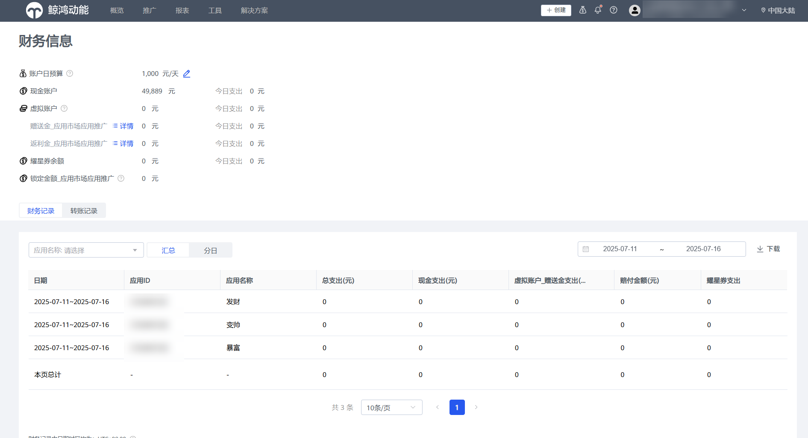
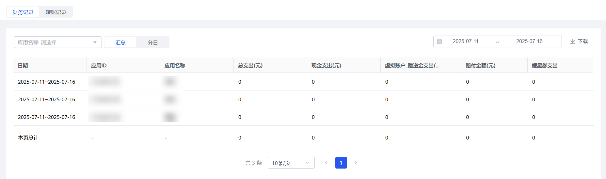
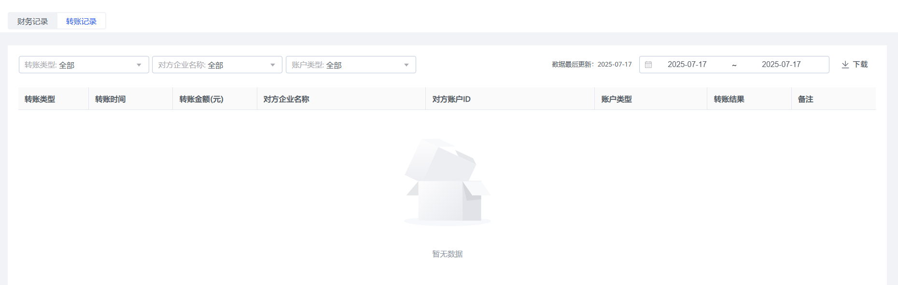

# 子客账户财务信息（应用市场应用推广）

## 概述

广告主在鲸鸿动能平台充值、投放广告后，可在投放端查看财务信息。

## 操作步骤

1. <strong>登录鲸鸿动能广告平台</strong> <strong>：</strong>单击""-&gt;“查看财务信息”
2. <strong>查看财务信息：</strong>财务信息主界面包括账户日预算、现金账户、虚拟账户、耀星券余额、锁定金额\_应用市场应用推广、财务记录和转账记录。

   
   - 财务记录：您可以通过筛选栏选择应用名称，选择汇总或者分日进行查看日期、应用名称、总支出、现金支出、 和虚拟账户\_赠送金支出、赔付金额和耀星支出数据，支持下载财务记录报表。

   

   - 转账记录：您可以通过筛选栏中转账类型、对方企业名称和账户类型的选择，查看转账类型，转账时间等数据。

   
