# 新功能速递

## 4月新功能速递

<strong>一、【投放平台新功能】</strong>

- 支持在一个广告计划下同时推广Android与鸿蒙应用
- 微信小程序推广支持 HarmonyOS 5及以上版本的设备
- 经理账户平台新增“静默状态”筛选及“账户名称”字段
- Marketing API创建计划支持指定营销目标

<strong>二、【服务商管理平台新功能】</strong>

- 子客开户支持一个华为账号批量创建多个广告账户
- 服务商管理平台新增“静默状态”筛选及“账户名称”字段

## 一、投放平台新功能

<strong>支持在一个广告计划下同时推广Android与鸿蒙应用</strong>

<strong>【功能说明】</strong>

为提升广告主投放效率及共享双端推广预算，现支持在同一广告计划内同时创建 Android 应用、鸿蒙应用两种产品类型的推广任务，同时创建的任务都默认共享相同的定向设置、投放时间与出价策略，一站式完成Android&鸿蒙应用的下载与促活推广，无需分开创建多组计划，大幅降低投放操作成本（备注：目前此功能仅适用于展示广告和商品广告）。

- 新增推广产品选项：在投放端创建广告计划时，选择营销目标为“应用推广”或“无明确目的导向”，即可在“推广产品”中看到新增的 “通投Android&鸿蒙应用” 选项。

- 投放前置准备：投放前需提前完成双端应用的转化事件资产配置与联调，您登录投放端后，通过“工具”&gt;“投放辅助”&gt;“事件资产管理”&gt;“新建资产”路径，分别创建鸿蒙应用与Android 应用对应的事件资产，并完成手动联调与启用配置，确保双端对应转化类型的事件资产均正常生效。

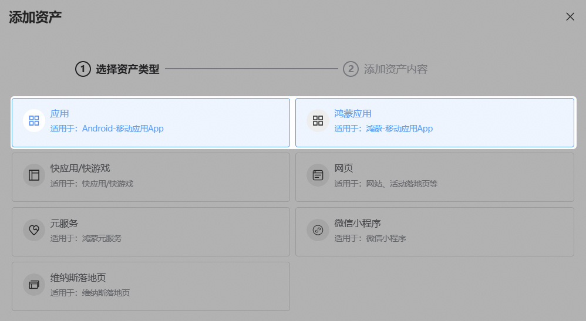

- 广告计划创建：

营销目标选择“应用推广”或“无明确目的导向”后，推广产品勾选“通投Android&鸿蒙应用”。

- 推广任务配置：

1) 应用信息关联：您填写Android应用/包名后，系统将自动关联鸿蒙应用的APP ID或包名，无需重复配置；

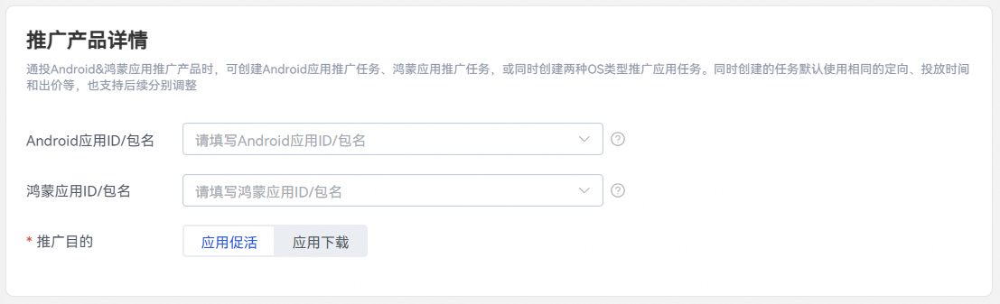

2)出价转化名称选择：仅当 Android应用与鸿蒙应用对应转化类型的事件资产均已完成定义并启用，方可选中该转化事件用于投放；

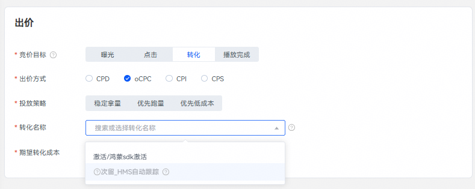

3)出价转化名称选择：仅当 Android应用与鸿蒙应用对应转化类型的事件资产均已完成定义并启用，方可选中该转化事件用于投放；

- 创意创建与落地页设置：

1) 通过素材库或本地上传素材，并确保上传的图片或视频素材符合平台规范；

2）设置DP或者落地页链接：

① 填写落地页链接：您可以按照自身需求去选择让“Android应用”、“鸿蒙应用”共用同一落地页链接，也可选择区分应用类型分别配置不同落地页；

② 填写应用直达链接：

场景1：您可以在AppGallery平台配置一个适配多端的聚合链接，让“Android应用”和“鸿蒙应用”共用同一个链接（备注：如您使用相同的DP链接，请参考[AppGallery的AppLinking聚合链接方案](https://developer.huawei.com/consumer/cn/doc/AppGallery-connect-Guides/agc-applinking-createlinks-byagc-0000001058988077)）

场景2：如果您没有配置适配多端的聚合链接，也可以按应用类型分开设置，为“Android应用”和“鸿蒙应用”分别配置独立的链接地址。

③ 填写监测链接：支持区分应用类型分别填写监测链接或不区分共用同一链接。

- 查看数据报表：

1) 投放端报表模块新增“通投Android &鸿蒙应用”推广产品筛选维度，可快速定位对应投放计划。

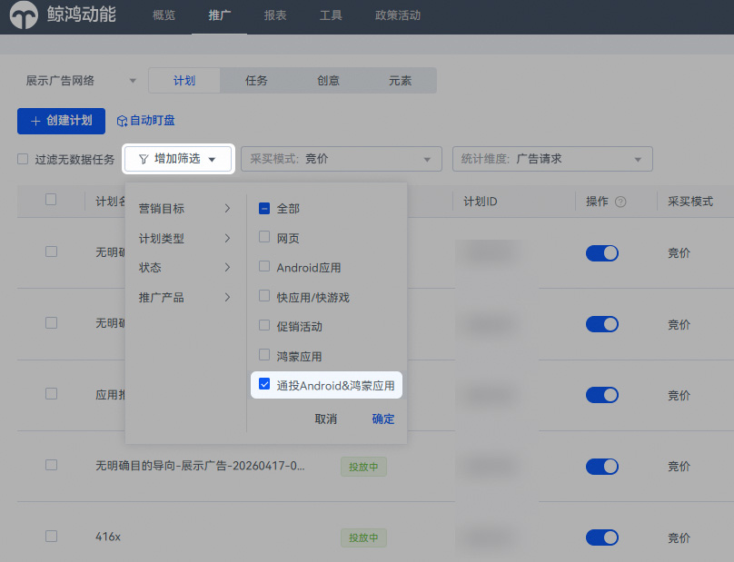

2) 支持点击任务查看“鸿蒙应用”和“Android应用”的推广任务的详细数据，同时支持针对单任务独立调整出价等投放设置。

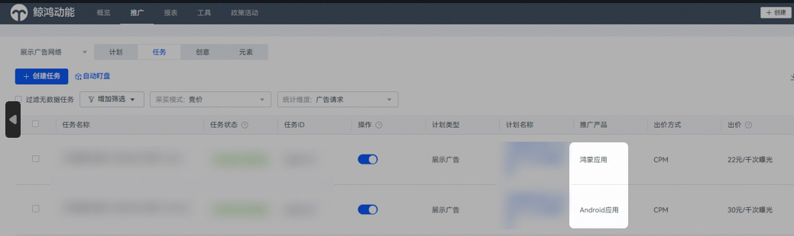

- Marketing API 适配说明：本功能已完成 Marketing API 全链路适配，相关“计划创建/查询”、“创意创编查”及“任务创建/查询”接口均已支持“通投Android&鸿蒙应用”类型（若想查阅相关接口文档请前往鲸鸿动能帮助中心，并依次进入：[推广 &gt; 鲸鸿动能广告（中国大陆地区） &gt; Marketing API &gt; 使用指南 &gt; 广告投放（新）&gt;计划/任务/创意/推广产品）](https://developer.huawei.com/consumer/cn/doc/promotion/ads_new_api01-0000001455600221)。
- 审核相互独立：Android应用推广与鸿蒙应用推广任务的审核与投放相互独立，单任务审核通过即可正常投放，不受另一任务审核状态影响。

<strong>【功能入口】</strong>

“推广”-&gt;“创建计划”-&gt;“应用推广”-&gt;“展示广告”/“商品广告”-&gt;“通投Android &鸿蒙应用”

“推广”-&gt;“创建计划”-&gt;“无明确目标导向”-&gt;“展示广告”/“商品广告”-&gt;“通投Android &鸿蒙应用”

“工具”-&gt;“事件资产管理”-&gt;“新建资产”-&gt;“应用”/“鸿蒙应用”

<strong>【适用范围】</strong>

直客账户、子客账户

<strong>微信小程序推广支持HarmonyOS 5及以上版本的设备</strong>

<strong>【功能说明】</strong>

即日起，微信小程序推广全面兼容 HarmonyOS 5及以上版本的手机设备，此前受系统版本限制的投放场景现已开放。

- 投放端提示语更新：

此前，推广产品选择“微信小程序”时，原有提示“暂时仅支持在HarmonyOS NEXT版本之前的设备推广”已移除，不再显示。

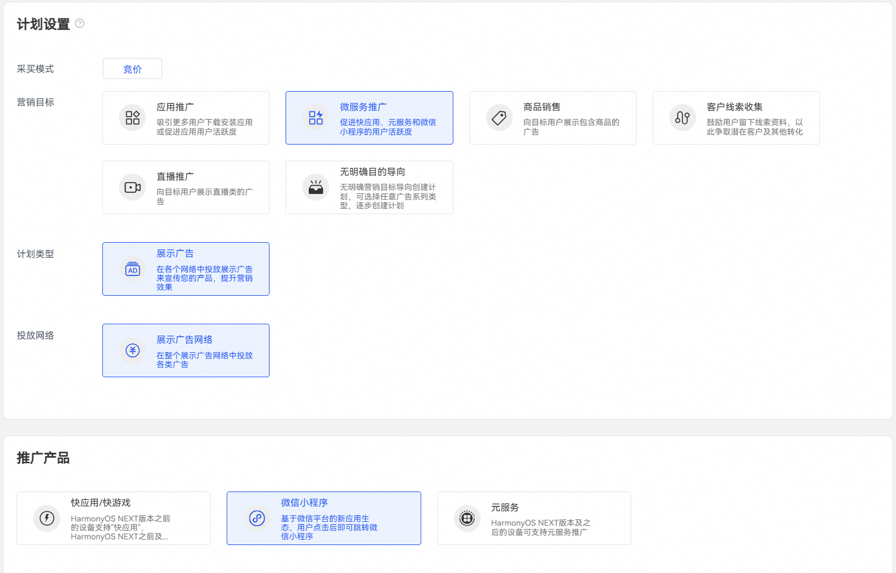

- 推广机制说明：

您在投放端选择微信小程序作为推广产品后，支持勾选鸿蒙相关版位，广告将在展示广告网络的资源位上呈现。

- 投放信息配置：

您需在投放端准确填写正确的“小程序名称”、“小程序 ID”和“小程序链接”三项信息，广告即可正常跳转至目标页面（备注：广告触发时，通过传入 AppID 与小程序页面路径（path）信息，即可调用接口拉起微信并打开目标小程序）。

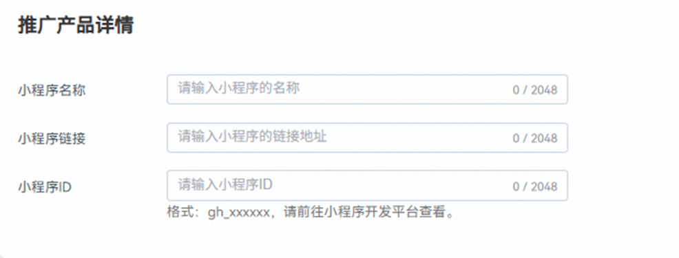

- 操作指引：

创建微信小程序广告的具体流程，[请参考鲸鸿动能帮助中心文档，并依次进入推广 &gt; 鲸鸿动能广告（中国大陆地区） &gt; 创建竞价广告 &gt; 微信小程序广告](/docs/monetize/promotion/ad-ads-wxxcxgg-0000001734471021)

<strong>【功能入口】</strong>

“推广”-&gt;“创建计划”-&gt;“微服务推广”-&gt;“微信小程序”

<strong>【适用范围】</strong>

直客账户、子客账户

<strong>经理账户平台新增“静默状态”筛选及“账户名称”字段</strong>

<strong>【功能说明】</strong>

为持续提升为优化平台查询性能并增强账户辨识度，经理账户平台新增了“静默状态”属性，同时在消耗统计页面增加“账户名称”字段，便于企业区分账户维度查询消耗数据。

- 静默状态判定条件：若账户持续一年未登录、未产生消耗且账户余额为零，则自动进入静默状态。此状态仅作用于数据筛选优化，不影响账户本身的使用功能；当重新登录时，账户状态将自动刷新恢复。
- 新增“静默状态”属性：经理账户平台首页新增“是否静默”查询条件，系统默认展示非静默状态的活跃账户数据。

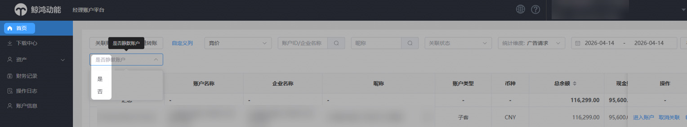

- 新增“账户名称”字段展示：经理账户平台-财务消耗统计页面现增加“账户名称”字段显示。

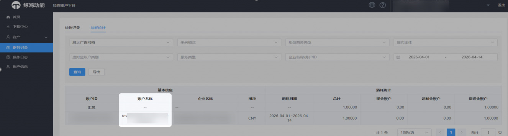

<strong>【功能入口】</strong>

“经理账户平台”-&gt;“首页”

“经理账户平台”-&gt;“财务记录”-&gt;“消耗统计”

<strong>【适用范围】</strong>

经理账户

<strong>Marketing API创建计划支持指定营销目标</strong>

<strong>【功能说明】</strong>

“创建计划（新）”接口支持指定“营销目标”参数。

## 二、服务商管理平台新功能

<strong>子客开户支持一个华为账号批量创建多个广告账户</strong>

<strong>【功能说明】</strong>

为提升广告账户开通效率，服务商在发起子客开户邀请时，支持单个华为账号一次性注册多个广告账户。只需在注册页面指定推广标的并设置开户个数，系统即可自动生成多条结构相同的广告账户信息，统一关联至同一华为账号下（备注：本功能适用于单华为账号开通多个同企业主体、同推广标的账户的场景；若需使用不同华为账号开户，需单独发起开户邀请）。

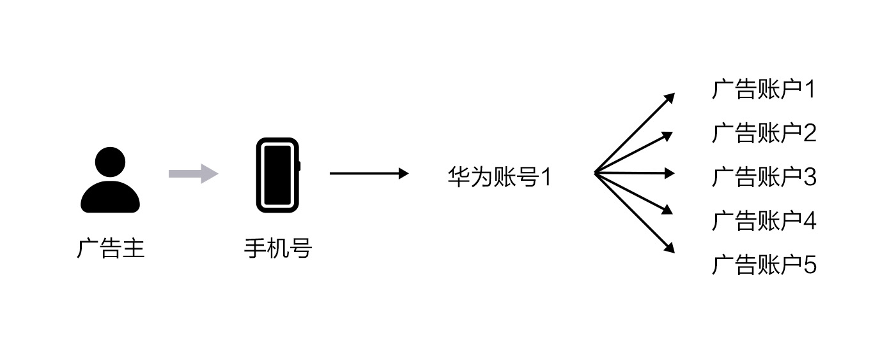

- 常规开户：

  1) 服务商邀请子客常规开户时，新增“开户个数”选项，单次最多可邀请5个账户（备注：常规开户信息填写页面，必须选“推广标的”后才会出现“开户个数”）。

  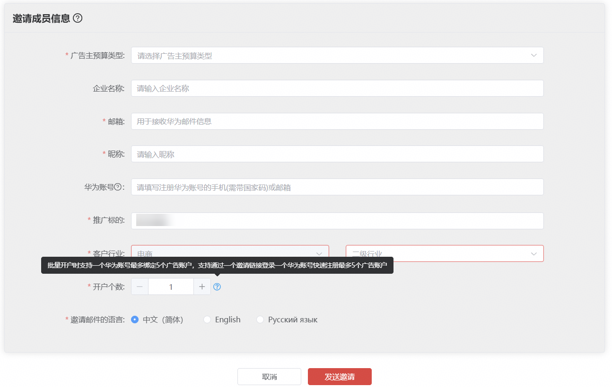

  2) 服务商邀请子客常规开户时，账户名称默认填充营业执照中的企业名称（备注：当账户名称空白时才自动填充，有值时不做填充）。

  3) 子客注册页面可同时填写多个账户名称，提交一次即完成全部注册。

  4) 子客开户审核流程不变，首个账户审核通过后，系统自动将其设为主账户，主账户审核通过后系统同步复制生成剩余4个子账户。

  5) 服务商邀请子客进行常规批量开户成功后，使用同一华为账号即可在多个广告账户间便捷切换。
- 操作限制：常规开户和极速开户信息填写页面中的“开户个数”选项不支持填写0，若填写0，系统将自动修正为1。
- 批量开户上限管控：当单次邀请开户个数或者该推广标的总批量开户个数达上限时，系统会分场景展现对应提示语。

  1) 单次邀请开户个数达到上限时，系统提示：单次批量开户个数已到达5个上限，请分批次。

  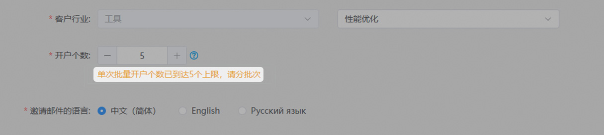

  2) 该推广标的总批量开户个数上限时，系统提示：该推广标的总批量开户个数已达上限，请逐个邀请开户注册。

  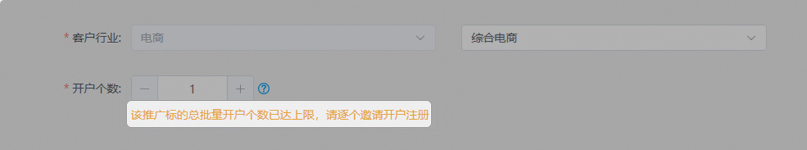

  <strong>【功能入口】</strong>

  “首页”-&gt; “新增子客”-&gt;“常规开户”/“极速开户”

  <strong>【适用范围】</strong>

  面向服务商（含一级服务商、子客服务商）邀请子客开户场景

<strong>服务商管理平台新增“静默状态”筛选与“账户名称”字段</strong>

<strong>【功能说明】</strong>

即日起，微信小程序推广全面兼容 HarmonyOS 5及以上版本的手机设备，此前受系统版本限制的投放场景现已开放。

为持续提升为优化平台查询性能并增强账户辨识度，服务商管理平台新增了“静默状态”属性，同时在消耗统计页面增加“账户名称”字段，便于企业区分账户维度查询消耗数据。

- 新增“静默状态”属性：服务商管理平台首页子客清单模块新增“是否静默”查询条件，系统默认查询并展示非静默状态的活跃账户数据。
- 静默状态判定规则：若账户（含一级服务商、子客服务商及子客账户，不含直客账户）持续一年未登录、未产生消耗且账户余额为零，则自动进入静默状态。此状态仅作用于数据筛选优化，不影响账户本身的使用功能；当重新登录时，账户状态将自动刷新恢复。

- 新增“账户名称”字段展示：服务商管理平台-消耗统计页面现增加“账户名称”字段显示。该字段旨在帮助服务商区分同一企业主体下、针对相同标的的不同账户消耗明细。

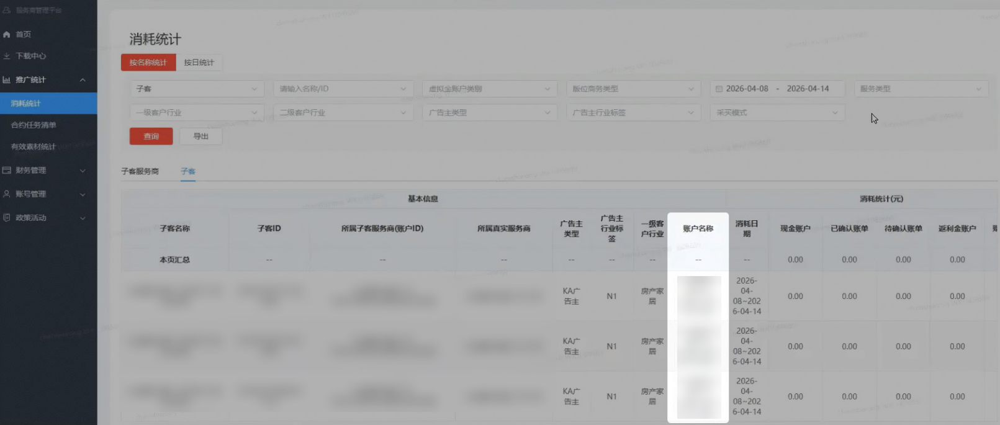

<strong>【功能入口】</strong>

“首页”-&gt;“子客清单”

“推广统计”-&gt;“消耗统计”

<strong>【适用范围】</strong>

服务商（含一级服务商、子客服务商）

## 相关链接

- [2026年3月新功能速递](https://alliance-communityfile-drcn.dbankcdn.com/FileServer/getFile/cmtyPub/011/111/111/0000000000011111111.20260529155956.24784248368447823089245671437740:20260531095857:2800:F85E765A45EE0ACD1C4607C5385FD56AED746F0748CB92DB056FFEBB1675F6CA.zip?needInitFileName=true)
- [2026年1月新功能速递](https://alliance-communityfile-drcn.dbankcdn.com/FileServer/getFile/cmtyPub/011/111/111/0000000000011111111.20260529155956.86102008669187811178238833635165:20260531095857:2800:06A216A86D83A64A2355FDECCF8847EEDD0A9E6FFC6FD9E1B1F5682E34FB44F5.zip?needInitFileName=true)
- [2025年11月新功能速递](https://alliance-communityfile-drcn.dbankcdn.com/FileServer/getFile/cmtyPub/011/111/111/0000000000011111111.20260529155957.76374898669391697131597101769033:20260531095857:2800:9ED659E848DC496692F9D8A8E176C624D74E96652B95A217CE116EA0B5949E6B.zip?needInitFileName=true)
- [2025年10月新功能速递](https://alliance-communityfile-drcn.dbankcdn.com/FileServer/getFile/cmtyPub/011/111/111/0000000000011111111.20260529155957.12530896401144224874295791190268:20260531095857:2800:B89AB8BF01D8DC6F6572BD5F8EC0B4F548D183304C93F8F76B768B95AB4613B6.zip?needInitFileName=true)
- [2025年9月新功能速递](https://alliance-communityfile-drcn.dbankcdn.com/FileServer/getFile/cmtyPub/011/111/111/0000000000011111111.20260529155957.89025946761721583648727251072076:20260531095857:2800:D60AB646F48A457F08CADBB782BF170C0060F41F4D85487943BC5C90B32C57E3.zip?needInitFileName=true)
- [2025年8月新功能速递](https://alliance-communityfile-drcn.dbankcdn.com/FileServer/getFile/cmtyPub/011/111/111/0000000000011111111.20260529155957.96745427236761916125984086264498:20260531095857:2800:0B1F288E39719A3FAE5B21A12E73C6F0485BC58568519CC3237630AD31EF502A.zip?needInitFileName=true)
- [2025年6月新功能速递](https://alliance-communityfile-drcn.dbankcdn.com/FileServer/getFile/cmtyPub/011/111/111/0000000000011111111.20260529155957.34570172902846539915510801203019:20260531095857:2800:ABEA261BE97097877CB29211EC574381CDD819073E22EE0C0975BDA2C5E6250B.zip?needInitFileName=true)
- [2025年3月新功能速递](https://alliance-communityfile-drcn.dbankcdn.com/FileServer/getFile/cmtyPub/011/111/111/0000000000011111111.20260529155957.84595977465221353529520402067320:20260531095857:2800:D2EE3FA2E851C999F41C2518214563C66FB3EB7B2BE91D051B8E260AEA506777.zip?needInitFileName=true)
- [2024年12月新功能速递](https://alliance-communityfile-drcn.dbankcdn.com/FileServer/getFile/cmtyPub/011/111/111/0000000000011111111.20260529155957.06356415243040839119049912769966:20260531095857:2800:98B2EC80A830E6E46C861741F0BF62C864E556BBE1E5A09B55989DCE5BE88B09.zip?needInitFileName=true)
