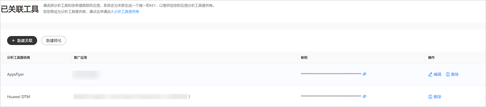

# 分析工具管理

## 概述

进行转化跟踪之前，您需要将应用与对应的应用分析工具进行关联，关联成功后才能完成转化数据的回传，具体请参考[事件资产管理](/docs/monetize/promotion/tracking-gaishu-0000001139892539)。

## 关联分析工具管理

您可以对“已关联工具”进行管理。

- 新建关联：您可以关联新的分析工具。
- 新建资产：通过此按钮您可以跳转到事件资产管理，详情请参考[事件资产管理](/docs/monetize/promotion/tracking-gaishu-0000001139892539)。
- 删除：密钥可以进行删除操作，删除后，转化跟踪也将会失效。如果您想重新使用此功能，请重新创建。
- 编辑：仅使用三方监测进行跟踪的应用才能使用编辑功能，如果您修改了监测链接，那么您需要重新[手动测试](/docs/monetize/promotion/tracking-app-overview-0000001209244840#ZH-CN_TOPIC_0000001209244840__section105501517172)，测试成功后新的曝光/点击监测链接才生效。详情请参考[三方监测跟踪](/docs/monetize/promotion/tracking-overview-0000001170938773)。

 

特殊场景：如果您的应用在多个广告账户中投放，且都需要将转化数据回传到对应广告账户，您可以使用秘钥共享的功能，此功能需要申请[特性通行名单](/docs/monetize/promotion/addtongxing-0000001128278195#ZH-CN_TOPIC_0000001128278195__li1573834017200)。
