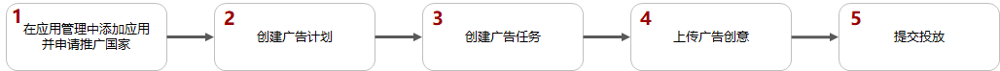
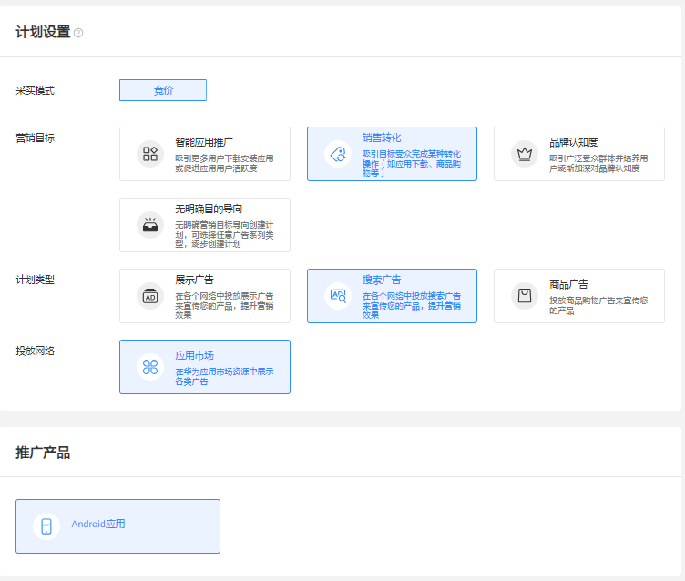
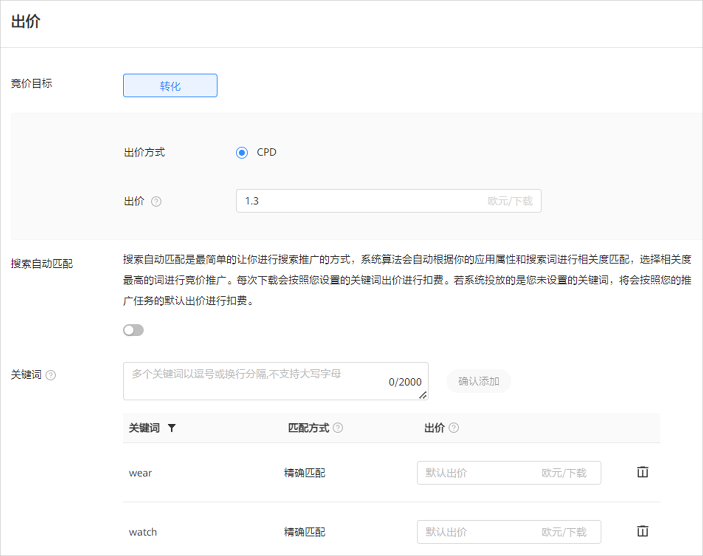
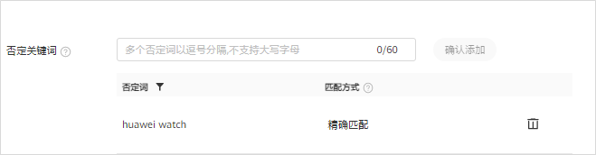
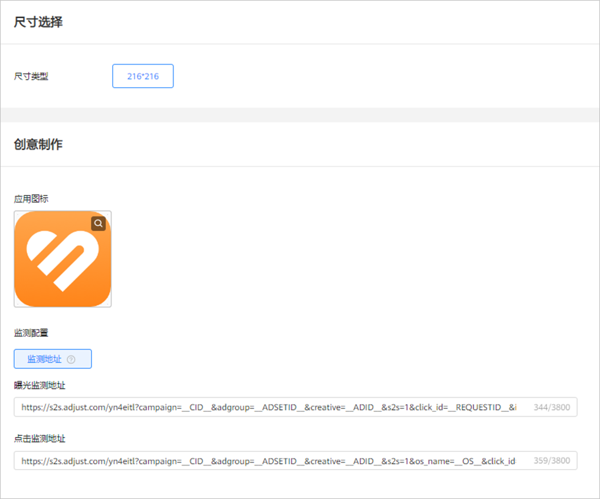

# 创建应用市场搜索广告

## 概述

应用市场搜索广告是指在[应用市场搜索结果中](https://developer.huawei.com/consumer/cn/doc/promotion/gallery-0000001057273476#section830795264818)上将您的应用展示推荐给用户，提升用户的下载。

## 操作流程

## 操作步骤

1. 在[应用管理](https://developer.huawei.com/consumer/cn/doc/promotion/appmanagement-0000001182393586)中添加应用并申请推广国家。
2. 创建广告计划。

   单击“创建”，选择“创建计划

   

   - <strong>营销目标：</strong>选择<strong>“</strong>销售转化<strong>”</strong>或者“无明确目的导向”，详情参考[营销目标](https://developer.huawei.com/consumer/cn/doc/promotion/overview-cjjjgg-0000001182873508#ZH-CN_TOPIC_0000001182873508__zh-cn_topic_0000001205953939_zh-cn_topic_0000001105216776_li07111843183611)。
   - <strong>计划类型：</strong>选择“搜索广告”，详情参考[计划类型](https://developer.huawei.com/consumer/cn/doc/promotion/overview-cjjjgg-0000001182873508#ZH-CN_TOPIC_0000001182873508__zh-cn_topic_0000001205953939_zh-cn_topic_0000001105216776_li234211653411)。
   - <strong>投放网络：</strong>选择“应用市场”，详情参考[投放网络](https://developer.huawei.com/consumer/cn/doc/promotion/overview-cjjjgg-0000001182873508#ZH-CN_TOPIC_0000001182873508__zh-cn_topic_0000001205953939_zh-cn_topic_0000001105216776_li93421166342)<strong>。</strong>
   - <strong>推广产品：</strong>选择“Android应用”，详情参考[推广产品](https://developer.huawei.com/consumer/cn/doc/promotion/overview-cjjjgg-0000001182873508#ZH-CN_TOPIC_0000001182873508__zh-cn_topic_0000001205953939_zh-cn_topic_0000001105216776_li8342416193416)<strong>。</strong>
   - <strong>计划日预算：</strong>详情参考[计划日预算](https://developer.huawei.com/consumer/cn/doc/promotion/overview-cjjjgg-0000001182873508#ZH-CN_TOPIC_0000001182873508__zh-cn_topic_0000001205953939_zh-cn_topic_0000001105216776_li14342141615342)。
   - <strong>推广计划名称：</strong>详情参考[推广计划名称](https://developer.huawei.com/consumer/cn/doc/promotion/overview-cjjjgg-0000001182873508#ZH-CN_TOPIC_0000001182873508__zh-cn_topic_0000001205953939_zh-cn_topic_0000001105216776_li1434211615342)。
3. 创建广告任务。
   - <strong>推广应用：</strong>从下拉列表中选择要推广的应用。列表中仅展示已经成功添加到“应用管理”并通过推广审核的应用。如果需要推广的应用不在下拉列表中，您需要先添加应用，详情请参考[应用管理](https://developer.huawei.com/consumer/cn/doc/promotion/appmanagement-0000001182393586)。
   - <strong>定向：</strong>设置您希望推广的国家/地区，只支持从此应用已经[审核通过](https://developer.huawei.com/consumer/cn/doc/promotion/review-0000001052064324)的国家中进行选择，同一任务中可以选择多个国家/地区进行投放，详情参考[定向](https://developer.huawei.com/consumer/cn/doc/promotion/targeting-0000001180547094)。
   - <strong>版位：</strong>选择App search。
   - <strong>投放日期：</strong>详情参考[投放日期](https://developer.huawei.com/consumer/cn/doc/promotion/overview-cjjjgg-0000001182873508#ZH-CN_TOPIC_0000001182873508__zh-cn_topic_0000001205953939_li73789433254)。

   

   

   - <strong>出价：</strong>只支持按照CPD模式进行竞价，在用户下载应用后按照您的出价进行计费。
   - <strong>搜索自动匹配：</strong>搜索自动匹配是最简单的让您进行搜索推广的方式，系统算法会自动根据你的应用属性和用户搜索词进行相关度匹配，自动选择相关度高的关键词进行竞价推广。每次下载会按照您设置的自动匹配出价进行扣费（自动匹配出价：即搜索任务的通投出价）。若系统自动匹配到的关键词，和您设置的精准匹配关键词重复时，将按出价高的匹配方式进行扣费。
   - <strong>关键词：</strong>您可以设置希望在用户搜索哪些关键词时对您的应用进行推广。
     - 关键词支持的匹配方式：仅支持“精确匹配”，当用户搜索词与您设置的关键词完全一致时，您的广告才有展现机会。精确匹配可以匹配关键词的单复数，进行时、过去式等变体，并且顺序必须保持一致。

       例如：关键词coffee cups，用户搜索coffee cups或者coffee cup（单数）都可以匹配。但如果用户搜索的是blue coffee cups（添加了额外的单词）或者coffee mugs（相似单词），这时您的广告就不会出现。
     - 关键词出价：每个关键词可以单独出价，设置关键词是快速将您的产品推送给目标用户的有效手段。关键词出价的优先级高于任务的默认出价，例如：上图中设置了wear出价是1.5，而任务的默认出价是1.3，这时用户在搜索wear时，系统将用1.5出价进行竞价。若该关键词没有单独设置出价，则使用默认出价进行竞价。

       通过设置关键词出价，您可以更精确的控制对不同用户的出价，以便在一些高潜用户的竞价上通过高出价提高转化率。 例如：HUAWEI Watch 3 pro的用户是潜在的高价值用户，您可以对Watch 3 pro给出更高出价，以便提高在搜索watch 3 pro时的转化率。
     - 关键词可以分批次增加，只能添加200个，添加的时候，您可以用逗号、换行分隔多个关键词。
   - <strong>任务名称</strong>：详情参考[任务名称](https://developer.huawei.com/consumer/cn/doc/promotion/overview-cjjjgg-0000001182873508#ZH-CN_TOPIC_0000001182873508__zh-cn_topic_0000001205953939_li237864312259)。
4. 添加广告创意。

   在应用市场广告下，系统默认使用您在应用市场上传的应用图标，您无需上传其他图片且不支持修改。

   

   <strong>监测地址（选填）</strong>：如果您使用三方监测进行转化跟踪，请先完成[三方监测](https://developer.huawei.com/consumer/cn/doc/promotion/tracking-overview-0000001170938773)的对应操作，完成后在您创建任务的时候，系统将会自动关联监测地址（关联出来的链接建议不要修改，避免影响跟踪数据）。如果您修改了关联分析工具中的监测链接，系统将会自动同步到任务，任务中无需修改。
5. 提交投放。

   单击“提交”，应用市场广告不需要审核，提交后直接进入投放状态。
