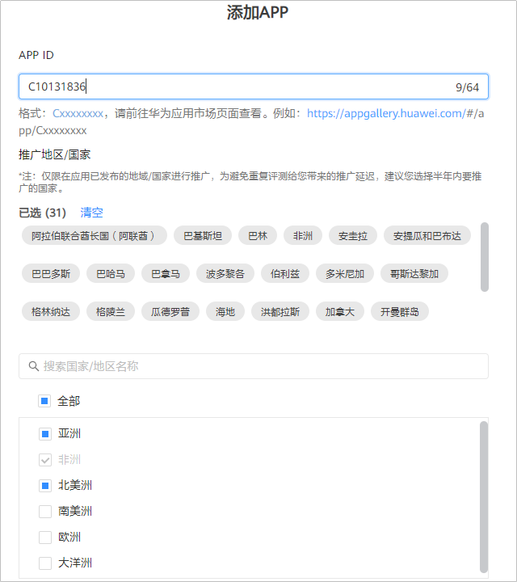
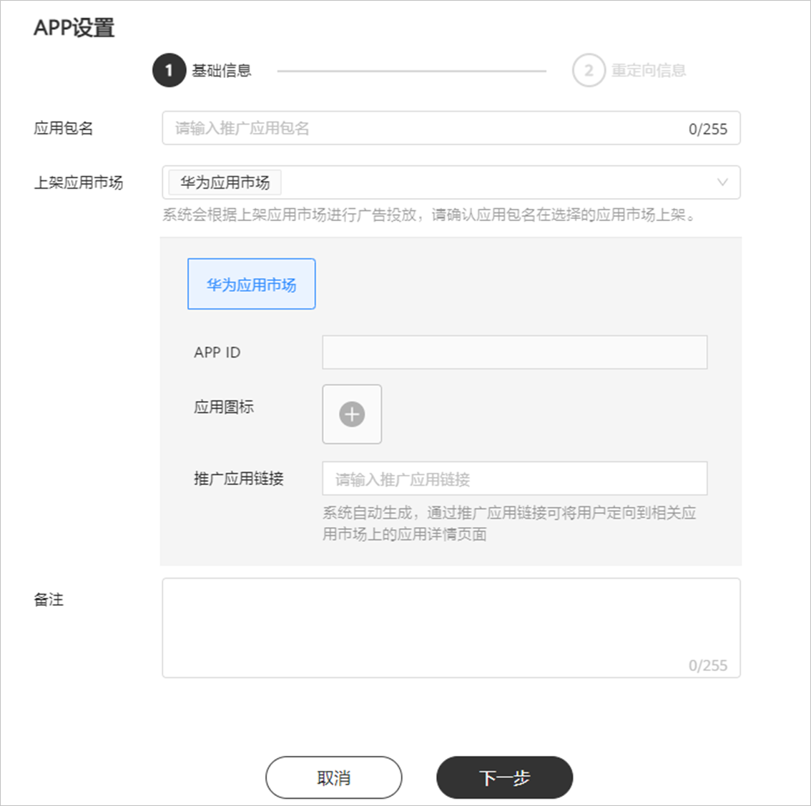
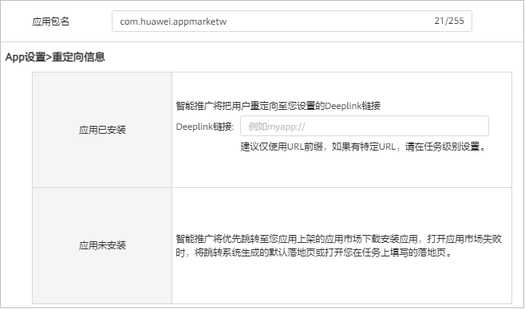

# 应用管理

## 概述

在投放应用市场广告、展示广告网络之前，您需要根据应用上架的应用市场在应用管理中添加应用。

如果您的应用同时上架了华为应用市场和GooglePlay等其他安卓应用商店，为了您广告在所有手机上能够正常投放，添加应用的时候您需要同时添加华为应用市场和GooglePlay等其他安卓应用商店的应用。

## 应用市场-应用管理操作步骤

如果想要在[华为应用市场](https://developer.huawei.com/consumer/cn/doc/promotion/gallery-0000001057273476)推广您的应用，您需要将您的应用在华为应用市场发布，且在应用管理中此添加应用并提交审核。

 

AG投放应用管理中最多添加120个来自华为应用市场的应用。

1. 添加应用并申请推广国家/地区。

   单击”工具”-&gt;“应用管理“-&gt;"AG投放应用管理"，单击“添加App”：

   

   - <strong>应用ID</strong>：输入应用ID，应用ID可在华为应用市场应用详情页网页链接尾部获取，例如：``https://appgallery.huawei.com/#/app/<strong>Cxxxxxxxxx</strong>``，请前往[华为应用市场](https://appgallery.huawei.com/#/Featured)查看。
   - <strong>推广国家</strong>/<strong>地区</strong>：您只能在应用已发布的地域/国家进行推广。您可以在搜索框中搜索您想要推广的国家，为避免重复评测给您带来的推广延迟，建议您选择半年内要推广的国家/地区。例如，您应用仅在英国和俄罗斯上架，则您只能在英国和俄罗斯申请推广。

     若您的应用曾经在鲸鸿动能广告平台、应用市场付费推广平台进行过推广，系统会默认显示您推广过的<strong>国家</strong>/<strong>地区</strong>，若您此次想要推广的区域包含在界面上显示的“<strong>推广国家</strong>/<strong>地区</strong>”内，请点击确认即可进行推广，无需进行第二步审核。

     若您想要推广的区域未包含在界面上显示的“<strong>推广国家</strong>/<strong>地区</strong>”内，推广国家添加完成后，请单击“确认“，此时应用将会提交审核。
2. 提交应用审核。

   您提交的应用将在3个工作日内完成审核，审核结果将发送至您的联系人邮箱，请注意查收。
3. 投放应用市场广告。

## 展示广告网络-应用管理操作步骤

 

如果您需要使用此功能，需要申请[特性通行名单](https://developer.huawei.com/consumer/cn/doc/promotion/addtongxing-0000001128278195#ZH-CN_TOPIC_0000001128278195__li45184615204)。

通用投放应用管理中最多添加100个应用。

如果想要在[展示广告网络](https://developer.huawei.com/consumer/cn/doc/promotion/display-0000001057113500)投放多平台智能下载的任务，您需要在应用管理中此添加应用。

1. 添加应用。

   单击”工具”-&gt;“应用管理“-&gt;“通用投放应用管理”，单击“添加App”，根据您应用上架的应用市场进行信息填写：

   

   - 应用包名：输入推广应用包名，例如：com.huawei.appmarket，请确保应用包名与相关应用市场包名一致，否则您的应用将无法正确投放。应用包名输入后点击回车，系统自动检测应用上架平台并勾选上架应用市场。如果检测结果有误，请您手动修改为正确信息。
   - App设置&gt;基础信息：

     | 上架应用市场 | 应用包名 | 应用ID | 应用图标 | 推广应用链接 | 应用名称 |
     | --- | --- | --- | --- | --- | --- |
     | 华为应用市场 | √ | √ | √ | √ |  |
     | Google Play | √ | √ | √ | √ | √ |
     | 其他安卓应用市场 | √ | - | - | - | √ |

      

     当您的应用仅在Google Play上架时，其任务计费方式不支持选择CPI。

     - 应用ID：您输入包名后，系统自动识别您的应用ID。
     - 应用图标：

       如果您的应用在华为应用市场上架，您输入包名后，系统自动识别出您的应用图标，图标不可更改。

       如果您的应用在Google Play上架，系统将自动填充Google Play的应用图标
     - 推广应用链接：系统根据您输入的应用包名自动生成推广应用链接。通过推广应用链接，用户看到您的广告后，可以点击跳转到相关应用市场上的应用详情页面。
     - 应用名称：应用添加完成后，推广应用名称自动填充，请确认该名称与在相关应用市场上架时所使用的名称一致，如果不一致，请单击“编辑”进行修改。
   - 基础信息设置完成后，单击“下一步”，补充“App设置&gt;重定向信息”内容：

     
     - 应用已安装：您需要补充应用直达链接，如果您想获取应用首页，获取方式请参考<strong>[应用直达链接获取工具](https://developer.huawei.com/consumer/cn/doc/promotion/overview-cjjjgg-0000001182873508#section19208102614323)；</strong>如果您想获取应用直达链接的指定页面，请联系您的研发同事获取。
     - 应用未安装：优先跳转至您应用上架的应用市场下载安装应用，如果打开应用市场失败，将跳转至系统根据应用市场智能生成的默认落地页或打开您在任务中填写的落地页。
2. 创建展示广告任务。

   选择步骤一中创建的应用，详情参考[创建展示广告](https://developer.huawei.com/consumer/cn/doc/promotion/displayad-0000001052424318)。
3. 展示广告任务提交审核。

   您在此处添加的应用跟随展示广告任务一起审核，如果因为您的应用信息错误导致展示广告任务被驳回，您需要根据驳回理由重新编辑应用信息并重新提交任务审核。
4. 投放展示广告。

## 应用管理操作

<strong>查看：</strong>应用添加完成后，您可以单击”工具箱”-&gt;“应用管理“-&gt;“AG投放应用管理/通用投放应用管理”-&gt;“查看”，选择您的应用，查询审核状态或查看应用信息。

<strong>编辑：</strong>如果您增加的应用信息有误，您可以单击”工具箱”-&gt;“应用管理“-&gt;“编辑”，选择您想要修改的应用进行编辑。

<strong>申请推广：</strong>如果您想继续增加华为应用市场应用的推广国家/地区，您可以单击”工具箱”-&gt;“应用管理“-&gt;“申请推广“进行添加。

## 用户安装应用方式

如果您的应用在多个应用市场上架，在创建展示广告任务时，应用所属平台推荐您选择“多平台智能下载”，系统将会根据您应用上架的应用市场，按照优先级推荐用户安装您的应用，应用安装方式如下：

- 当用户手机安装了GooglePlay：

  |  |  |  |  |  |  |  |
  | --- | --- | --- | --- | --- | --- | --- |
  | 应用所属平台 | 适用场景 | 您应用上架的应用市场 | | | 用户下载、安装应用方式 | |
  | 华为应用市场 | GooglePlay | 其他安卓应用商店(APKPure) | 华为手机 | 非华为手机 |
  | 多平台智能下载 | 如果您的应用在多个应用市场上架，推荐您使用多平台智能下载 | √ | - | √ | 单击“下载”直接下载并安装（华为应用市场包） | 单击“下载”直接下载+安卓系统的系统安装器安装（华为应用市场包） |
  | √ | - | √ | 单击“下载”直接下载并安装（华为应用市场包） | 单击“下载”直接下载+安卓系统的系统安装器安装（华为应用市场包） |
  | √ | - | - | 单击“下载”直接下载并安装（华为应用市场包） | 单击“下载”直接下载+安卓系统的系统安装器安装（华为应用市场包） |
  | √ | - | - | 单击“下载”直接下载并安装（华为应用市场包） | 单击“下载”直接下载+安卓系统的系统安装器安装（华为应用市场包） |
  | √ | √ | √ | 单击“下载”直接下载并安装（华为应用市场包） | 跳转GooglePlay下载安装 |
  | √ | √ | √ | 单击“下载”直接下载并安装（华为应用市场包） | 跳转GooglePlay下载安装 |
  | √ | √ |  | 单击“下载”直接下载并安装（华为应用市场包） | 跳转GooglePlay下载安装 |
  | √ | √ |  | 单击“下载”直接下载并安装（华为应用市场包） | 跳转GooglePlay下载安装 |
  | - | √ | √ | 单击“下载”直接下载并安装（APKPure包） | 跳转GooglePlay下载安装 |
  | - | √ | √ | 单击“下载”直接下载并安装（APKPure包） | 跳转GooglePlay下载安装 |
  | - | - | √ | 单击“下载”直接下载并安装（APKPure包） | 单击“下载”直接下载+安卓系统的系统安装器安装（APKPure包） |
  | - | - | √ | 单击“下载”直接下载并安装（APKPure包） | 单击“下载”直接下载+安卓系统的系统安装器安装（APKPure包） |
  | - | √ | - | - | 跳转GooglePlay下载安装 |
  | - | √ |  | 跳转GooglePlay下载安装 | 跳转GooglePlay下载安装 |
  | 华为应用市场 | 如果您的应用在华为应用市场上架 | √ |  |  | 单击“下载”直接下载并安装（华为应用市场包） | 单击“下载”直接下载+安卓系统的系统安装器安装（华为应用市场包） |
  | GooglePlay | 如果您的应用在GooglePlay上架 | - | √ | - | 跳转GooglePlay下载安装 | 跳转GooglePlay下载安装 |
  | 其他安卓应用商店(APKPure) | 如果您的应用在APKPure上架 | - | - | √ | 单击“下载”直接下载并安装（APKPure包） | 单击“下载”直接下载+安卓系统的系统安装器安装（APKPure包） |
  | 第三方监测渠道 | 您已经成功对接三方监测平台，您可以投放OneLink等第三方深度链接。 | √ | - | - | 单击“下载”直接下载并安装（华为应用市场包） | 单击“下载”直接下载+安卓系统的系统安装器安装（华为应用市场包） |
  |  | √ | - | 跳转GooglePlay下载安装 | 跳转GooglePlay下载安装 |

- 当用户手机未安装GooglePlay：

  |  |  |  |  |  |  |  |
  | --- | --- | --- | --- | --- | --- | --- |
  | 应用所属平台 | 适用场景 | 您应用上架的应用市场 | - | - | 用户下载、安装应用方式 | |
  | 华为应用市场 | GooglePlay | 其他安卓应用商店(APKPure) | 华为手机 | 非华为手机 |
  | 多平台智能下载 | 如果您的应用在多个应用市场上架，推荐您使用平台智能下载 | √ | √ | √ | 单击“下载”直接下载并安装（华为应用市场包） | 单击“下载”直接下载+安卓系统的系统安装器安装（华为应用市场包） |
  | √ | √ | √ | 单击“下载”直接下载并安装（华为应用市场包） | 单击“下载”直接下载+安卓系统的系统安装器安装（华为应用市场包） |
  | √ | √ | - | 单击“下载”直接下载并安装（华为应用市场包） | 单击“下载”直接下载+安卓系统的系统安装器安装（华为应用市场包） |
  | √ | - | √ | 单击“下载”直接下载并安装（华为应用市场包） | 单击“下载”直接下载+安卓系统的系统安装器安装（华为应用市场包） |
  | √ | √ | - | 单击“下载”直接下载并安装（华为应用市场包） | 单击“下载”直接下载+安卓系统的系统安装器安装（华为应用市场包） |
  | √ | - | √ | 单击“下载”直接下载并安装（华为应用市场包） | 单击“下载”直接下载+安卓系统的系统安装器安装（华为应用市场包） |
  | √ | - | - | 单击“下载”直接下载并安装（华为应用市场包） | 单击“下载”直接下载+安卓系统的系统安装器安装（华为应用市场包） |
  | √ | - | - | 单击“下载”直接下载并安装（华为应用市场包） | 单击“下载”直接下载+安卓系统的系统安装器安装（华为应用市场包） |
  | - | √ | √ | 单击“下载”直接下载并安装（APKPure包） | 单击“下载”直接下载+安卓系统的系统安装器安装（APKPure包） |
  | - | - | √ | 单击“下载”直接下载并安装（Apkpure包） | 单击“下载”直接下载+安卓系统的系统安装器安装（APKPure包） |
  | - | - | √ | 单击“下载”直接下载并安装（APKPure包） | 单击“下载”直接下载+安卓系统的系统安装器安装（APKPure包） |
  | - | √ | √ | 单击“下载”直接下载并安装（APKPure包） | 单击“下载”直接下载+安卓系统的系统安装器安装（APKPure包） |
  |  | √ | - | 您的广告将不会被投放 | 您的广告将不会被投放 |
  | 华为应用市场 | 如果您的应用在华为应用市场上架 | √ |  | - | 单击“下载”直接下载并安装（华为应用市场包） | 单击“下载”直接下载+安卓系统的系统安装器安装（华为应用市场包） |
  | GooglePlay | 如果您的应用在GooglePlay上架 | - | √ | - | 您的广告将不会被投放 | 您的广告将不会被投放 |
  | 其他安卓应用商店(APKPure) | 如果您的应用在APKPure上架 | - | - | √ | 单击“下载”直接下载并安装（APKPure包） | 单击“下载”直接下载+安卓系统的系统安装器安装（APKPure包） |
  | 第三方监测渠道 | 您已经成功对接三方监测平台，您可以投放OneLink等第三方深度链接。 | √ | - | - | 单击“下载”直接下载并安装（华为应用市场包） | 单击“下载”直接下载+安卓系统的系统安装器安装（华为应用市场包） |
  | - | √ | - | 您的广告将不会被投放 | 您的广告将不会被投放 |
