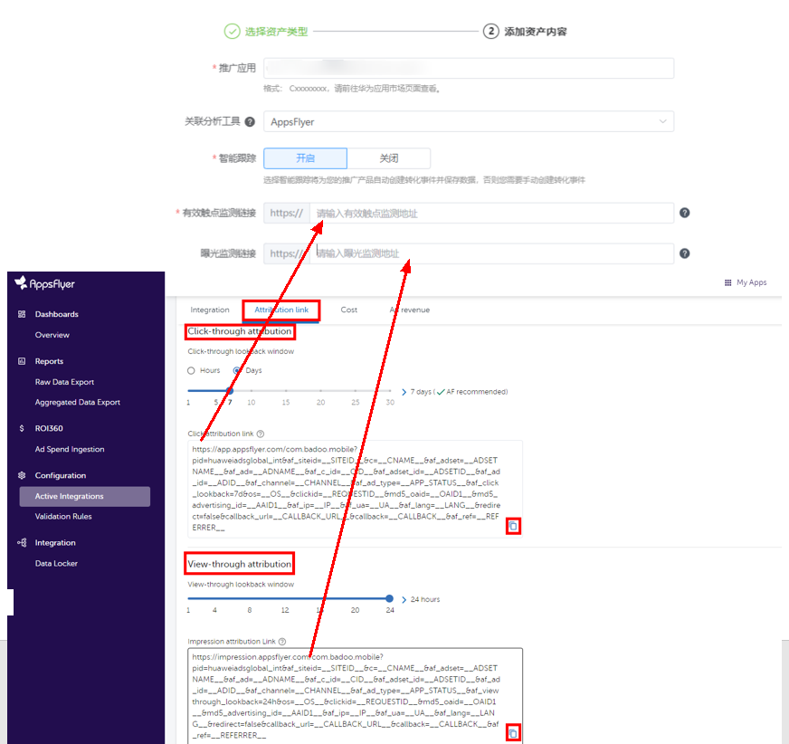

# AppsFlyer

## 概述

AppsFlyer根据不同的归因方式，支持的SDK版本如下，详情请参考[官网链接](https://www.appsflyer.com/)：

- OAID/GAID归因支持的SDK版本为5.4.0以上；
- Referrer归因支持的SDK版本为6.2.3及以上版本，当版本大于等于6.14.0之后，您需要手动[添加依赖](https://dev.appsflyer.com/hc/docs/install-android-sdk#huawei-install-referrer)才能对接referrer，且如需投放AppGallery，需保证SDK为6.14.0及以上版本。

## AppsFlyer代理账户预审批：

为了提高系统安全性，2024年7月14 日起，Appsflyer停止对非授权代理商的广告系列进行衡量，代理账户需要获得广告平台的预先审批后，才可使用对接。

如需授权审批，请联系鲸鸿动能运营人员并提供申请信息，或直接发送申请信息至邮箱petalads@huawei.com。申请信息模板如下表所示：

|  |  |
| --- | --- |
| 邮件标题 | 请按照“[代理名称]-[af\_prt]-申请AppsFlyer代理授权”格式填写。 |
| 邮件内容 | 代理名称：【代理公司全称】 |
| 代理af\_prt参数：【Appsflyer代理标识符】 |
| 广告主应用/ 名称：【应用名称】/【广告主名称】… |

## 操作流程

## AppsFlyer操作步骤

1. 集成AppsFlyer SDK并采集OAID/GAID。
   - 集成：详细操作请参照[AppsFlyer SDK集成指导](``https://support.appsflyer.com/hc/zh-cn/articles/207032126-适用于开发人员的Android-SDK集``成)；若已集成，可跳过此步。
   - 采集OAID/GAID：三方监测事件必须使用OAID/GAID跟踪归因，请确保您的应用已加入OAID采集代码，否则可能将无法正确跟踪。
     - 如果您跟踪的应用是华为应用市场的应用，且您使用的<strong>AppsFlyerSDK</strong>是6.2.3版本以下，您需要按照AppsFlyer的开发指南手动采集OAID，具体请参考[OAID采集](https://support.appsflyer.com/hc/zh-cn/articles/360006278797)。
     - 如果您跟踪的应用是华为应用市场的应用，且使用的<strong>AppsFlyerSDK</strong>是6.2.3及以上版本，6.2.3及以上版本已包含部分OAID的集成，您只需要补充以下图片中的代码即可。

       
     - 如果您跟踪的应用是非华为应用市场的应用，GAID会自动采集。
2. 在鲸鸿动能广告平台新建关联。

   需要为您希望跟踪的每一个应用使用指定的监测工具新建资产，详细请参考[新建资产](https://developer.huawei.com/consumer/cn/doc/promotion/tracking-app-overview-0000001209244840#ZH-CN_TOPIC_0000001209244840__li8351194812211)。

   填写曝光监测链接、点击监测链接：监测链接获取请参考[在三方监测平台获取曝光和点击监测链接](https://developer.huawei.com/consumer/cn/doc/promotion/tracking-overview-0000001170938773#ZH-CN_TOPIC_0000001170938773__li344454212571)。

   

    

   - 如果您后期修改了关联分析工具中的曝光/点击监测链接，您需要重新对任意一个指标进行[手动测试](https://developer.huawei.com/consumer/cn/doc/promotion/tracking-app-overview-0000001209244840#ZH-CN_TOPIC_0000001209244840__section105501517172)，测试成功后新的曝光/点击监测链接才生效，其他的指标启用状态，与修改链接前保持一致。
   - 如果您想在广告投放前对您创建的转化指标进行测试，那您可以进行[手动测试](https://developer.huawei.com/consumer/cn/doc/promotion/tracking-app-overview-0000001209244840#ZH-CN_TOPIC_0000001209244840__section105501517172)。
   - 如果您使用的监测链接未包含Referrer参数（af\_ref=\_\_REFERRER\_\_），请重新在三方监测平台拷贝监测链接并填入鲸鸿动能广告平台。
   - 如果您想要使用AppsFlyer的onelink作为监测链接，请使用长链接，短链接不可用于追踪。您可以通过以下方式获取长链接：

     1. 在AppsFlyer的OneLink custom links页面，点击Get URL。

     2. 在AppsFlyer的Attribution link页面，选择onelink模板，保存onelink链接并使用。 具体可咨询您的AppsFlyer账户经理。
   - 如果您的应用需投放AppGallery，且支持referrer归因，需保证SDK为6.14.0及以上版本。
3. 在AppsFlyer上设置数据回传。

   为了将AppsFlyer上跟踪到的转化结果传递给鲸鸿动能广告平台，以便鲸鸿动能广告平台可以将转化结果用于报表统计和投放优化，需要在AppsFlyer上配置数据回传给鲸鸿动能广告平台。

   - 如何配置转化事件回传给鲸鸿动能广告平台：详情请参考[AppsFlyer操作文档](https://alliance-communityfile-drcn.dbankcdn.com/FileServer/getFile/cmtyPub/011/111/111/0000000000011111111.20260513165910.02837067559583026381505073029481:20260531101614:2800:DACD9FDCF0972C7289C76A7BB5FBF9B02C9AC45C99309AD4739914340472F67C.pdf?needInitFileName=true)。
   - 如果您希望统计付费指标的金额，详情请参考[付费指标](https://developer.huawei.com/consumer/cn/doc/promotion/tracking-app-overview-0000001209244840#ZH-CN_TOPIC_0000001209244840__zh-cn_topic_0000001122291488_li132211445203517)。
4. 确认转化数据回传至鲸鸿动能广告平台。
   - 如果您想要投放非oCPC广告，您可以直接创建广告任务，待鲸鸿动能广告平台收到转化数据后，转化跟踪指标状态为“已启用”。
   - 如果您想要投放oCPC广告，鲸鸿动能广告平台必须先收到转化数据，收到转化数据后，转化跟踪指标状态为“已启用”，此时您才能创建任务，详情可参考[如何让鲸鸿动能广告平台收到转化数据](https://developer.huawei.com/consumer/cn/doc/promotion/tracking-app-overview-0000001209244840#ZH-CN_TOPIC_0000001209244840__table594218593381)。
5. 在鲸鸿动能广告平台创建广告任务。

   您在上传广告创意时，系统将会自动关联到创意中的曝光/点击监测链接（自动关联的链接不要修改，避免影响跟踪数据）。
6. 在鲸鸿动能广告平台[查看转化数据](https://developer.huawei.com/consumer/cn/doc/promotion/tracking-shu-0000001139892541)。
