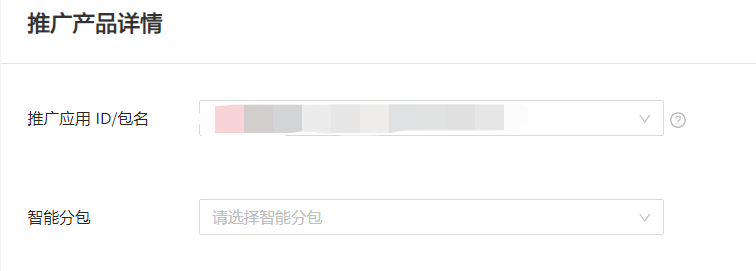
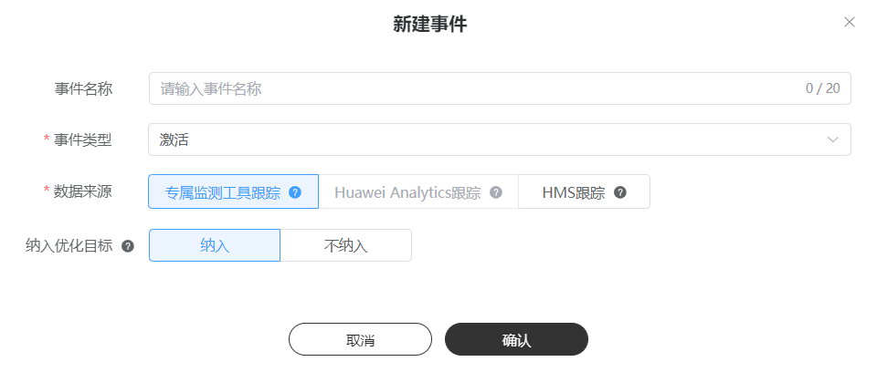

# 智能分包跟踪

## 功能介绍

为帮助衡量买量效果，鲸鸿动能推出智能分包跟踪方案，广告主可针对不同的推广任务选择不同的虚拟分包；相比传统渠道包归因，广告主无需管理分包，通过应用市场传递分包参数，实现分包跟踪。

具体流程如下：

1. 广告主在鲸鸿动能新建智能分包，并在投放任务中绑定智能分包；
2. 广告投放，用户点击广告下载并安装应用，智能分包参数写入应用市场客户端；
3. APP激活时调用应用市场接口查询智能分包参数获得归因信息；
4. 归因信息上传至广告主服务器进行解析；
5. 转化数据回传到鲸鸿动能，优化广告投放。

## 操作步骤

1. <strong>新建智能分包</strong>

   （1）操作入口：“工具”-&gt;“事件资产管理”-&gt;“新建资产”-&gt;“应用”

   - 关联分析工具：转化跟踪工具，此处请选择‘专属监测工具’，即广告主自主进行转化数据的跟踪和归因。
   - 跟踪模式：选择‘智能分包’；若您同时要使用监测链接功能则选择通用模式。
   - 智能跟踪：智能跟踪将为您的资产自动监测转化回传并创建转化事件。

   （2）操作入口：“选择资产”-&gt;“智能分包”-&gt;“添加分包”

   - 智能分包名称：为您创建的分包进行命名，长度应在128字符内，只能包含中英文、数字、下划线和空格。
   - 智能分包渠道号：传递到客户端的参数，您可以使用该参数来区别分包。
2. <strong>推广任务绑定智能分包</strong>

   操作入口：“创建计划”-&gt;“推广Android应用”-&gt;“APP安装：未安装”

   此时在推广应用ID下方弹出智能分包选择框，选择绑定您要使用的智能分包

   
3. <strong>查询智能分包参数</strong>

   开发步骤

   （1）构造Uri对象：uriString为“content://com.huawei.appmarket.commondata/item/5”。

   （2）调用ContentResolver.query接口，第1个参数传入Uri对象，第4个参数传入应用包名。

   注意：使用该接口将涉及contentResolver的获取，ContentResolver对象会与应用市场进行通信，部分场景下将被识别为关联启动，请您注意如下：

   - 需要在隐私声明中加上关联启动相关条例。
   - 获取用户隐私同意后，再进行接口的调用。

   cursor = contentResolver.query(uri, null, null, packageName, null);

   （3）解析ContentResolver.query接口返回的“Cursor”字段值。

   您可以使用Cursor.getString(X)获取相关归因信息，X可以是归因信息类型的常量或常量值，如下表所示。

   | <strong>常量</strong> | <strong>常量值</strong> | <strong>说明</strong> |
   | --- | --- | --- |
   | INDEX\_ENTER\_AG\_TIME | 1 | 在广告位点击安装按钮的时间。  单位：秒  示例：1632811393 |
   | INDEX\_INSTALLED\_FINISH\_TIME | 2 | 应用安装完成的时间。  单位：秒  示例：1632811393 |
   | INDEX\_START\_DOWNLOAD\_TIME | 3 | 应用开始下载的时间。  单位：秒  示例：1632811393 |
   | INDEX\_TRACKID | 4 | 应用市场付费推广的归因信息。 |
   | INDEX\_REFERRER\_EX | 5 | 鲸鸿动能归因信息。  reportCount:内部字段，无需关注  contentid：创意ID  channelId：智能分包渠道号  referrer：referrer跟踪参数  channel：渠道号  taskid：任务ID  campaignid：计划ID  corpid：账号ID  rtaid:rta参数(需要RTA权限)  callback：回传参数 |

   如果“Cursor”字段值为空，表示没有相应归因信息，可能的原因如下。

   - 应用只能查询其自身的归因信息，归因信息在端侧存储期限为90天，其中付费推广中的trackId在云侧的存储有效期是30天。
   - 用户手动清空华为应用市场缓存，会造成归因数据的缺失。
   - 用户卸载应用后，应用市场缓存的归因信息会丢失。

   注意：INDEX\_TRACKID和INDEX\_REFERRER\_EX参数只有在10.5.0.300及以上版本的应用市场客户端才支持。

   （4）取出INDEX\_REFERRER\_EX对应的归因结果进行两次decode转码获得json字符串，建议您不要在客户端处理归因字符串，将归因字符串上报服务端，在服务端进行解析处理。

   归因结果示例：

   ```
   %257B%2522reportCount%2522%253A-1%252C%2522contentId%2522%253A%252270075533%2522%252C%2522channelId%2522%253A%2522wuzifeng20240227%2522%252C%2522referrer%2522%253A%2522huaweiads_20240228152346100286949%2522%252C%2522channel%2522%253A%2522huaweiads%2522%252C%2522taskId%2522%253A%252242511984%2522%252C%2522campaignId%2522%253A%252229971889%2522%252C%2522corpId%2522%253A%25221250698106572381568%2522%252C%2522callback%2522%253A%252245063105%25252620240228152346100286949%2525261250698106572381568%252526contentId_70061289%2522%257D
   ```

   两次转码后：

   ```
   {"reportCount":-1,"contentId":"70075533","channelId":"20240227","referrer":"huaweiads_20240228152346100286949","channel":"huaweiads","taskId":"42511984","campaignId":"29971889","corpId":"1250698106572381568","callback":"45063105%2620240228152346100286949%261250698106572381568%26contentId_70061289"}
   ```

   示例代码：

   ```
   import android.content.ContentResolver;
   import android.content.Context;
   import android.database.Cursor;
   import android.net.Uri;
   import android.text.TextUtils;
   import android.util.Log;
   import android.widget.Toast;
   import org.json.JSONException;
   import org.json.JSONObject;
   import java.net.URLDecoder;

   private static final String PROVIDER_URI = "content://com.huawei.appmarket.commondata/item/5";
   private static final int INDEX_ENTER_AG_TIME = 1;
   private static final int INDEX_INSTALLED_FINISH_TIME = 2;
   private static final int INDEX_START_DOWNLOAD_TIME = 3;
   private static final int INDEX_TRACKID = 4;
   private static final int INDEX_REFERRER_EX = 5;

   /**
   * 获取 referrerEx
   *
   * @param pkgName 目标包名
   * @return json 格式字符串
   */
   private String getReferrerEx(Context context, String pkgName) {
   String referrerEx = null;
   Cursor cursor = null;
   Uri uri = Uri.parse(PROVIDER_URI);
   ContentResolver contentResolver = context.getContentResolver();
   String[] packageName = new String[]{pkgName};
   try {
   cursor = contentResolver.query(uri, null, null, packageName, null);
   if (cursor != null) {
   cursor.moveToFirst();
   Log.i(TAG, "packageName= " + pkgName);
   if (cursor.getColumnCount() > INDEX_REFERRER_EX) {
   // 10.5.0.300 及之后版本
   Log.i(TAG, "enter AppGallery time = " + cursor.getString(INDEX_ENTER_AG_TIME));
   Log.i(TAG, "installed time = " + cursor.getString(INDEX_INSTALLED_FINISH_TIME));
   Log.i(TAG, "download time = " + cursor.getString(INDEX_START_DOWNLOAD_TIME));
   Log.i(TAG, "trackId = " + cursor.getString(INDEX_TRACKID));
   Log.i(TAG, "referrerex = " + cursor.getString(INDEX_REFERRER_EX));
   referrerEx = cursor.getString(INDEX_REFERRER_EX);
   } else {
   // 不支持归因信息
   Log.e(TAG, "AppGallery not support");
   }
   }
   } catch (Exception e) {
   //处理异常
   Log.e(TAG, "query referrer failed." + e.getMessage());
   } finally {
   if (cursor != null) {
   cursor.close();
   }
   }
   //对从数据库查询到的结果进行转码
   referrerEx = decodeUrl(referrerEx);

   // 如果 referrerEx 是 json 格式，打印具体内容
   if (!TextUtils.isEmpty(referrerEx)) {
   try {
   JSONObject attributionMap = new JSONObject(referrerEx);
   Log.i(TAG, "json channelId = " + attributionMap.getString("channelId"));
   Log.i(TAG, "json callback = " + attributionMap.get("callback"));
   Log.i(TAG, "json taskId = " + attributionMap.get("taskId"));
   Log.i(TAG, "json campaignId = " + attributionMap.get("campaignId"));
   Log.i(TAG, "json corpId = " + attributionMap.get("corpId"));
   } catch (JSONException e) {
   e.printStackTrace();
   }
   }
   Toast.makeText(context, "referrer ex is: " + referrerEx, Toast.LENGTH_LONG).show();
   return referrerEx;
   }

   private String decodeUrl(String url) {
   if (url == null) {
   return null;
   } else {
   try {
   return URLDecoder.decode(url, "UTF-8");
   } catch (Exception e) {
   Log.i(TAG, "decodeUrl error " + e.getMessage());
   return null;
   }
   }
   }
   ```
4. <strong>功能调试</strong>

   如果您已经开通智能分包权限并且准备好集成了查询归因信息的测试包，那么就可以开始调试。

   （1）创建应用事件资产，设置智能分包渠道号；

   （2）创建应用推广试投放任务，安装状态选择未安装，选择智能分包，完成试投放任务创建；

   （3）在测试手机中找到试投放广告，点击并下载APP；

   （4）使用手机上备份的测试APP覆盖安装（若测试包已经上架应用商店，则可以跳过这一步）；

   （5） 激活测试APP查询归因参数，上传服务器解析。

   注意：

   首次对接测试智能分包，老版本应用不具备查询能力的，从测试广告下载APP后，直接使用您的新版本安装包进行升级，切勿卸载后再安装，否则会导致归因信息丢失。

   切勿使用Android Studio安装测试版本，此过程等同于卸载重装。

   测试包的签名文件须与在架版本保持一致，否则无法安装成功。
5. <strong>转化数据回传</strong>

   （1）广告主完成归因后，可根据鲸鸿动能转化跟踪接口对接回传转化事件，用于鲸鸿动能的广告优化功能等。

   （2）若您开启了智能跟踪，鲸鸿动能接收到广告主转化回传后，将会自动创建转化事件并保存数据，若您未开启智能跟踪，则需手动创建事件。

   

   （3）智能分包跟踪无法进行扫码联调，请使用试投放进行调试。

## 附件

请参考[鲸鸿动能转化跟踪接口对接说明(中国大陆)v2.1.6](https://alliance-communityfile-drcn.dbankcdn.com/FileServer/getFile/cmtyPub/011/111/111/0000000000011111111.20260529160258.23470677907686905025220430718241:20260531101412:2800:EADB8E4BB19629726865866ED8059C4B30B3F9C1B350EA204DE20C7E2D7F146C.pdf?needInitFileName=true)

## F&Q

<strong>Q：INDEX\_REFERRER\_EX获取到的归因信息有哪几种？</strong>

A：推广分包信息

\\{reportCount:xxx,contentid:xxx,channelid:xxx,referrer:xxx,channel:xxx,taskid:xxx,campaignid:xxx,corpid:xxx,rtaid:xxx,callback:xxx\\}

推广主包信息（不包含channelid参数）

\\{reportCount:xxx,contentid:xxx ,referrer:xxx,channel:xxx,taskid:xxx,campaignid:xxx,corpid:xxx,rtaid:xxx,callback:xxx\\}

其余情况为非鲸鸿动能推广场景。

说明：INDEX\_REFERRER\_EX为空的一部分，包含一定的低版本鲸鸿动能推广量。

<strong>Q：INDEX\_REFERRER\_EX和INDEX\_TRACKID分别代表什么含义？</strong>

A：INDEX\_REFERRER\_EX为鲸鸿动能使用的归因参数，INDEX\_TRACKID为应用市场付费推广使用的归因参数，两个字段填充互斥只会存在一个有值。

<strong>Q：智能分包归因需要使用INDEX\_REFERRER\_EX里的多少字段？</strong>

A：建议您选择性的保存如下参数，其中callback在转化回传时需要带回给鲸鸿动能。

contentid：创意ID；channelid：智能分包渠道号；taskid：任务ID

campaignid：计划ID；corpid：账号ID；rtaid:rta参数；callback：回传参数

<strong>Q：广告主如果同时使用智能分包和监测链接跟踪，该怎么做转化回传？</strong>

A：一般情况下选择一种归因结果回传即可；如果想要综合两份归因结果进行回传，可在广告主侧合并去重之后再回传给鲸鸿动能；不建议直接将两份归因结果未做处理同时回传给鲸鸿动能，这可能会导致转化重复。

<strong>Q：为什么建议广告主不要在客户端处理归因字符串，将归因字符串上报服务端，在服务端进行解析处理？</strong>

A：回传接口是设计服务端使用的，接口中涉及敏感信息，不宜放到客户端使用。

而且归因字符串格式内容都是不固定的，数据格式内容若有改变除非客户端发版修改，否则会影响归因信息的识别与获取。

<strong>Q：如果同时投多个推广任务，关联多个自定义渠道号，在同一个设备发生多次广告安装，此时的归因信息是什么？</strong>

A：最后一个安装成功的任务对应的归因信息。
