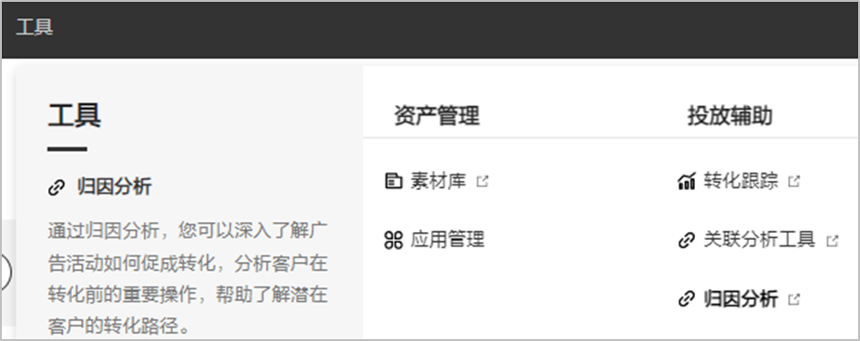
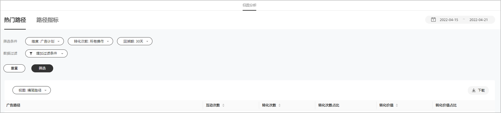

# 归因分析

 

如果您需要使用此功能，需要申请[特性通行名单](/docs/monetize/promotion/addtongxing-0000001128278195#ZH-CN_TOPIC_0000001128278195__li106584282110)。

## 概述

事件完成后，您便可以使用归因分析，通过方便易用的分析报告来查看转化数据（用户在您应用上执行的重要操作，例如付费、购物等）。归因分析会向您显示用户完成转化所经历的路径，并深入分析您不同的广告活动如何共同促成转化。

## 如何打开归因分析工具

1. 登录鲸鸿动能广告平台。
2. 单击“工具”-&gt;“投放辅助”-&gt;”归因分析”。

   

## 如何使用归因分析

归因分析提供了以下报告控件。您可以使用这些控件来定制报告和查看那些对业务至关重要的数据。

### 日期范围

您选择的日期范围将决定要在报告中纳入的转化数据范围。点击页面右上角的日期范围进行选择，日期范围支持选择“今天/昨天/过去7天/过去30天/过去90天/自定义”。

### 筛选条件

您可以通过不同的筛选条件，筛选出您想要的分析报告。

- 维度：指的是报表展示的维度，单击页面左上角的“维度”下拉菜单可更改报告显示的数据细分。例如，您可以选择广告计划、广告任务、广告创意等。
- 转化操作：指的是来源于广告主创建的转化指标，只有当您创建了的转化才会在这里显示单项转化，只需单击页面中心上方的“转化操作”下拉菜单，即可选择要纳入到报告中的转化操作。默认情况下，各个报告都会包含您在“[纳入到“指定转化次数”](/docs/monetize/promotion/tracking-app-overview-0000001209244840#ZH-CN_TOPIC_0000001209244840__zh-cn_topic_0000001138842000_li3531103316572)”列中”设置下选择的所有转化操作。
- 回溯期：从转化开始回溯多长时间内的广告互动。

## 热门路径

显示用户完成转化所采用的最常见路径。此报告会根据实现转化之前客户点击的广告来确定路径。您可以在此报告中查看更多详细信息，只需从下拉菜单中进行选择即可。

- 视图
  - 精简路径：精简路径会将具有相同维度值的连续广告互动视为一次互动。这有助于您了解客户在其转化路径上如何在不同关键字、广告组或广告系列之间进行切换。

## 路径指标

显示用户完成转化所需的时间和互动次数，该报告还显示在指定天数或互动次数后发生的转化次数及相应的转化价值。

路径指标包含互动次数：

- 互动次数：查看用户完成转化所需的互动次数，请选择“衡量类型”标签页。您可以使用此视图查看促成转化的较佳频次。

  发生转化所需的平均点击次数：系统根据您总次数求出的平均值。
