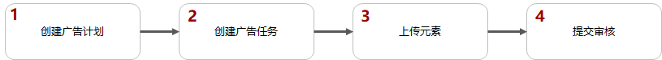
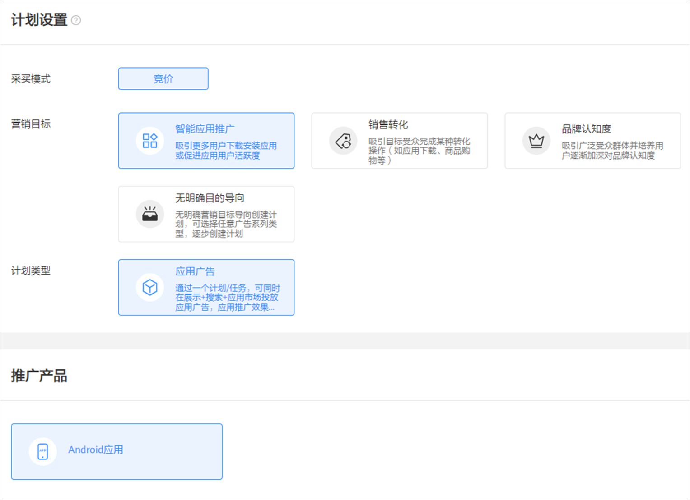
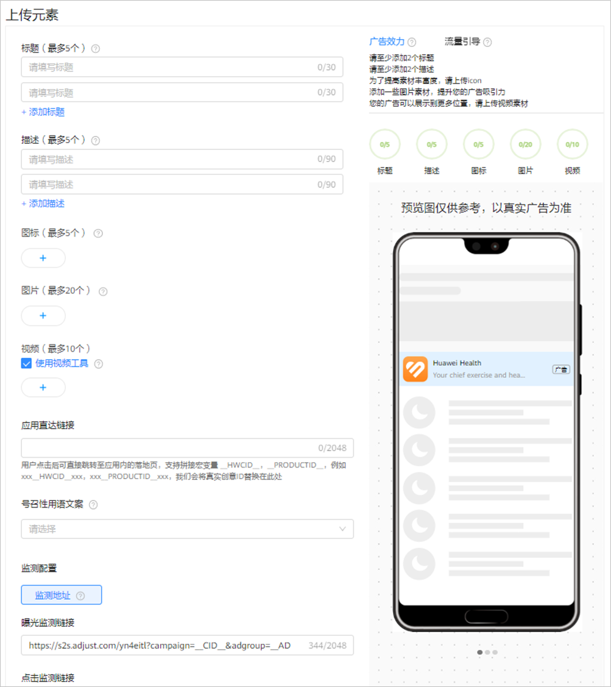

# 创建智能应用广告

## 概述

智能应用广告是指在[展示广告网络资源](/docs/monetize/promotion/display-0000001057113500)上对您的应用进行推广。

您只需要添加元素，系统会根据您提供的应用图标、应用名称、应用描述、图片、视频等素材，为您自动生成适合Banner、Native、Splash、Interstitial、Rewarded等多个版位的创意，覆盖多个版位，增加元素丰富度，可提高广告优化空间。请确保您的标题和描述能够与任意素材搭配使用。

## 操作流程

## 操作步骤

1. 创建广告计划。

   单击“创建”，选择“创建计划”。

   

   - <strong>营销目标：</strong>选择“智能应用推广”或者“无明确目的导向”，详情参考[营销目标](/docs/monetize/promotion/overview-cjjjgg-0000001182873508#ZH-CN_TOPIC_0000001182873508__zh-cn_topic_0000001205953939_zh-cn_topic_0000001105216776_li07111843183611)。
   - <strong>计划类型：</strong>选择“应用广告”，详情参考[计划类型](/docs/monetize/promotion/overview-cjjjgg-0000001182873508#ZH-CN_TOPIC_0000001182873508__zh-cn_topic_0000001205953939_zh-cn_topic_0000001105216776_li234211653411)。
   - <strong>推广产品：</strong>选择“Android应用”，详情参考[推广产品](/docs/monetize/promotion/overview-cjjjgg-0000001182873508#ZH-CN_TOPIC_0000001182873508__zh-cn_topic_0000001205953939_zh-cn_topic_0000001105216776_li8342416193416)<strong>。</strong>
   - <strong>计划日预算：</strong>详情参考[计划日预算](/docs/monetize/promotion/overview-cjjjgg-0000001182873508#ZH-CN_TOPIC_0000001182873508__zh-cn_topic_0000001205953939_zh-cn_topic_0000001105216776_li14342141615342)。
   - <strong>推广计划名称：</strong>详情参考[推广计划名称](/docs/monetize/promotion/overview-cjjjgg-0000001182873508#ZH-CN_TOPIC_0000001182873508__zh-cn_topic_0000001205953939_zh-cn_topic_0000001105216776_li1434211615342)。
2. 创建广告任务。

   如果您希望在已有的计划下增加新的任务，请参考[已有计划下创建任务](/docs/monetize/promotion/overview-cjjjgg-0000001182873508#ZH-CN_TOPIC_0000001182873508__zh-cn_topic_0000001205953939_li5851143183912)。

   - <strong>广告投放类型</strong>：选择“正式投放“。 如果您希望在正式投放之前对投放进行测试，您可以创建[试投放](/docs/monetize/promotion/ads-adtest-0000001190031279)任务。
   - <strong>推广应用</strong>：从下拉列表中选择您想要推广的应用，或者手动输入应用ID/包名，应用ID可在华为应用市场应用详情页网页链接尾部获取，例如：``https://appgallery.huawei.com/#/app/Cxxxxxxxxx``，请前往[华为应用市场](https://appgallery.huawei.com/#/Featured)查看。
   - <strong>定向：</strong>详情参考[定向设置](/docs/monetize/promotion/targeting-0000001180547094)。此时您的应用安装需要选择“已安装”。
   - <strong>投放日期：</strong>详情参考[投放日期](/docs/monetize/promotion/overview-cjjjgg-0000001182873508#ZH-CN_TOPIC_0000001182873508__zh-cn_topic_0000001205953939_li73789433254)。
   - <strong>投放时间：</strong>详情参考[投放时间](/docs/monetize/promotion/overview-cjjjgg-0000001182873508#ZH-CN_TOPIC_0000001182873508__zh-cn_topic_0000001205953939_li1237874310252)。
   - <strong>投放频次设置：</strong>您可以设置广告任务对用户的展示次数。例如：时长设置5，展示频次设置为10，则在5天的周期内此任务向一个用户展示不超过10次。
   - <strong>设置出价：</strong>出价方式随竞价目标而变化。如果你的竞价目标是曝光，那么出价方式为CPM；如果你的竞价目标是点击，那么出价方式为CPC。
   - <strong>任务名称：</strong>详情参考[任务名称](/docs/monetize/promotion/overview-cjjjgg-0000001182873508#ZH-CN_TOPIC_0000001182873508__zh-cn_topic_0000001205953939_li237864312259)。
3. 添加元素。

   

   此处您需要设置<strong>标题和描述</strong>，系统会根据您提供的应用图标、应用名称、应用描述、图片、视频等素材，为您自动生成适合Banner、Native、Splash、Interstitial、Rewarded等多个版位的创意。

   - <strong>标题</strong>：可以设置2-5条，标题可以提升您的广告的吸引力，请确保您的标题能够独立成文，可与任何其他素材资源搭配使用。
   - <strong>描述：</strong>可以设置2-5条，描述可以增加用户与您的广告的互动，请确保您的描述能够独立成文，可与任何其他素材资源搭配使用。
   - <strong>图标：</strong>如果您想要增加应用图标的丰富度，您可以在此处添加与您应用相关的图标，系统将会在此处添加的图标与您在应用市场的图标中选择优质的进行展示，可以上传5个。

      

     应用图标不得上传您在应用市场上架的应用图标。
   - <strong>图片</strong>：为了保证效果，图片素材建议不要加文字，同时为了广告能够获取更多展示机会，建议您上传尽可能多的尺寸图片，可以添加20张：

     图片类型：JPG, PNG, JPEG。

     图片文件大小：500 KB以内。

     图片尺寸：为了保证您的广告覆盖率以及广告美观度，建议您上传的图片素材包含如下尺寸：160\*160、225\*150（单图）、225\*150（多图）、320\*50、728\*90、720\*1280、1080\*1620、1080\*1920、1920\*1080。

      

     225 \* 150（多图）需要同时添加 3 张 225 \* 150 图片。
   - <strong>视频：</strong>为了保证您的广告覆盖率以及广告美观度，建议您上传的视频素材包含下表尺寸，可以添加10个。

     视频类型：MP4

     视频文件大小：30MB以内

     视频尺寸（对应时长）：

     | <strong>广告样式</strong> | 视频尺寸 | 视频对应时长s（自己制作的视频） |
     | --- | --- | --- |
     | 开屏 | 1280\*720 | 3-5s |
     | 720\*1280 | 5s |
     | 激励视频 | 720\*1280 | 15-30s |
     | 640\*360 | 15-30s |
     | 插屏 | 720\*1080 | 15s |
     | 640\*360 | 15s |
     | 1280\*720 | 15-60s |
     | 720\*1280 | 15s |
     | 原生 | 640\*360 | 6-60s |
     | 1280\*720 | 5-60s |
     | 视频贴片 | 640\*360 | 30s |
   - <strong>应用直达链接</strong>：
     - 普通应用直达链接：用户点击后可直接跳转至应用内的详情页。如果您想获取应用首页，获取方式请参考<strong>[应用直达链接获取工具](/docs/monetize/promotion/overview-cjjjgg-0000001182873508#section19208102614323)；</strong>如果您想获取应用直达链接的指定页面，请联系您的研发同事获取。
     - 延迟深度链接：用户点击广告后，若用户没有下载应用则拉起应用市场下载，下载激活后，用户打开即到达指定页面，如果用户下载完应用后，当时没有立即打开应用，那么当他下一次第一次打开应用时则打开您上一次推广的应用直达链接页面。如果您想使用延迟深度链接功能，您需要完成以下步骤：
       1. 链接生成：您需要将自己生成的应用直达链接填入创意中。
       2. 延迟深度链接：需要集成com.huawei.hms:ads-installreferrer: 3.4.56.300，详情可参考[DeeplinkClient](https://developer.huawei.com/consumer/cn/doc/development/HMSCore-References/deeplinkclient-0000001361239353)。
       3. 开发：
          - 如果您使用华为分析进行转化跟踪，您需要将华为分析SDK版本升级到6.8.0以上（包含6.8.0）。
          - 如果您未使用华为分析进行转化跟踪，您需要按照此文档[广告服务API](/docs/monetize/promotion/attachments-0000001532611905#ZH-CN_TOPIC_0000001532611905__li19257226201617)操作。
   - <strong>号召性用语文案：</strong>下拉选择按钮文案，例如：去购买、立即体验等，按照您所需选择相应的按钮文案。用户看到您的广告后，点击按钮即可进入您设置的应用直达链接。
   - <strong>监测地址（选填）：</strong>如果您使用三方监测进行后期转化数据的跟踪，请先完成[三方监测](/docs/monetize/promotion/tracking-overview-0000001170938773)的对应操作，完成后系统自动关联监测地址到任务（关联出来的链接不要修改，避免影响数据跟踪）。如果您修改了关联分析工具中的监测链接，系统将会自动同步到任务，任务中无需修改。
     - 自定义参数：创建oCPC广告创意时，您可以在监测地址后面添加自定义参数，应用于监测不同渠道转化等功能。使用前您必须保证增加了自定义参数的监测地址可以正常访问。单击“+”可添加1-10个自定义参数。

        

       每个监测地址必须包含以下5个参数，且自定义参数不允许修改这5个参数：\_\_OAID1\_\_、\_\_CALLBACK\_URL\_\_、\_\_CID\_\_、\_\_CALLBACK\_\_、\_\_AAID1\_\_。

       - 举例：自定义参数为：source=hw，监测地址链接为：``https://www.huawei.com``，添加后的监测地址为：``https://www.huawei.com&source=hw``。
       - 自定义参数包含以下功能：
         - <strong>宏替换：</strong>替换曝光/点击监测链接的宏参数，详情可参考[鲸鸿动能广告支持的宏参数](/docs/monetize/promotion/overview-cjjjgg-0000001182873508#ZH-CN_TOPIC_0000001182873508__li1775211574612)。
         - <strong>覆盖：</strong>如果原来监测链接中已有参数，您自己添加了相同的自定义参数，系统会将原来参数的值覆盖为新的参数值。例如：原来监测链接为``https://www.huawei.com?utm\_source=huawei``，您配置了自定义参数utm\_source=efg。新下发的监测链接应当为``https://www.huawei.com?utm\_source=efg``。
   - <strong>广告效力</strong>：广告效力用来衡量您的广告的多样性。在添加素材资源时，您可以参考广告效力，丰富广告样式及相关性，提高您的转化效果。
   - <strong>流量引导：</strong>您可以重点添加/优化如下尺寸素材，系统会为您带来更好的投放效果：

     图片：1080\*607、1080\*170、1080\*1620、1920\*1080、1080\*1920。

     视频：640\*360、720\*1280、720\*1080。
   - <strong>预览：</strong>创意支持实时预览，此处显示的预览效果仅为示例，并不包含所有可能展示的广告样式。请确保您提供的元素资源无论单独使用，还是组合使用均不违反[审核要求](/docs/monetize/promotion/review-0000001052064324)。
4. 提交审核。

   单击“<strong>提交</strong>”，审核通过后即可推广。审核时间、审核结果通知、审核结果查看请参考[广告审核](/docs/monetize/promotion/review-0000001052064324)。
