# Banner

## 300×50（图片）

|  |  |
| --- | --- |
| <strong>广告样式</strong> | Banner |
| <strong>版位名称</strong> | Global 3rd-Party Banner Inventory |
| <strong>展示样式</strong> | Image |
| <strong>分辨率</strong> | 300×50 |
| <strong>格式</strong> | JPG, JPEG, or PNG |
| <strong>素材大小</strong> | &lt;= 500 KB |

广告位置尺寸标注：

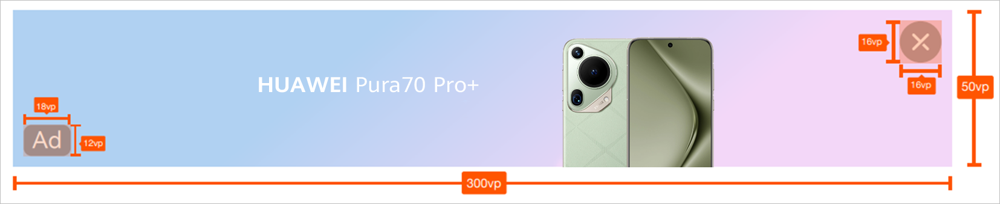

## 320×50（图片）

|  |  |
| --- | --- |
| <strong>广告样式</strong> | Banner |
| <strong>版位名称</strong> | Global 3rd-Party Banner Inventory |
| <strong>展示样式</strong> | Image |
| <strong>分辨率</strong> | 320×50 |
| <strong>格式</strong> | JPG, JPEG, or PNG |
| <strong>素材大小</strong> | &lt;= 500 KB |

广告位置尺寸标注：

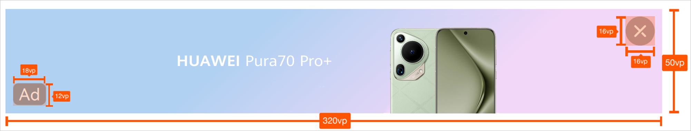

## 300×250（图片）

|  |  |
| --- | --- |
| <strong>广告样式</strong> | Banner |
| <strong>版位名称</strong> | Global 3rd-Party Banner Inventory |
| <strong>展示样式</strong> | Image |
| <strong>分辨率</strong> | 300×250 |
| <strong>格式</strong> | JPG, JPEG, or PNG |
| <strong>素材大小</strong> | &lt;= 500 KB |

广告位置尺寸标注：

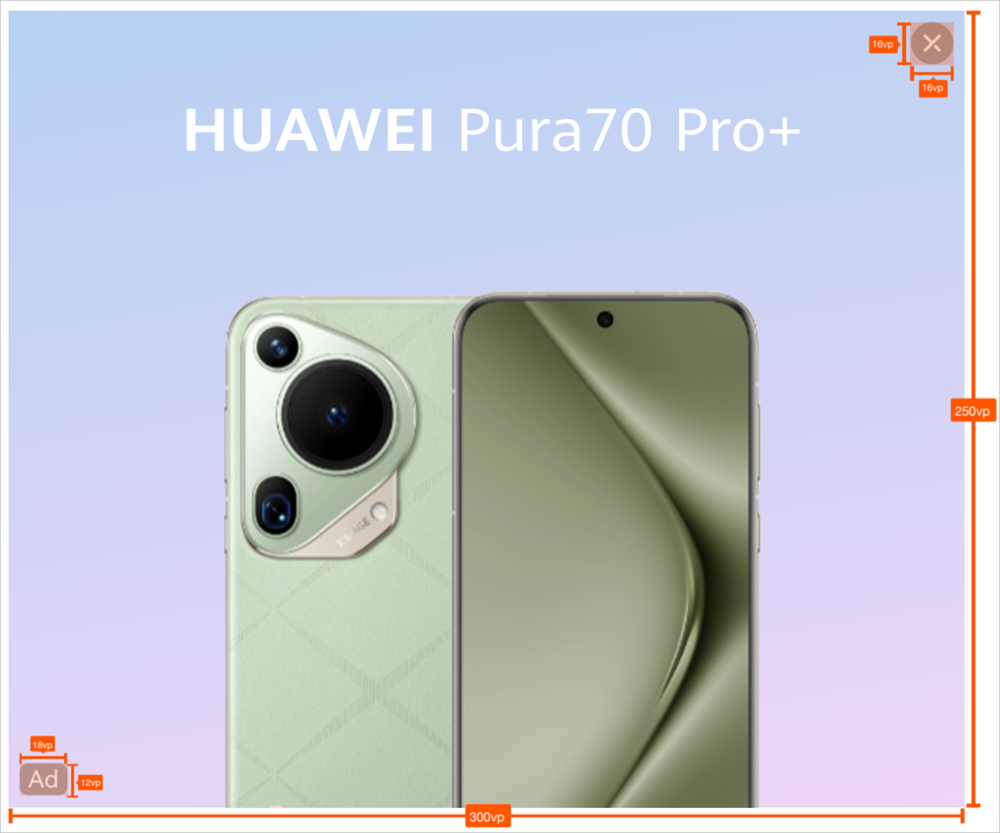

## 728×90（图片）

|  |  |
| --- | --- |
| <strong>广告样式</strong> | Banner |
| <strong>版位名称</strong> | Global 3rd-Party Banner Inventory |
| <strong>展示样式</strong> | Image |
| <strong>分辨率</strong> | 728×90 |
| <strong>格式</strong> | JPG, JPEG, or PNG |
| <strong>素材大小</strong> | &lt;= 500 KB |

广告位置尺寸标注：

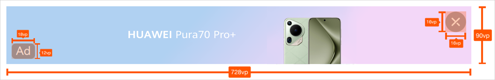

## 960×150（图片）

|  |  |
| --- | --- |
| <strong>广告样式</strong> | Banner |
| <strong>版位名称</strong> | Global 3rd-Party Banner Inventory |
| 3rd-Party\_SSP\_Banner\_960\*150 |
| <strong>展示样式</strong> | Image |
| <strong>分辨率</strong> | 960×150 |
| <strong>格式</strong> | JPG, JPEG, or PNG |
| <strong>素材大小</strong> | &lt;= 500 KB |

广告位置尺寸标注：

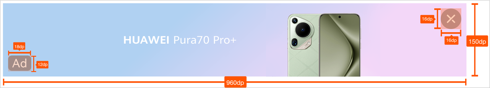

## 960×300（图片）

|  |  |
| --- | --- |
| <strong>广告样式</strong> | Banner |
| <strong>版位名称</strong> | Global 3rd-Party Banner Inventory |
| <strong>展示样式</strong> | Image |
| <strong>分辨率</strong> | 960×300 |
| <strong>格式</strong> | JPG, JPEG, or PNG |
| <strong>素材大小</strong> | &lt;= 500 KB |

广告位置尺寸标注：

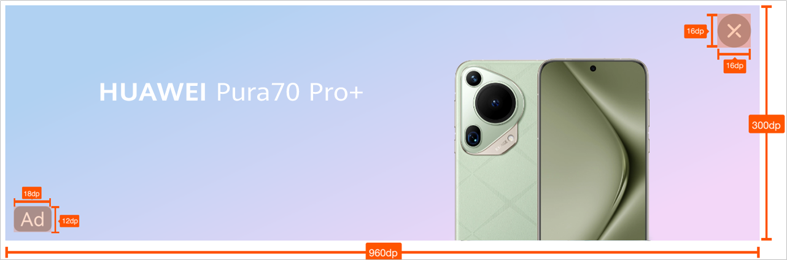

## 900×750（图片）

|  |  |
| --- | --- |
| <strong>广告样式</strong> | Banner |
| <strong>版位名称</strong> | Global 3rd-Party Banner Inventory |
| Banner & Native Eco |
| 3rd-Party\_SSP\_Banner\_900\*750 |
| <strong>展示样式</strong> | Image |
| <strong>分辨率</strong> | 900×750 |
| <strong>格式</strong> | JPG, JPEG, or PNG |
| <strong>素材大小</strong> | &lt;= 500 KB |
| <strong>文本字符</strong> | &lt;=40 |
| <strong>品牌名称字符</strong> | &lt;=25 |

广告位置尺寸标注：

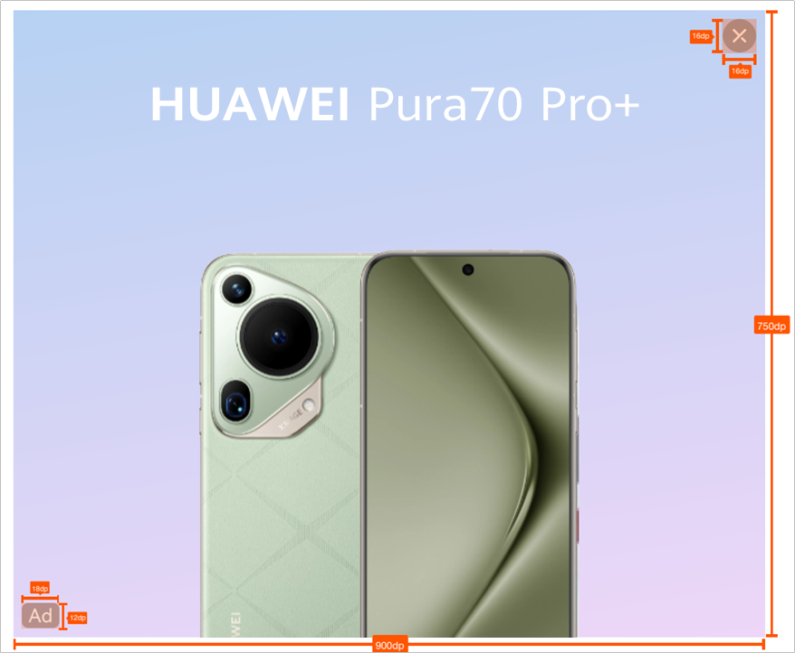

## 1080×96（图片）

|  |  |
| --- | --- |
| <strong>广告样式</strong> | Banner |
| <strong>版位名称</strong> | Global 3rd-Party Banner Inventory |
| Banner & Native Eco |
| <strong>展示样式</strong> | Image |
| <strong>分辨率</strong> | 1080×96 |
| <strong>格式</strong> | JPG, JPEG, or PNG |
| <strong>素材大小</strong> | &lt;= 500 KB |

广告位置尺寸标注：

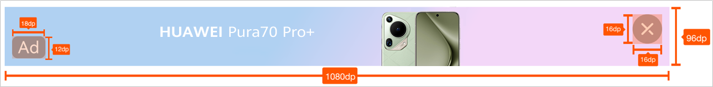

## 1080×150（图片）

|  |  |
| --- | --- |
| <strong>广告样式</strong> | Banner |
| <strong>版位名称</strong> | Global 3rd-Party Banner Inventory |
| Banner & Native Eco |
| <strong>展示样式</strong> | Image |
| <strong>分辨率</strong> | 1080×150 |
| <strong>格式</strong> | JPG, JPEG, or PNG |
| <strong>素材大小</strong> | &lt;= 500 KB |

广告位置尺寸标注：

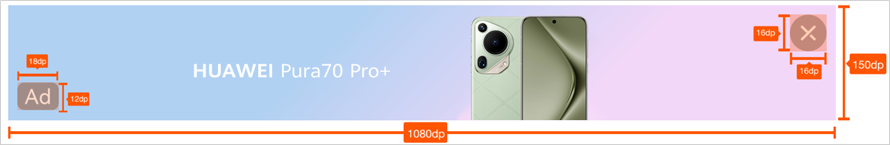

## 1080×170（图片）

|  |  |
| --- | --- |
| <strong>广告样式</strong> | Banner |
| <strong>版位名称</strong> | Global 3rd-Party Banner Inventory |
| Banner & Native Eco |
| <strong>展示样式</strong> | Image |
| <strong>分辨率</strong> | 1080×170 |
| <strong>格式</strong> | JPG, JPEG, or PNG |
| <strong>素材大小</strong> | &lt;= 500 KB |

广告位置尺寸标注：

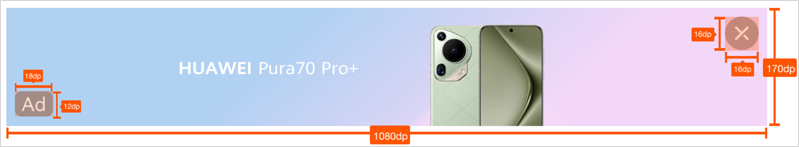

## 1080×270（图片）

|  |  |
| --- | --- |
| <strong>广告样式</strong> | Banner |
| <strong>版位名称</strong> | Global 3rd-Party Banner Inventory |
| <strong>展示样式</strong> | Image |
| <strong>分辨率</strong> | 1080×270 |
| <strong>格式</strong> | JPG, JPEG, or PNG |
| <strong>素材大小</strong> | &lt;= 500 KB |

广告位置尺寸标注：

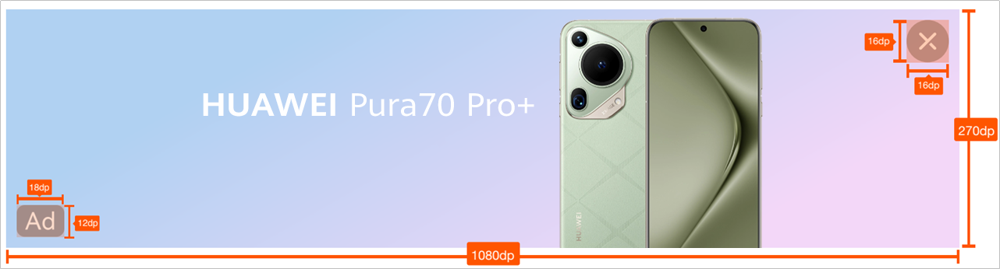

## 1080×432（图片）

|  |  |
| --- | --- |
| <strong>广告样式</strong> | Banner |
| <strong>版位名称</strong> | Global 3rd-Party Banner Inventory |
| <strong>展示样式</strong> | Image |
| <strong>分辨率</strong> | 1080×432 |
| <strong>格式</strong> | JPG, JPEG, or PNG |
| <strong>素材大小</strong> | &lt;= 500 KB |

广告位置尺寸标注：

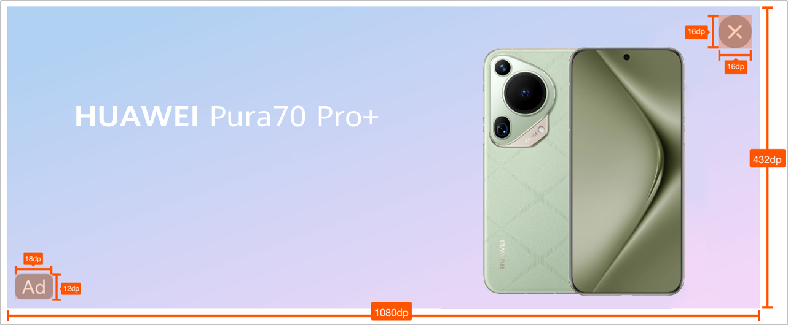

## 1404\*180 （图片）

|  |  |
| --- | --- |
| <strong>广告样式</strong> | Banner |
| <strong>版位名称</strong> | 3rd-Party\_SSP\_Banner\_1404\*180 |
| <strong>展示样式</strong> | Image |
| <strong>分辨率</strong> | 1404\*180 |
| <strong>格式</strong> | JPG, JPEG, or PNG |
| <strong>素材大小</strong> | &lt;= 500 KB |

广告位置尺寸标注：

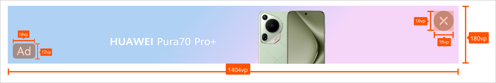

## 2184\*270 （图片）

|  |  |
| --- | --- |
| <strong>广告样式</strong> | Banner |
| <strong>版位名称</strong> | 3rd-Party\_SSP\_Banner\_2184\*270 |
| <strong>展示样式</strong> | Image |
| <strong>分辨率</strong> | 2184\*270 |
| <strong>格式</strong> | JPG, JPEG, or PNG |
| <strong>素材大小</strong> | &lt;= 500 KB |

广告位置尺寸标注：

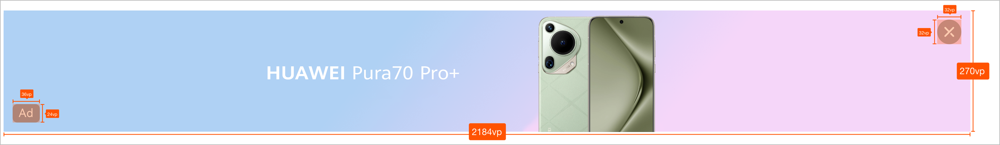
