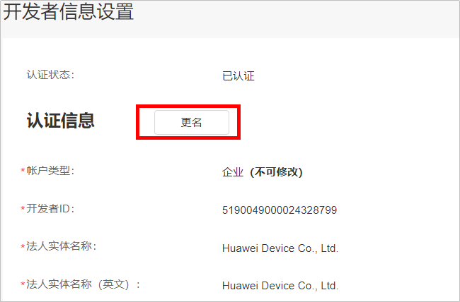
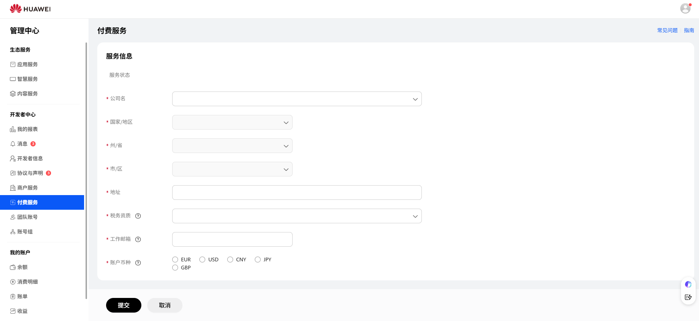
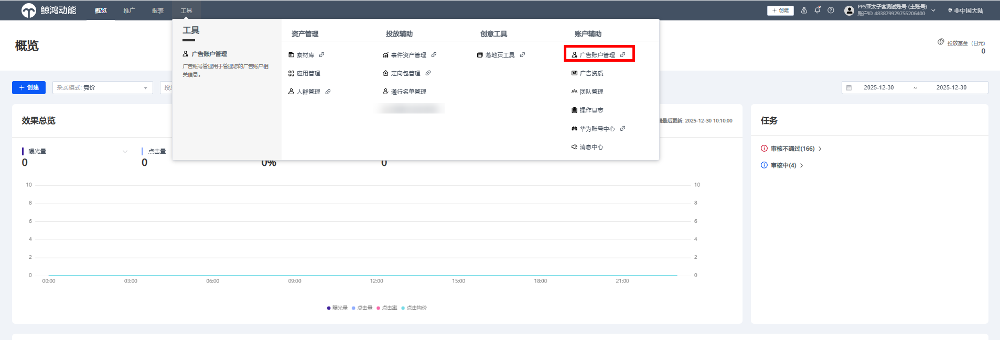
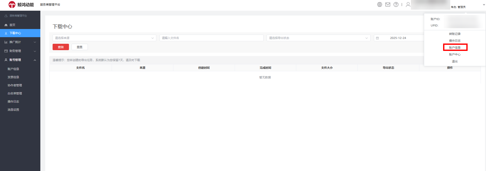
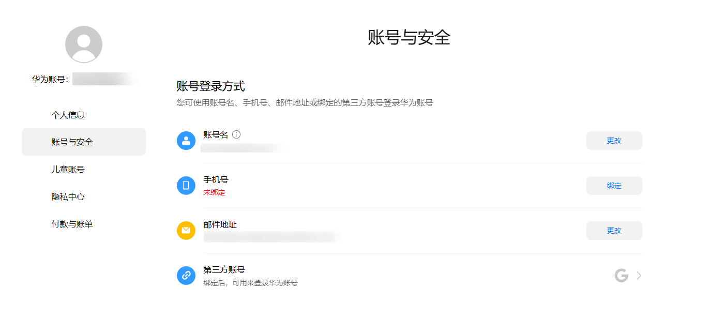
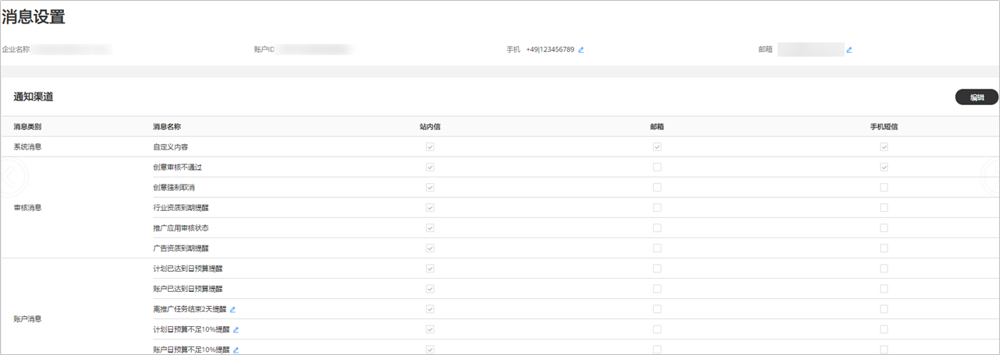

# 查看/修改账户基本信息

- <strong>广告账户企业名称修改</strong>：登录[华为开发者联盟管理中心](https://developer.huawei.com/consumer/cn/console#/serviceCards/)-&gt;“<strong>设置</strong>”-&gt;“<strong>开发者信息</strong>”-&gt;“<strong>更名</strong>”即可修改企业认证名称，具体可参考：[变更企业名称](https://developer.huawei.com/consumer/cn/doc/start/information-modification-0000001053145467)。

  
- <strong>税务信息修改</strong>：登录[华为开发者联盟管理中心](https://developer.huawei.com/consumer/cn/console#/serviceCards/)-&gt;“<strong>设置</strong>”-&gt;“<strong>付费服务</strong>”，即可修改税务信息。

  
- <strong>广告账号管理</strong>

  如果您是<strong>直客或子客</strong>首先请登录[鲸鸿动能广告平台](https://ads.huawei.com/usermgtportal/home/index.html#/)，单击“<strong>工具</strong>“-&gt;“<strong>广告账号管理</strong>“，支持查看、修改广告账户信息和经理信息，其中修改邓白氏号码/营业执照、区域和地址会触发审核。

  

  如果您是<strong>服务商或子客服务商</strong>首先请登录[鲸鸿动能广告平台](https://ads.huawei.com/usermgtportal/home/index.html#/)，进入界面后单击页面右上角“<strong>∨</strong>” -&gt;“<strong>账户信息</strong>”，即可查看、修改广告账号相关信息，其中修改邓白氏号码/营业执照、区域和地址会触发审核。

  
- <strong>广告账户实名认证</strong>：
  - <strong>需要[实名认证](https://developer.huawei.com/consumer/cn/doc/start/itrna-0000001076878172)的场景如下：</strong>
    - 若您的广告任务在审核时被鲸鸿动能广告平台判定为涉及[受限内容](https://developer.huawei.com/consumer/cn/doc/promotion/industry-admission-rules-0000001189244454#section71534582218)，或者您要使用这些广告功能，如线上充值，您必须完成[实名认证](https://developer.huawei.com/consumer/cn/doc/start/itrna-0000001076878172)再进行广告投放。
    - 如果您在华为开发者联盟官网平台已经提交实名审核，但被驳回了，您需要根据驳回理由，在广告开户时<strong>重新修改实名信息</strong>，并提交审核，此时您可以进入广告账户试用，但审核通过后即可进行充值投放等操作。
    - 若您在华为开发者联盟平台提交的实名认证还在审核中，您需要等待实名通过后，才能开通鲸鸿动能广告账户。
  - <strong>如何进行[实名认证](https://developer.huawei.com/consumer/cn/doc/start/itrna-0000001076878172)</strong>：
    - 如果因为广告任务在审核时被鲸鸿动能广告平台判定为涉及[受限内容](https://developer.huawei.com/consumer/cn/doc/promotion/industry-admission-rules-0000001189244454#section71534582218)，您需要重新登录广告账户，单击提示框中的“完善信息”，通过邓白氏号码或者营业执照号码进行实名认证，实名审核时间为1-2个工作日，审核结果将会发送到您的[联系人邮箱](https://developer.huawei.com/consumer/cn/doc/promotion/register-0000001052264353#ZH-CN_TOPIC_0000001052264353__li4641112612506)。

      

      

      如果您要使用线上充值功能、Marketing API等功能，具体可参考[邓白氏码](https://developer.huawei.com/consumer/en/doc/start/atpopb-0000001062836624)和[营业执照](https://developer.huawei.com/consumer/en/doc/start/mracoei-0000001062678404)进行广告账户实名认证，完成实名认证后提单申请才能使用。
- <strong>华为账号管理</strong>：具体可参考：[华为账号信息设置](https://developer.huawei.com/consumer/cn/doc/start/account-management-0000001052865467)。

  
- <strong>消息设置</strong>：

  如果您是<strong>直客或子客</strong>首先请登录[鲸鸿动能广告平台](https://ads.huawei.com/usermgtportal/home/index.html#/)，单击“<strong>工具</strong>“-&gt;“<strong>消息设置</strong>“，支持查看、修改接收消息的手机号和邮箱号，单击“<strong>编辑</strong>”支持自定义消息接收渠道。

  如果您是<strong>服务商或子客服务商</strong>首先请登录[鲸鸿动能广告平台](https://ads.huawei.com/usermgtportal/home/index.html#/)，进入界面后单击页面账号管理右边“<strong>∨</strong>” -&gt;“<strong>消息设置</strong>”，支持查看、修改接收消息的手机号和邮箱号，单击“<strong>编辑</strong>”支持自定义消息接收渠道。

  
