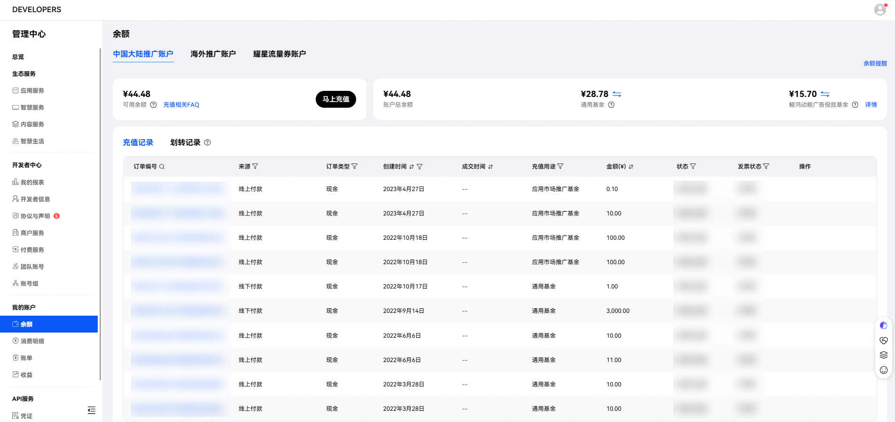
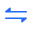

# 如何在开发者联盟网站查看账户余额

因为账户都是在开发者联盟网站上创建的，所以可以在开发者联盟网站上查看账户余额。

在开发者联盟网站的“[我的账户-余额](https://developer.huawei.com/consumer/cn/console#/myaccount/mainbalance/0/mainbalance-bill/0)”中操作充值和资金划转，也可以查看充值记录和是否开发票的状态。

开发者联盟后台有两类基金，具体如下：

- <strong>通用基金</strong>

  可用于所有付费类服务的消耗，包括应用推广、鲸鸿动能广告、AGC付费服务等。
- <strong>鲸鸿动能广告投放基金</strong>

  用于应用市场应用推广及鲸鸿动能广告投放消耗。
- <strong>余额</strong>

  中国大陆推广账户内，所有基金的余额之和，余额=通用基金 +鲸鸿动能广告投放基金
- <strong>可用余额</strong>

  当前可用于支付除推广以外付费业务的余额。为保证应用市场推广的正常扣费，会在余额中预留一部分金额进行扣费。可用余额=余额-被预留的金额。

点击对应基金旁的“划转”图标，即可完成资金划转。可操作通用基金、鲸鸿动能广告投放基金之间的划转。
