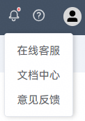

# 问题反馈

## 在线提单

1. 登录[华为应用市场应用推广平台](https://ads.huawei.com/cn/)，在顶部菜单栏点击“问号”图标，选择“意见反馈”，进入问题工单反馈页面。

   
2. 选择“推广与变现”—“应用市场应用推广”。

   
3. 选择对应的问题分类，按照模板反馈问题。

   

## 联系智能客服

1. 登录[华为应用市场应用推广平台](https://ads.huawei.com/cn/)，在顶部菜单栏点击“问号”图标，选择“在线客服”，进入智能客服。

   
2. 进入智能客服页面后，您可在输入框中直接输入问题进行咨询；页面左侧将保留历史对话记录，便于随时查看。

   

## 联系人工客服

发送邮件到邮箱developer@huawei.com反馈问题，请提供应用名称、应用ID、账户ID（后台右上角客户ID）、问题描述等。
