# 资源位素材尺寸要求

## 元素合规

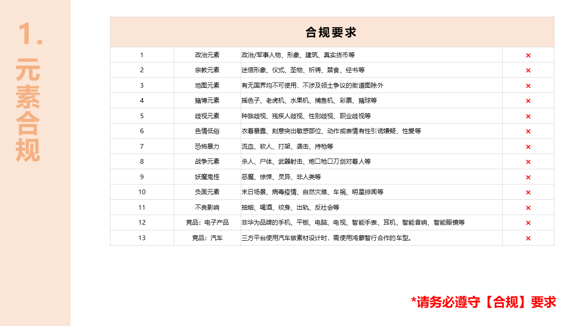

## 应用市场客户端素材输出要求

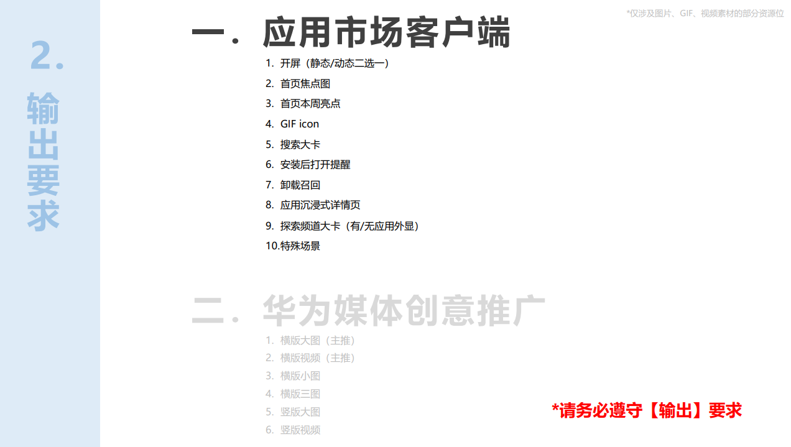

### 静态开屏

### 动态开屏

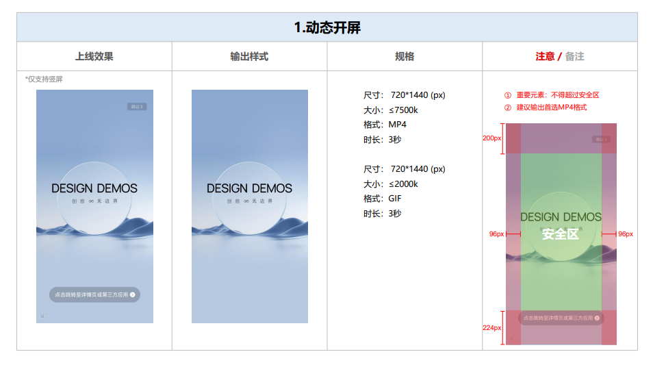

### 首页焦点图

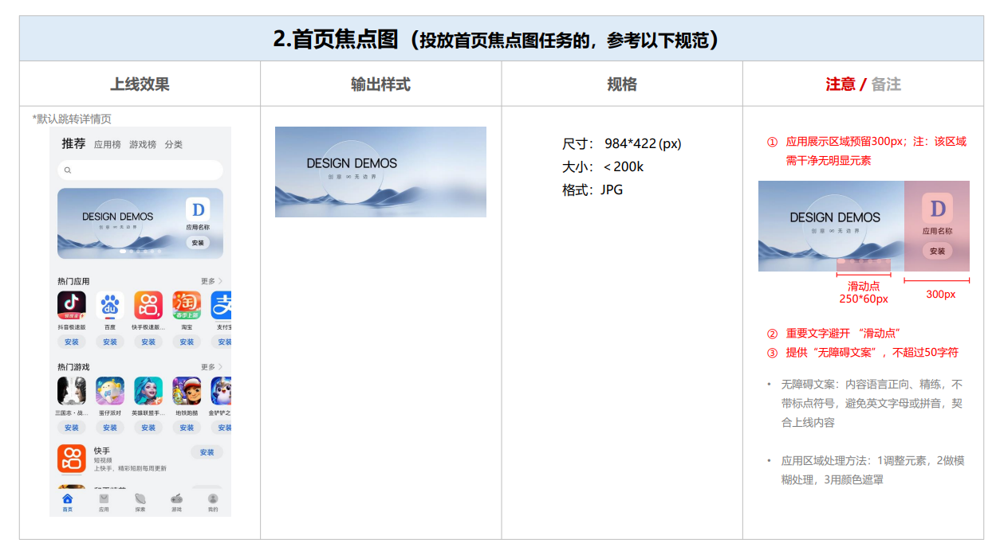

### 首页本周亮点

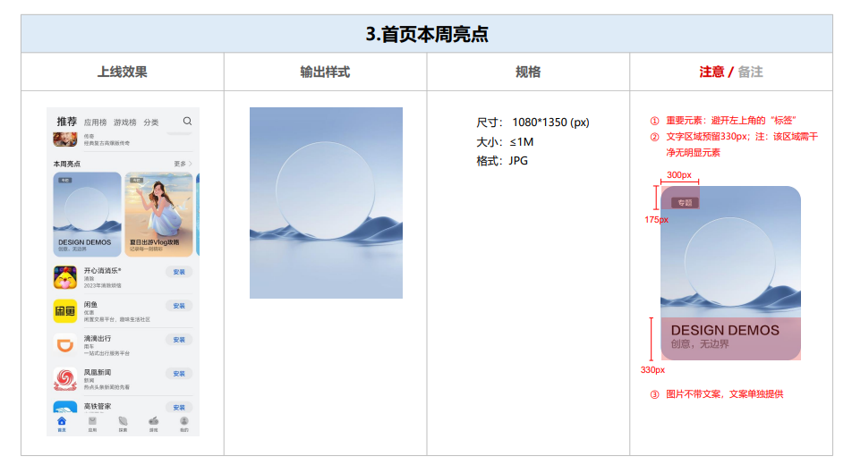

### GIF ICON

### 搜索大卡

### 安装后打开提醒

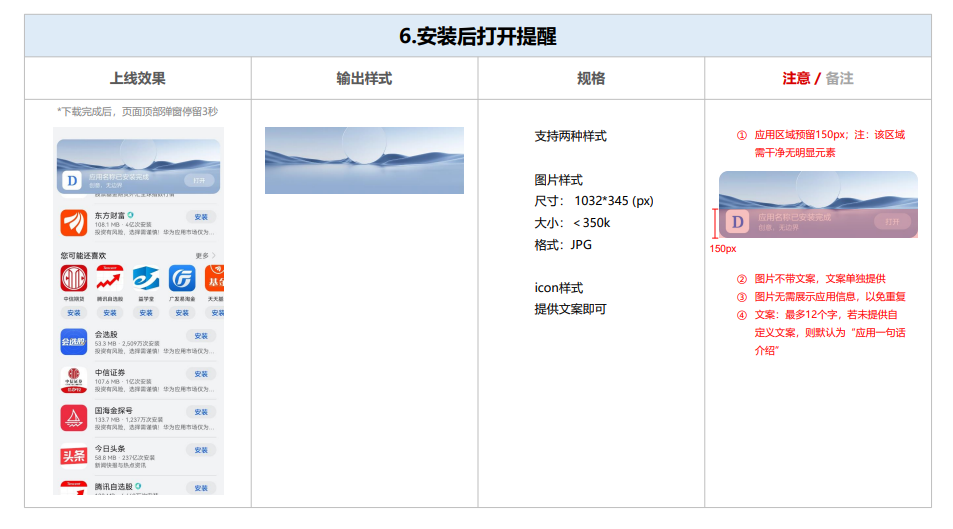

### 卸载召回

### 应用沉浸式详情页

### 搜索频道大卡

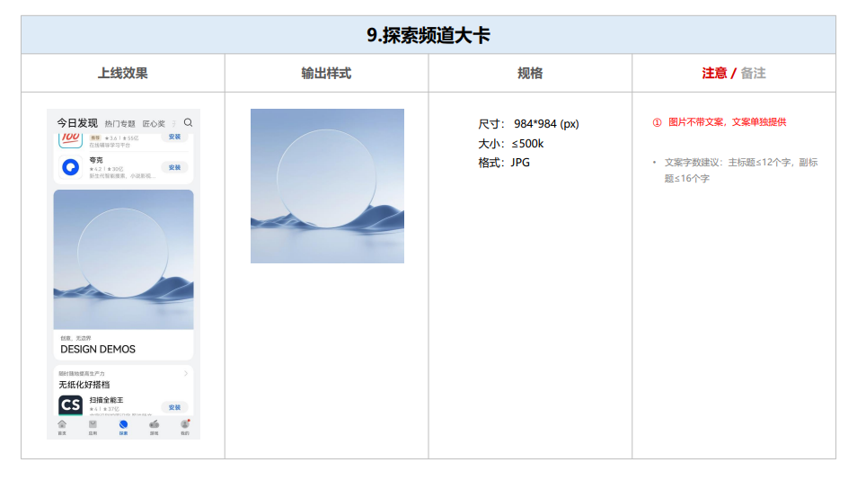

### 特殊场景

<strong>首页焦点图</strong>

<strong>中卡单图</strong>

## 华为媒体创意推广

### 横版大图

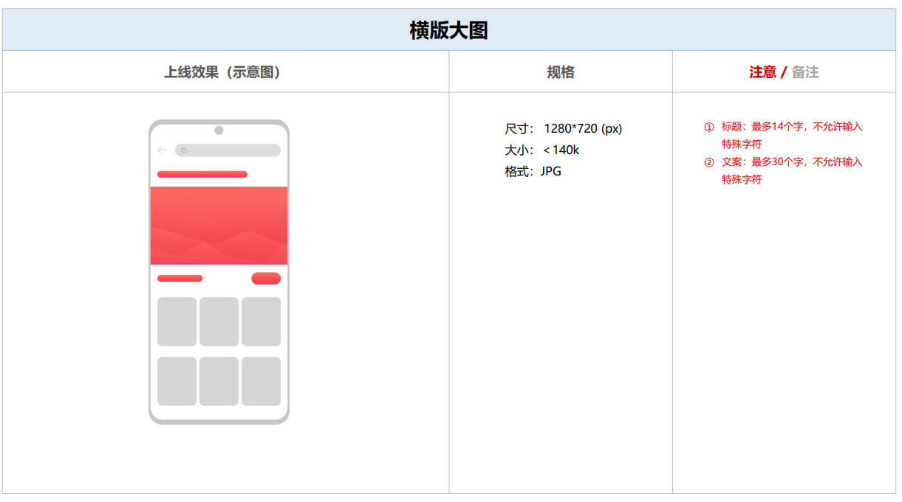

### 横版视频

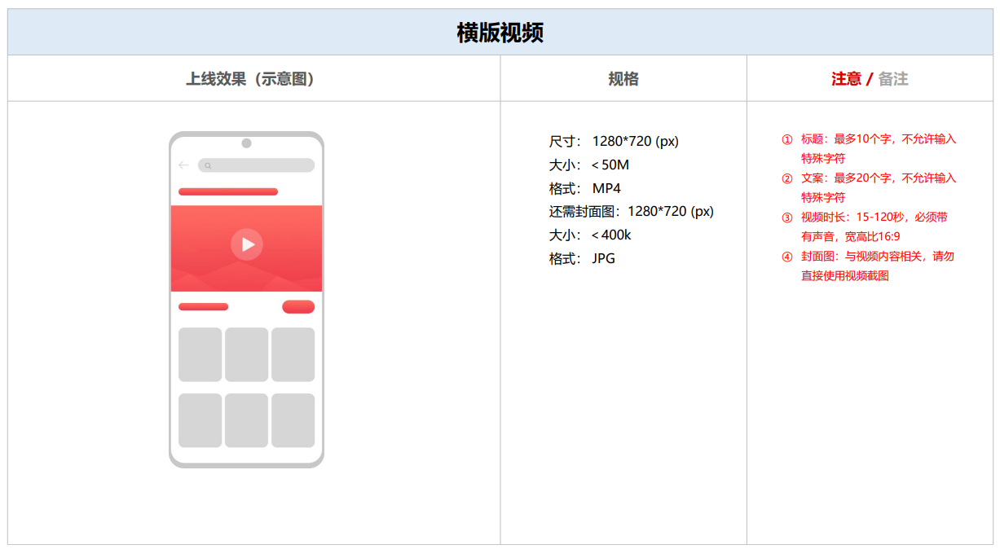

### 横版小图

### 横版三图

### 竖版大图

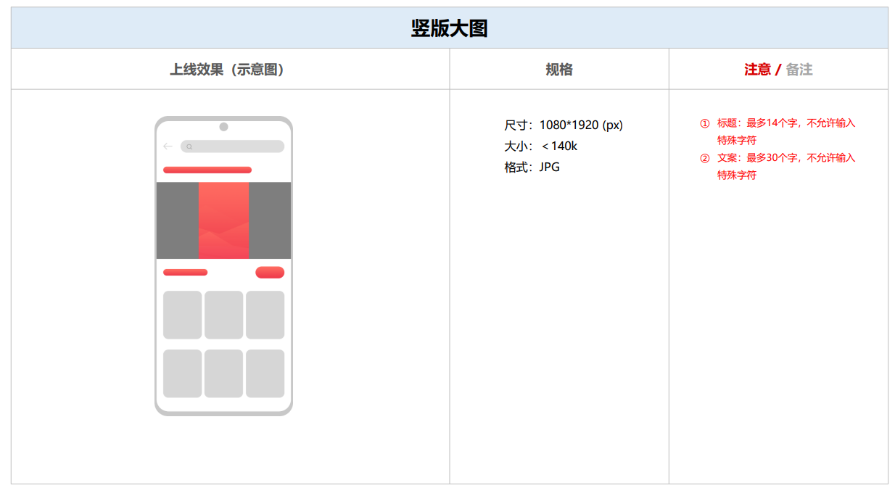

### 竖版视频

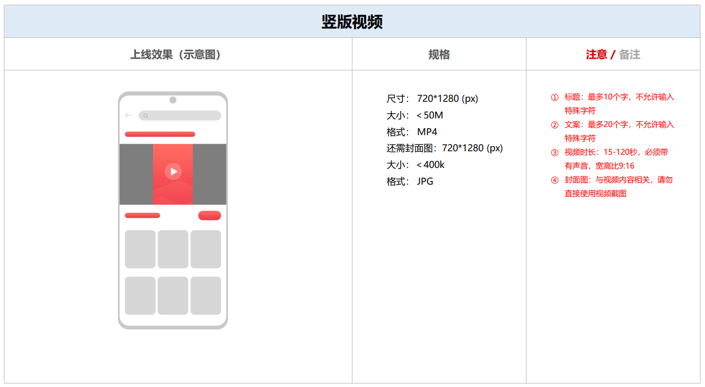

## 素材质量

### 画面质量

### 排版布局

### 设计样式

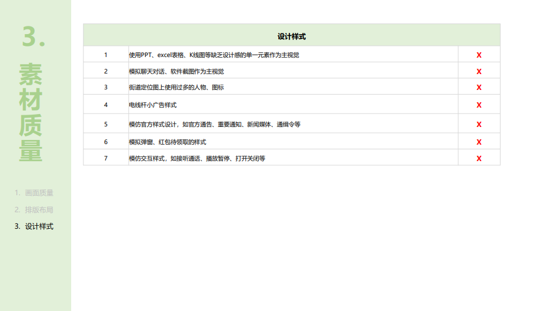
