# 资源位素材尺寸要求

## 元素合规

## 应用市场客户端素材输出要求

### 静态开屏

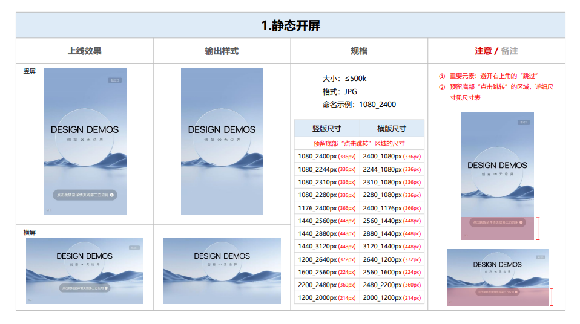

### 动态开屏

### 首页焦点图

### 首页本周亮点

### GIF ICON

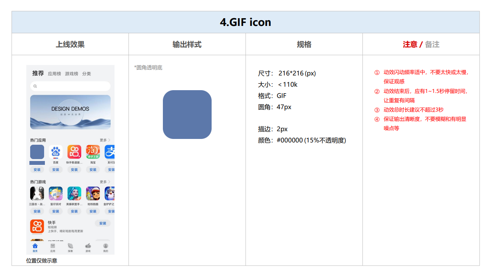

### 搜索大卡

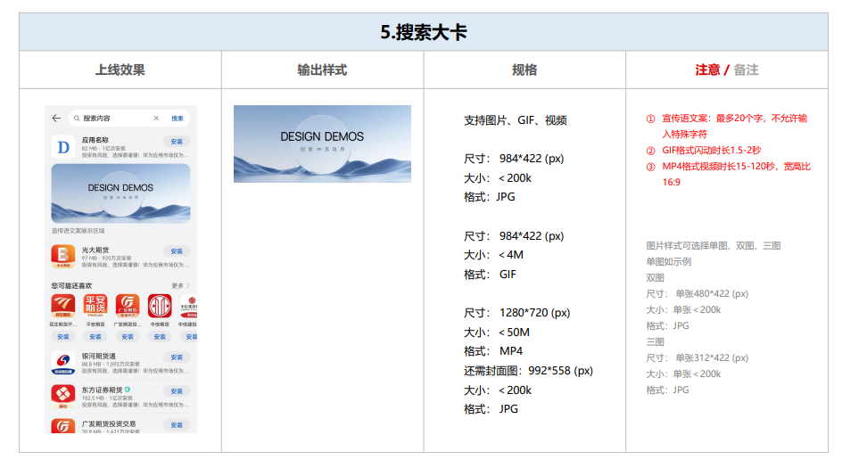

### 安装后打开提醒

### 卸载召回

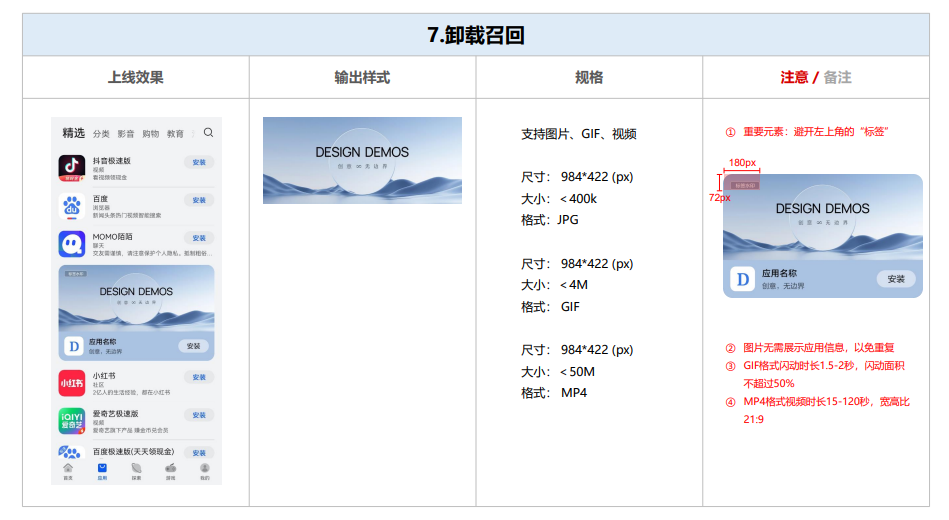

### 应用沉浸式详情页

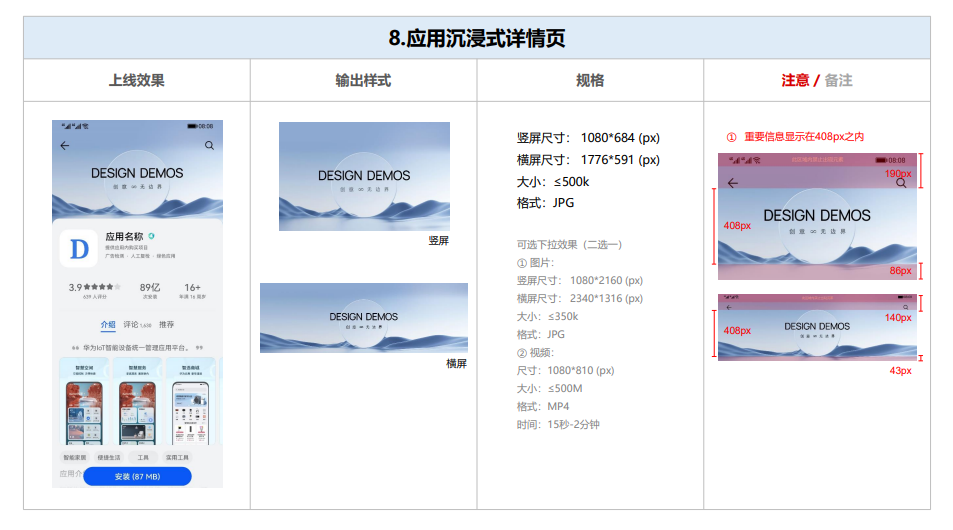

### 搜索频道大卡

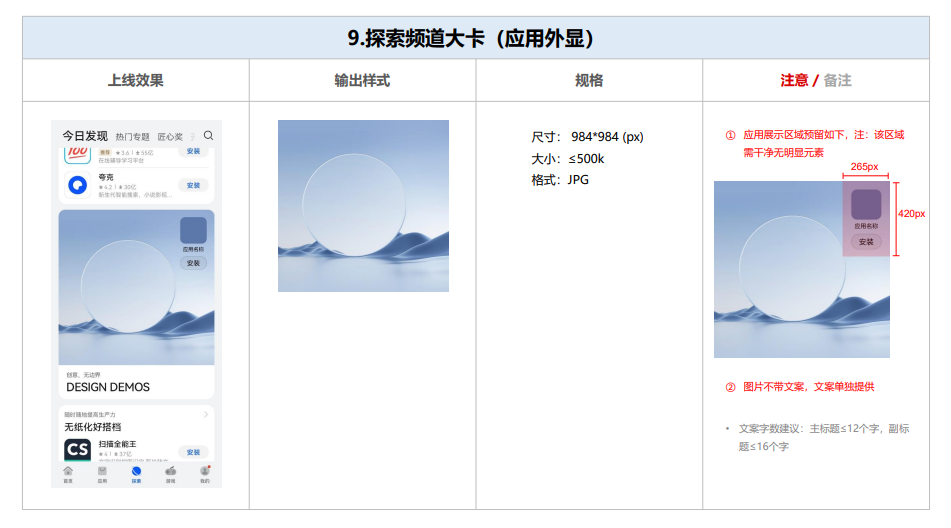

### 特殊场景

<strong>首页焦点图</strong>

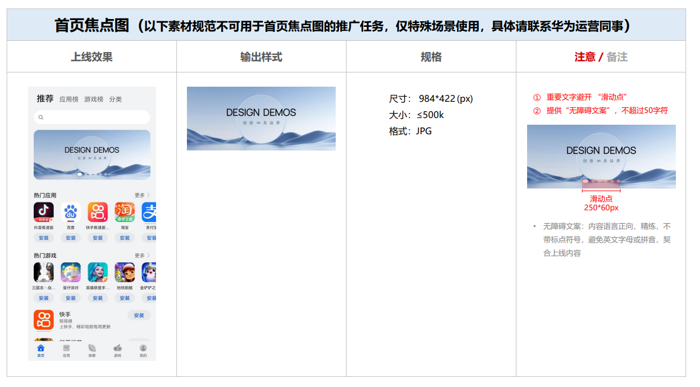

<strong>中卡单图</strong>

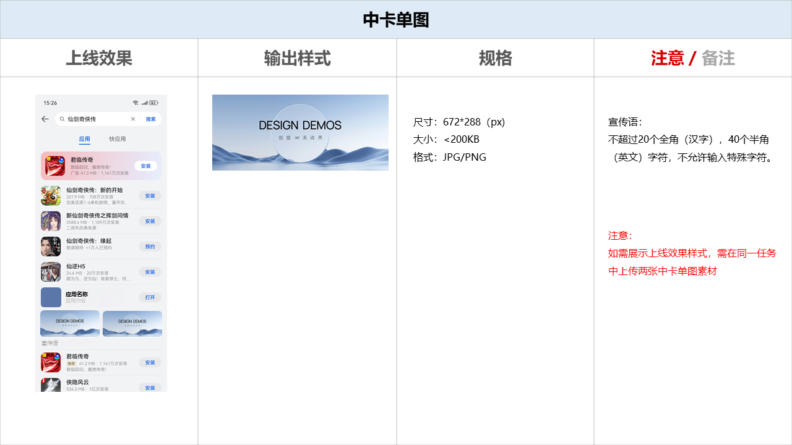

## 华为媒体创意推广

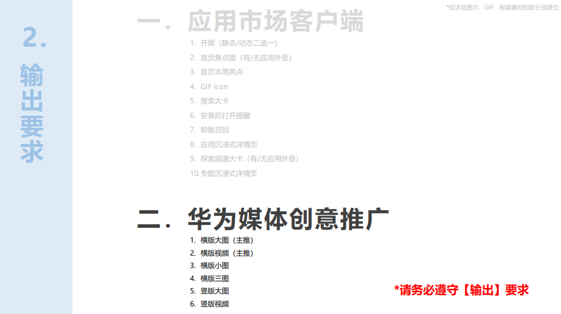

### 横版大图

### 横版视频

### 横版小图

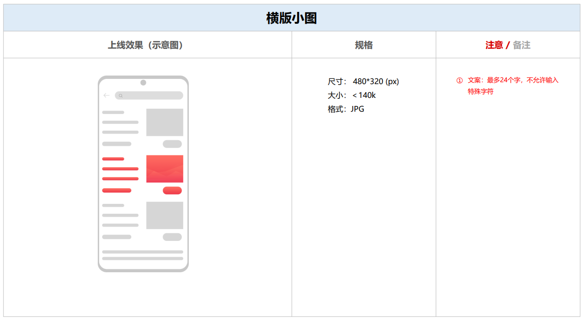

### 横版三图

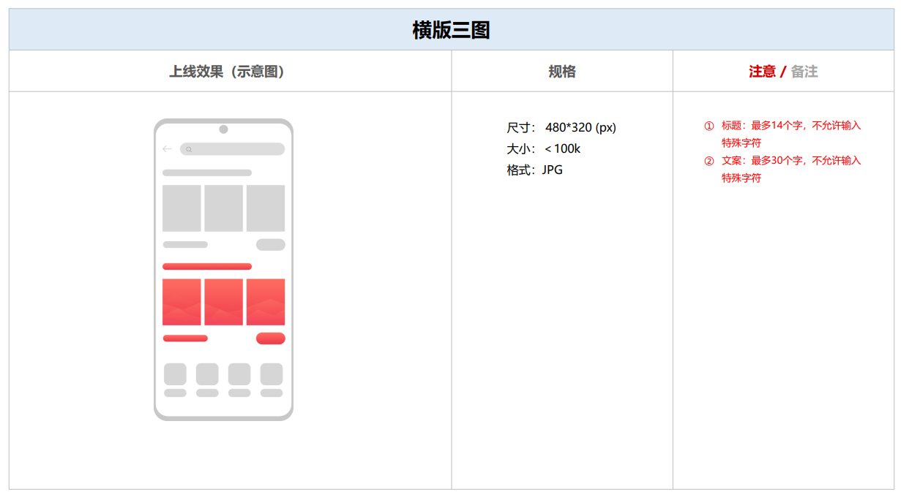

### 竖版大图

### 竖版视频

## 素材质量

### 画面质量

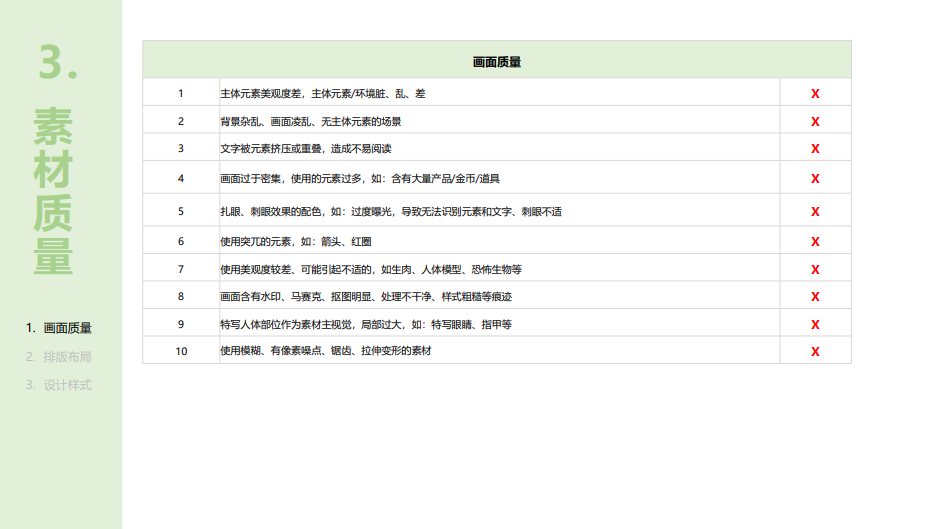

### 排版布局

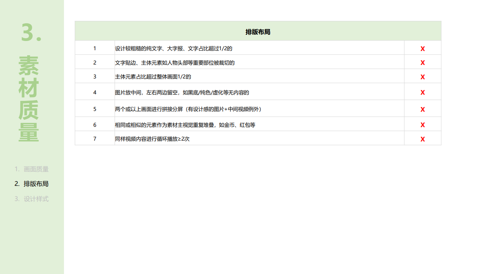

### 设计样式

