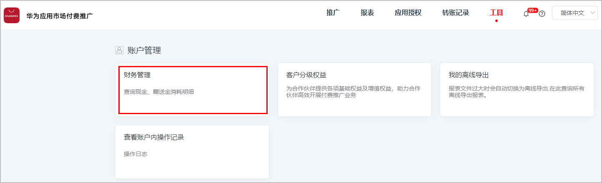
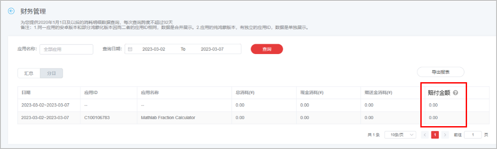

# 查看相关数据

## 查看子任务数据报表

1. 登录[华为应用市场应用推广平台](https://developer.huawei.com/consumer/cn/service/apcs/app/home.html)，点击右上角“管理中心”，进入“管理中心”页面。
2. 点击“报表”，选择“子任务数据”页签。
3. 您可以筛选时间段及数据展示方式（“合计”或者“分日”），筛选应用、任务及子任务进行数据查询和下载。

   
4. 您可以点击“自定义列”，勾选“赔付金额”指标，即可在子任务数据报表查看到赔付金额数据。

    

   此处赔付金额仅做结算参考，与最终发放可能存在偏差，核算请以财务管理为准。

   

## 查看财务管理

1. 登录[华为应用市场应用推广平台](https://developer.huawei.com/consumer/cn/service/apcs/app/home.html)，点击右上角“管理中心”，进入“管理中心”页面。
2. 在顶部菜单栏中，选择“工具”，进入工具页面，点击“财务管理”，进入“财务管理”页面。

   
3. 在条件栏中输入查询条件，点击“查询”，查询您的赔付金额数据。

    

   查询不支持跨月，时间周期必须是完整自然月才计算对应月赔付金额，否则不展示赔付金额。

   
