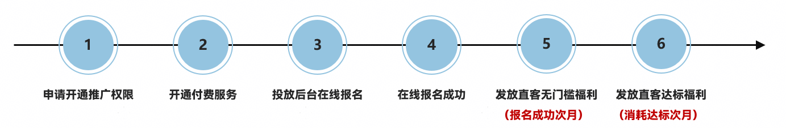
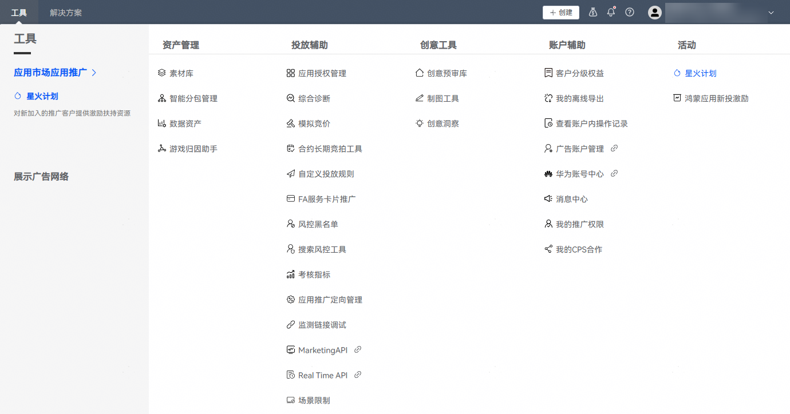
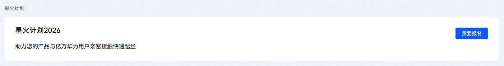
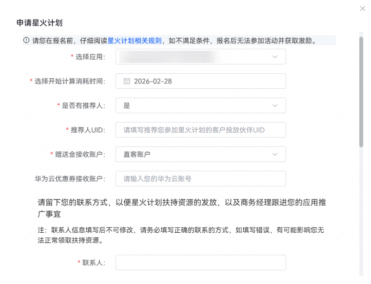
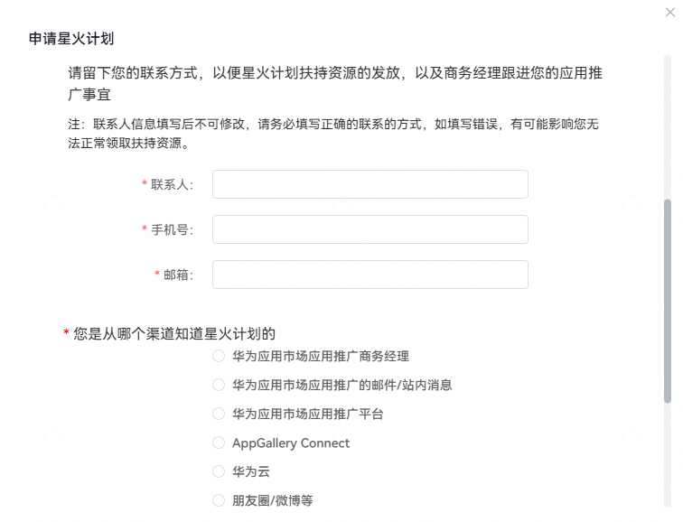
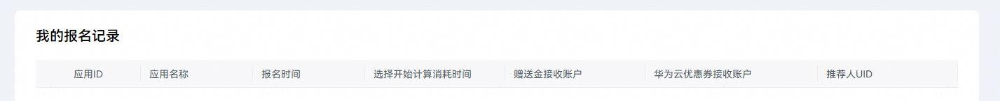

# 星火计划2026报名流程

## 直客报名流程

1. <strong>申请开通推广权限</strong>

   操作指导：

   &lt;https://developer.huawei.com/consumer/cn/doc/distribution/promotion/bp-start-guest-apply-evaluation-0000001346654709&gt
2. <strong>开通付费服务（</strong> <strong>不开通会导致福利发放失败</strong> <strong>）</strong>

   操作指导：

   &lt;https://developer.huawei.com/consumer/cn/doc/start/payment-service-0000001052865979#h1-1-&gt
3. <strong>投放后台在线报名</strong>

   登录[华为应用市场应用推广平台](https://ads.huawei.com/cn/)，顶部菜单栏点击【工具】页签，确认推广范围为“应用市场应用推广”。选择“活动”—“星火计划”。

   

   - 点击“我要报名”按钮（具体报名要求详见[星火计划2026活动介绍](/docs/monetize/promotion/bp-campaigns-spark-introduction-0000001362029581)）。

     
   - 填写主要报名信息。

     

     具体报名信息说明如下：

     1. <strong>选择应用</strong> <strong>：</strong>勾选符合要求的应用。
     2. <strong>选择开始计算消耗时间</strong> <strong>：</strong>勾选实际预计开始投放的时间，后续是否达标，会从该时间开始统计，开始消耗时间不早于报名时间，不晚于2026年12月31号。
     3. <strong>赠送金接收账户：</strong>如果不涉及推荐人默认接收账户为直客账户，如果涉及推荐人需要用户自行选取接收账户为直客账户还是推荐人账户。（应用只能在直客账户或推荐人账户投放，不支持两个账户投放一个应用，赠送金不支持账户间的转移）。
     4. <strong>推荐人</strong> <strong>UID</strong> <strong>：</strong>如果不涉及推荐人则该项不填，如有推荐人，则需找对应推荐人获取客户投放伙伴UID（推荐人必须是客户投放伙伴）。
   - 填写个人信息并提交。

     
   - 查看已报名应用清单。

     

 

- 直客需要用应用所属实体对应的开发者账号登录<strong>华为应用市场应用推广平台</strong>报名，客户投放伙伴相关账户及投放操作账户只展示星火计划内容不可进行报名。
- 符合报名条件的应用，可通过应用市场推广平台报名（具体报名情况以华为应用市场复核为准）。
