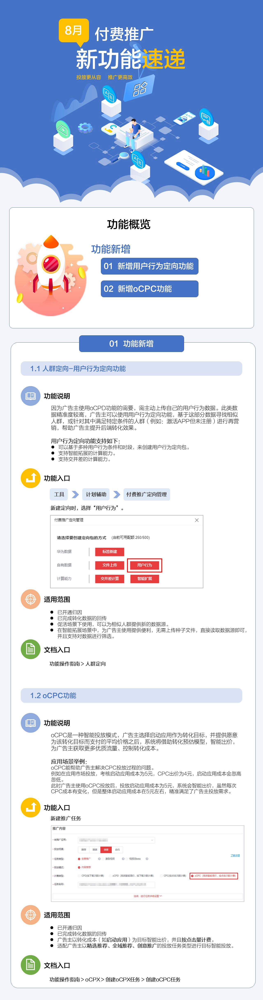
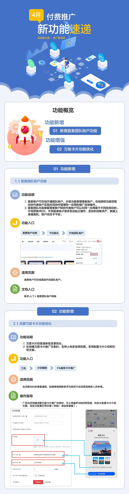

# 更新说明

## 8月份新功能速递

## 4月份新功能速递

## 往期更新说明

| 更新时间 | 更新说明 |
| --- | --- |
| 2023-04-06 | 新增[oCPD双目标出价](/docs/monetize/promotion/bp-functions-ocpd_2target_overview-0000001527328981)，新增<strong>激活应用</strong>和<strong>次日留存</strong>双目标出价功能。 |
| 2023-02-24 | - 支持IMEI（安卓10版本以前）归因数据回传。   - 更新[监测链接](/docs/monetize/promotion/bp-functions-link-configure-0000001351658397)，修改<strong>\_\_ID\_TYPE\_\_</strong>和<strong>\_\_UNIQUE\_ID\_\_</strong>宏参数新增支持回传IMEI（安卓10版本以前）。   - 更新[回传用户行为数据接口](/docs/monetize/promotion/bp-functions-ocpd-interface-return-0000001238484400)，修改<strong>deviceIdType</strong>和<strong>deviceId</strong>字段支持回传IMEI（安卓10版本以前）。 - 补充[卸载召回FAQ](/docs/monetize/promotion/bp-functions-load-recall-faq-0000001417392493)。 |
| 2023-02-10 | 更新[飞跃计划2023版](https://developer.huawei.com/consumer/cn/doc/promotion/bp-campaigns-leap-0000001361789909)。 |
| 2023-01-30 | 更新[星火计划2023版](/docs/monetize/promotion/bp-campaigns-spark-introduction-0000001362029581)。 |
| 2022-11-17 | 新增自定义落地页功能。 |
| 2022-11-14 | 新增[服务卡片](/docs/monetize/promotion/bp-functions-fa-introduction-0000001349288420)功能。 |
| 2022-09-08 | - 新增[投放创意任务](/docs/monetize/promotion/bp-delivery-task-create-0000001345794602)。 - 新增[创意洞察](/docs/monetize/promotion/bp-functions-creative-insight-introduction-0000001399648185)、[制图工具](/docs/monetize/promotion/bp-functions-draw-tools-introduction-0000001399522565)、[素材库](/docs/monetize/promotion/bp-functions-material-library-introduction-0000001399645709)。 |
| 2022-07-29 | 文档样式整体优化，全量更新文档中界面截图。 |
| 2022-07-13 | 更新[回传用户行为数据接口](/docs/monetize/promotion/bp-functions-ocpd-interface-return-0000001238484400)，新增customAction和actionParam接口字段。 |
| 2022-07-12 | 重大优化：   - 推荐场景下，取消“榜单推荐”和“桌面推荐”任务类型，新增“精选推荐”和“全域推荐”。 - “精选推荐”、“全域推荐”、“应用搜索”、“创意推广”四个任务类型下均新增“流量场景”层级，细分流程场景为“应用市场”、“华为媒体”、“联盟媒体”。 |
| 2022-07-08 | 新增[自定义投放规则](/docs/monetize/promotion/bp-functions-customize-introduction-0000001309549666)。 |
| 2022-05-28 | 新增[物理分包](/docs/monetize/promotion/bp-functions-physical-subcontract-introduction-0000001341160241)。 |
| 2022-05-23 | 更新[HA回传接口](/docs/monetize/promotion/bp-functions-ha-interface-illustrate-return-0000001348932565)，新增customAction和actionParam接口字段。 |
| 2022-04-20 | 新增[投放快应用任务](/docs/monetize/promotion/bp-delivery-task-brand-quickapp-0000001347353661)。 |
| 2022-03-23 | 新增[投放焦点展台任务](/docs/monetize/promotion/bp-delivery-task-focus-0000001337190909)。  新增[华为分析归因](/docs/monetize/promotion/bp-functions-ha-introduction-0000001348812977)。    更新[合作伙伴分级权益规则](/docs/monetize/promotion/bp-bonus-cooperation-0000001309230226)。 |
| 2022-03-21 | 新增新版本功能点（已删除，此部分更新将通过消息中心发布）。 |
| 2022-02-15 | 新增[账户管理](/docs/monetize/promotion/bp-delivery-account-management-overage-0000001346691949)。    回传用户行为数据接口删除missTime字段。 |
| 2022-02-11 | 更新[飞跃计划2022版](https://developer.huawei.com/consumer/cn/doc/promotion/bp-campaigns-leap-0000001361789909#section1877157090)。 |
| 2022-02-10 | 新增[星火计划2022活动介绍](/docs/monetize/promotion/bp-campaigns-spark-introduction-0000001362029581)、[报名流程](/docs/monetize/promotion/bp-campaigns-spark-apply-0000001362109149)。 |
| 2021-12-27 | 1、更新操作指南中涉及的子任务管理、报表界面及操作流程，涉及：[直客指南](/docs/monetize/promotion/bp-start-guest-overview-0000001294014938)、[投放推荐任务](/docs/monetize/promotion/bp-delivery-task-recommend-0000001337110797)、[投放搜索任务](/docs/monetize/promotion/bp-delivery-task-search-0000001280324781)、投放搜索大卡任务。  2、更新2022年的[激励规则](/docs/monetize/promotion/bp-bonus-incentive-0000001309070274)。 |
| 2021-11-15 | 新增新版投放端[主子任务相关FAQ](/docs/monetize/promotion/bp-faq-0000001361789913#section16411443101918)。    更新操作指南中涉及的新版投放端界面及操作流程，涉及：[投放推荐任务](/docs/monetize/promotion/bp-delivery-task-recommend-0000001337110797)、[投放搜索任务](/docs/monetize/promotion/bp-delivery-task-search-0000001280324781)、投放搜索大卡任务、[影子投放](/docs/monetize/promotion/bp-functions-shadow-delivery-introduction-0000001284775684)、[人群定向](/docs/monetize/promotion/bp-functions-target-introduction-0000001285262204)、[RTA](/docs/monetize/promotion/bp-functions-rta-introduction-0000001352138281)。 |
