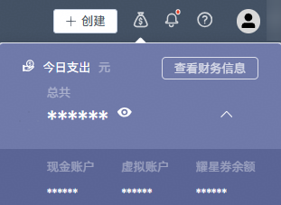

# 设置账户日预算

- 概览页-日预算模块

  账户日预算模块可以设置当日和次日的日预算，用于控制账户内所有应用的消耗。账户内所有应用的当日消耗超过此预算后，系统会自动限制账户内所有任务的推广，次日再恢复正常投放。预算达到限额后，已曝光的任务30天内产生的点击量/下载量仍会计费，因此您账户的实际消耗可能会超过账户日预算。建议开发者根据现有的账户消耗和预算情况，合理设置日预算。

  如果开发者设置账户级日预算，任务投放将受三个因素限制：余额不足、账户日预算不足、任务日预算不足。需要注意的是，账户级日预算修改不能低于当日已消耗的105%，每天账户日预算修改次数不超过20次。

  
- 设置次日预算

  点击支持设置账户日预算：可选“不限制”或“指定预算”。预算支持两种生效方式：当日立即生效，或次日 0 点生效。账户日预算最低设置500元。

  

  
- 查看日消耗进度

  点击投放端右上角钱包图标，可查看当日支出明细。请您根据投放需要，及时调整日预算。

  
