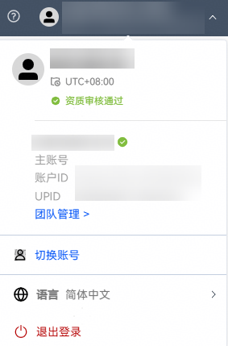

# 查看账户信息

投放端右上角，点击账户名称旁的下拉框，可以查看账户基本信息：账户ID和登录账户的UPID信息。

具体说明如下：

- <strong>公司名称</strong>

  企业实名认证的公司名称，直客协作者账户名称为直客管理者填写的昵称。
- <strong>账户ID</strong>

  开户时系统生成的账户唯一标识ID。
- <strong>UPID</strong>

  推广账户绑定的华为账号标识，是开发者联盟通用的开发者ID。
- <strong>团队管理</strong>

  可邀请其他华为账号共同管理本账户，详见[文档介绍](https://developer.huawei.com/consumer/cn/doc/promotion/mix-tool-0000002466178422)。
- <strong>切换账号</strong>

  当前华为账号绑定登录多个账户，通过此入口切换。
