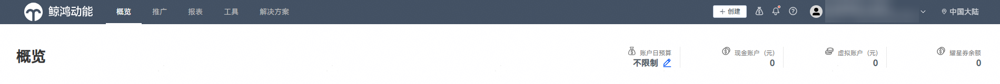
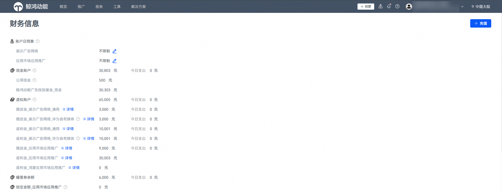

# 查看账户余额

华为应用市场应用推广平台的余额如下图所示。

 

- 您也可以在开发者联盟网站查看账户余额，具体请参见[如何在开发者联盟网站查看账户余额](/docs/monetize/promotion/bp-appendix-check-overage-0000001294207226)。
- 客户投放伙伴主账户在开发者联盟网站所显示的余额为其账户下所有子账户的余额之和，在华为应用市场应用推广平台显示的余额为给子账户转账后剩下的余额。

账户余额由多种资金类型构成，包括：现金、虚拟金和耀星券。

具体说明如下：

1. 现金账户
   - <strong>公用现金</strong>

     对应开发者联盟页面的“通用基金”，用于应用市场应用推广等付费服务。公用现金余额不包含已被其他业务冻结或预留的金额。通用基金可在开发者联盟内通用于各类付费服务，包括付费展示推广、应用市场应用推广、快服务付费推广、购买华为云、PUSH 等。
   - <strong>鲸鸿动能广告投放基金\_</strong> <strong>现金</strong>

     对应开发者联盟页面“鲸鸿动能广告投放基金”，该现金余额可用于应用市场应用推广和鲸鸿动能展示广告网络投放使用。
2. 虚拟账户
   - <strong>赠送金\_</strong> <strong>应用市场应用推广</strong>

     星火计划赠送金等激励活动赠送的可用于推广的金额。
   - <strong>返利金\_</strong> <strong>应用市场应用推广</strong>

     月度消耗返利、OCPX赔付等可用于推广的金额。
   - <strong>返利金\_</strong> <strong>鸿蒙应用市场应用推广</strong>

     鸿蒙应用推广的返利金额，包含：鸿蒙应用新投激励金、鸿蒙应用消耗返利金。
3. 耀星券余额
   - <strong>耀星券余额</strong>

     耀星券是给耀星应用提供扶持的虚拟金。耀星券仅能供耀星应用投放至耀星榜单。
4. 锁定金额
   - <strong>锁定金额\_</strong> <strong>应用市场应用推广</strong>

     合约竞拍任务已竞得资源或处于领先状态将会提前锁定金额，已锁定金额不能参与其他竞价任务的消耗。
