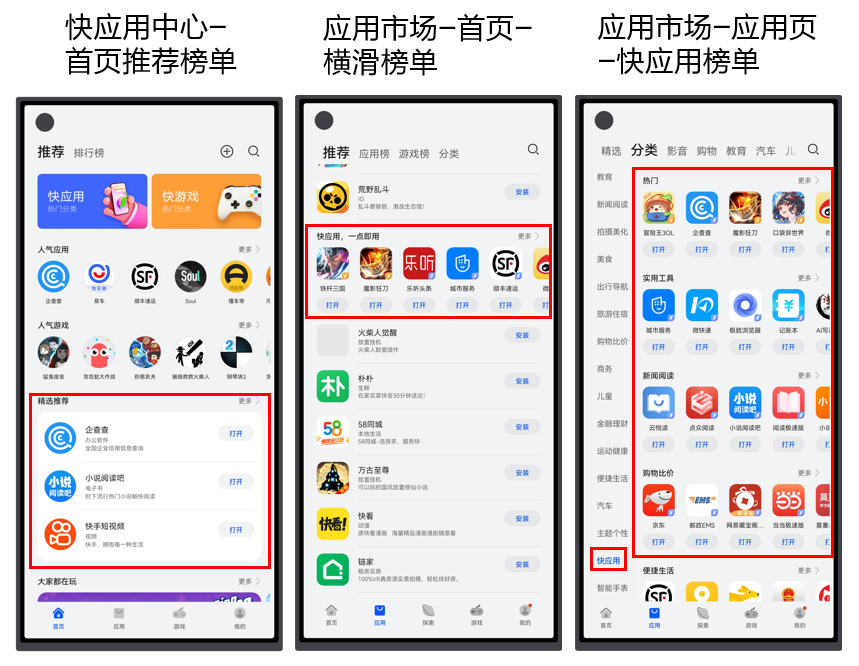
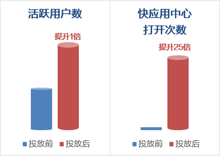

# 投放快应用任务

## 背景信息

您可以通过在华为应用市场应用推广平台创建快应用投放任务，投放至华为应用市场、快应用中心以及华为设备其他流量场景。计费方式支持CPC和CPM，满足快应用在推荐、搜索、创意三大投放场景的获量需求。

快应用资源位示例如下图所示。

 

投放快应用的搜索和推荐任务，参考：[投放推荐任务](https://developer.huawei.com/consumer/cn/doc/promotion/bp-delivery-task-recommend-0000001337110797)、[投放搜索任务](https://developer.huawei.com/consumer/cn/doc/promotion/bp-delivery-task-search-0000001280324781)。

## 成功案例

### 用户需求

在华为应用市场投放任务，使快应用活跃用户数高速增长。

### 解决方案

此快应用2022年5月开始在华为应用市场投放，在华为应用市场、快应用中心中获得曝光资源。

活跃用户数高速增长：快应用整体活跃用户数环比提升一倍。

华为官方分发渠道打开次数激增：快应用中心打开次数增加25倍。

