# 投放图文合约任务

## 背景信息

华为应用市场除了有丰富的榜单类和搜索类资源外，还有形式多样的品牌资源，满足开发者拉新、促活、成交等多种推广投放需求，提升用户对品牌的认可度和美誉度，进一步提高品牌价值及影响力。

 

图文合约相关的介绍，详情请参见[视频课程](https://developer.huawei.com/consumer/cn/training/course/video/C101678341377235208)。

图文合约资源位示例如下图所示。

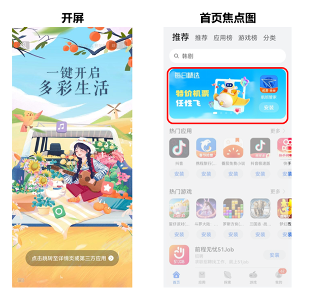.

搜索大卡资源位包含焦点展台大卡、P1搜索大卡、P2搜索大卡资源位，具体示例如下图所示：

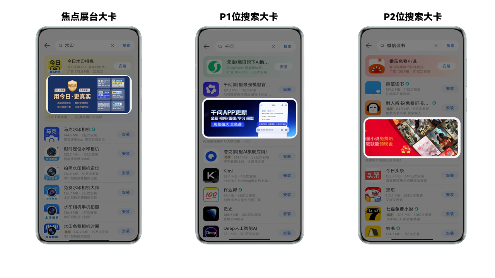

## 创建任务

1. 登录[华为应用市场应用推广平台](https://ads.huawei.com/cn/)，“应用市场应用推广”推广范围，点击“推广”—“创建计划”，进入任务创建页面。

   

   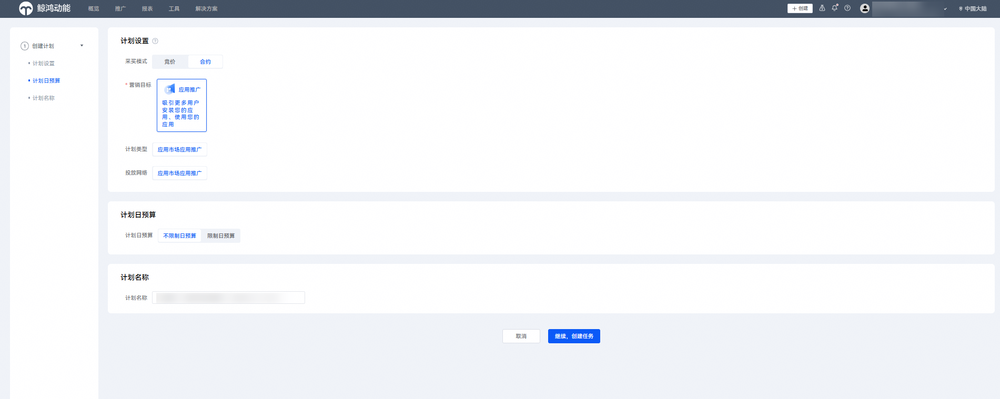

   | 计划设置项 | 说明 |
   | --- | --- |
   | 采买模式 | 选择“合约”。 |
   | 计划日预算 | 选择“不限制日预算”。 |
   | 计划名称 | 命名格式建议：任务类型+应用名称+时间信息，长度不超过128字符。计划与任务层级一一对应，计划名称可与任务名称命名一致。 |
2. 在“推广内容”设置模块，配置相关任务设置项。

   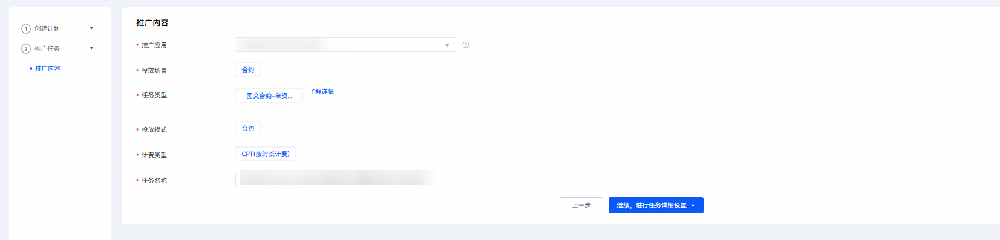

   | 任务设置项 | 说明 |
   | --- | --- |
   | 被推广应用 | 选择您需要推广的应用。 |
   | 投放场景 | 选择“合约”。 |
   | 任务类型 | 选择“图文合约-单资源”。 |
   | 投放模式 | 选择“合约”。 |
   | 计费类型 | 取值范围  - CPT：以时长为计费单位。 |
   | 任务名称 | 命名格式建议：任务类型+应用名称+时间信息。 |
3. 配置完成后，点击“继续，进行任务详细设置”。
4. 在“推广范围”设置模块，配置相关任务设置项。

    

   - “推广范围”设置模块显示的内容为已开放可竞拍的资源。如果要投放其他资源版位，请联系相关运营人员申请投放资源。
   - 合约竞拍任务状态为竞价中-领先、竞得资源时，不支持取消任务。

   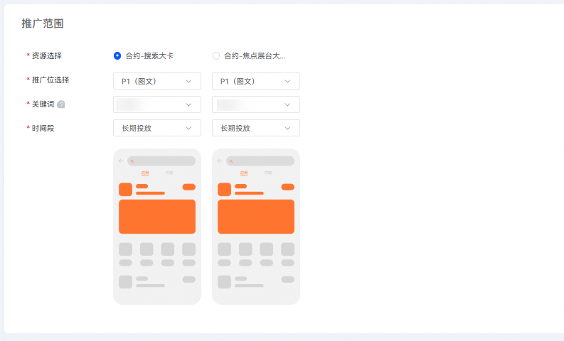

   |  |  |
   | --- | --- |
   | <strong>任务设置项</strong> | <strong>说明</strong> |
   | 资源选择 | 选择要竞拍的资源，如：“合约-焦点展台大卡”、“合约-搜索大卡”。 |
   | 推广位选择 | 选择要竞拍的推广，如：“合约-搜索大卡”开放的推广位为P1、P2；“合约-焦点展台大卡”开放推广位为P1。 |
   | 关键词 | 选择要竞拍的目标资源。 |
   | 时间段 | 时间段为该资源开放时间。 |
5. 在“投放控制”设置模块，配置相关任务设置项。

   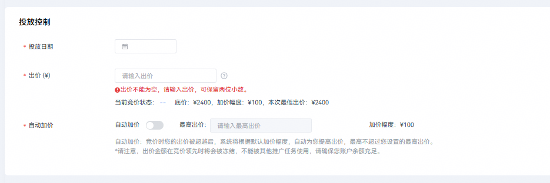

   | 任务设置项 | 说明 |
   | --- | --- |
   | 投放日期 | 设置任务对应的投放日期X。  说明：  1、投放日期仅可选1天创建竞拍任务；若要连续多天竞拍，可用[合约长期竞拍工具](/docs/monetize/promotion/contract-tool-0000002502709186)创建自动竞拍计划。  2、任务最早创建时间：X-32天的下午15:00之后，最晚创建时间：X-2天的下午15:00之前。  3、任务竞拍结束时间：X-2天的下午15:00。  例如：投放日期为2月5日，则最早创建时间为1月4日下午15:00过后，最晚创建时间为2月3日下午15:00之前。X-2天的下午15:00过后即可知道是否竞拍成功。 |
   | 出价 | 创建任务时输入起拍价，任务创建后、竞价结束前可进入查看当前竞价状态：出价领先、出价被超越，并修改出价，每次加价必须大于加价幅度值；出价的时候请确保账户内余额高于您的出价。  说明：  - 出价领先的任务订单，系统会实时锁定您的账户里面的这个出价金额，不能被其他推广任务使用，请确保您账户余额充足。出价被超越后，锁定的金额立即会被释放。 - 出价金额等于该推广资源单天的价值；若竞拍多天，任务总金额=出价金额\*竞拍天数。 |
   | 自动加价 | 是否开启自动加价功能。竞价时您的出价被超越后，系统将根据默认加价幅度，自动为您提高出价，最高不超过您设置的最高出价。  如果开启，则需要配置“最高出价”设置项。 |
6. 在“推广创意”设置模块，配置相关任务设置项。

    

   - 如果图片中使用了肖像，请上传对应的证明资质。
   - 如果有多个材料，请打包上传。
   - 请在“创意展示”任务设置项处点击“创意类型及素材规范说明”查看并严格依照[素材审核规范](#section18226423152816)进行推广素材制作。
   - 若您需修改素材，请在投放日期的12小时之前上传修改后的版本。若未及时修改导致素材审核不通过，合约任务将无法正常上线投放。例如：投放日期为2月5日，素材最晚修改提交时间为2月4日12:00，请您及时修改并上传符合要求的素材。
7. 填写完毕后，点击“提交”。

## 素材审核规范

素材准备与审核规范相关内容，请参见[视频课程](https://developer.huawei.com/consumer/cn/training/course/video/C101679626221829413)和[华为应用市场推广免责函模板](https://alliance-communityfile-drcn.dbankcdn.com/FileServer/getFile/cmtyPub/011/111/111/0000000000011111111.20260424165425.82696474506377594887294533591914:20260531101910:2800:0F9EDFD7107547A1BBAA29443AC8038021DF2DE0BA27B66C8695F16A5EF5C63F.docx?needInitFileName=true)。

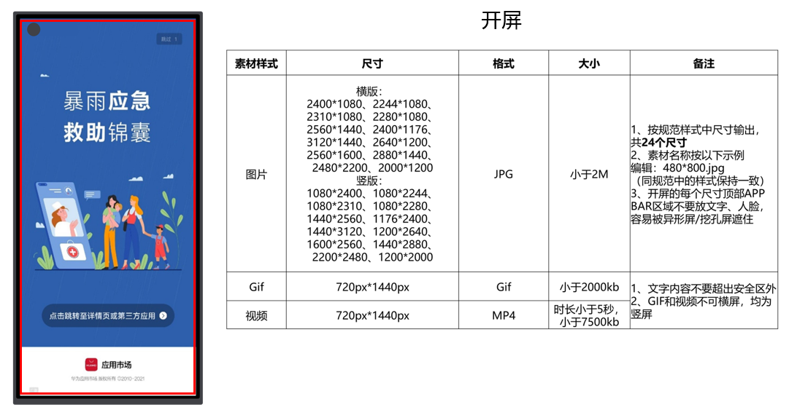

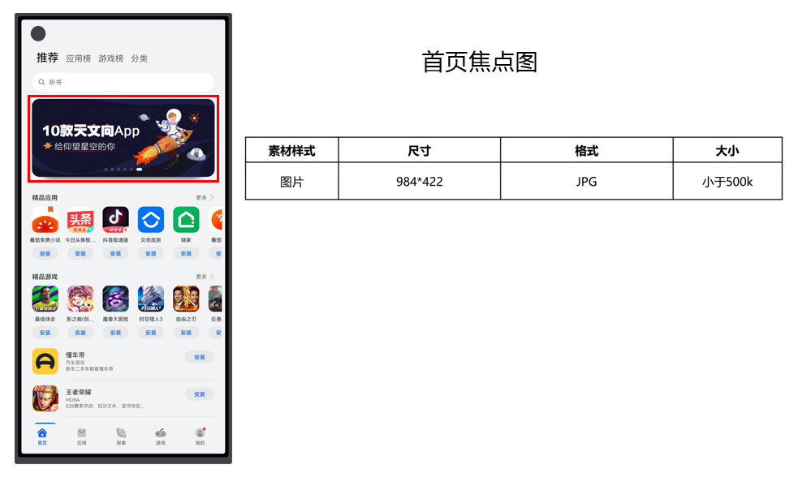

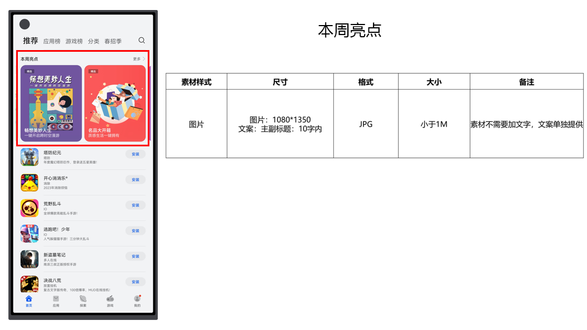

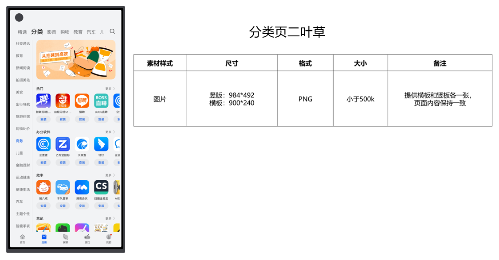

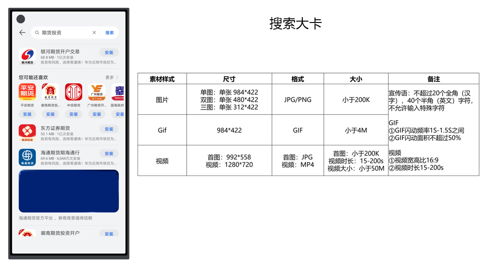

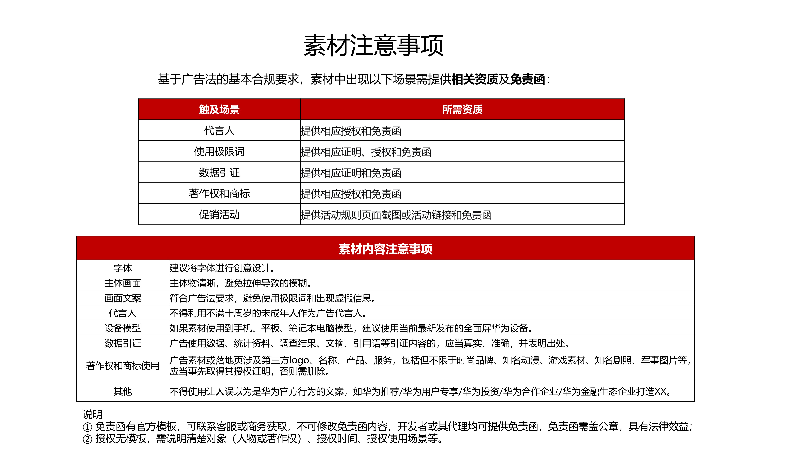
